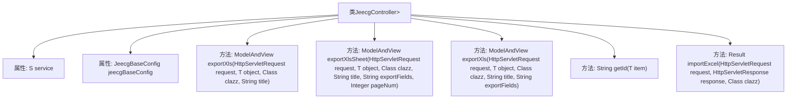
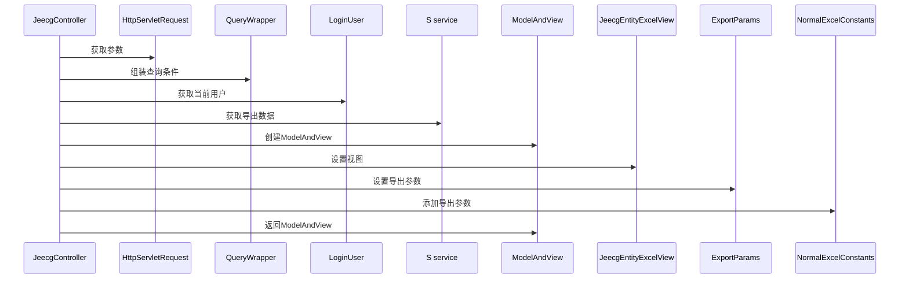

# 基础信息

|      |      |
|------|------|
| 名称 | JeecgController |
| 编码语言 | .java |
| 代码路径 | JeecgBoot/jeecg-boot/jeecg-boot-base-core/src/main/java/org/jeecg/common/system/base/controller/JeecgController.java |
| 包名 | org.jeecg.common.system.base.controller |
| 依赖项 | ['com.baomidou.mybatisplus.core.conditions.query.QueryWrapper', 'com.baomidou.mybatisplus.core.metadata.IPage', 'com.baomidou.mybatisplus.extension.plugins.pagination.Page', 'com.baomidou.mybatisplus.extension.service.IService', 'lombok.extern.slf4j.Slf4j', 'org.apache.commons.beanutils.PropertyUtils', 'org.apache.shiro.SecurityUtils', 'org.jeecg.common.api.vo.Result', 'org.jeecg.common.system.query.QueryGenerator', 'org.jeecg.common.system.vo.LoginUser', 'org.jeecg.common.util.oConvertUtils', 'org.jeecg.config.JeecgBaseConfig', 'org.jeecgframework.poi.excel.ExcelImportUtil', 'org.jeecgframework.poi.excel.def.NormalExcelConstants', 'org.jeecgframework.poi.excel.entity.ExportParams', 'org.jeecgframework.poi.excel.entity.ImportParams', 'org.jeecgframework.poi.excel.entity.enmus.ExcelType', 'org.jeecgframework.poi.excel.view.JeecgEntityExcelView', 'org.springframework.beans.factory.annotation.Autowired', 'org.springframework.web.multipart.MultipartFile', 'org.springframework.web.multipart.MultipartHttpServletRequest', 'org.springframework.web.servlet.ModelAndView', 'javax.annotation.Resource', 'javax.servlet.http.HttpServletRequest', 'javax.servlet.http.HttpServletResponse', 'java.io.IOException', 'java.util'] |
| 概述说明 | JeecgController实现Excel多sheet导出、字段自定义及批量导入数据处理。 |

# 说明

JeecgController类提供了Excel文件的导出与导入功能，支持多sheet导出，允许用户自定义字段，并能够处理批量导入的数据。该功能设计灵活，适用于多种数据处理场景，确保数据的高效管理与操作。

# 类列表 Class Summary

| 名称   | 类型  | 说明 |
|-------|------|-------------|
| JeecgController | class | JeecgController类实现Excel导出与导入功能，支持多sheet导出、字段自定义及批量导入数据处理。 |

## 类 JeecgController

|      |      |
|------|------|
| 访问范围 | @Slf4j;public |
| 类型 | class |
| 名称 | JeecgController |
| 说明 | JeecgController类实现Excel导出与导入功能，支持多sheet导出、字段自定义及批量导入数据处理。 |

### UML类图

```mermaid
classDiagram
    class JeecgController~T, S~ {
        -S service
        -JeecgBaseConfig jeecgBaseConfig
        +ModelAndView exportXls(HttpServletRequest request, T object, Class~T~ clazz, String title)
        +ModelAndView exportXlsSheet(HttpServletRequest request, T object, Class~T~ clazz, String title, String exportFields, Integer pageNum)
        +ModelAndView exportXls(HttpServletRequest request, T object, Class~T~ clazz, String title, String exportFields)
        -String getId(T item)
        +Result~?~ importExcel(HttpServletRequest request, HttpServletResponse response, Class~T~ clazz)
    }

    class IService~T~ {
        <<Interface>>
        +List~T~ list(QueryWrapper~T~ queryWrapper)
        +IPage~T~ page(Page~T~ page, QueryWrapper~T~ queryWrapper)
        +boolean saveBatch(List~T~ list)
        +long count()
    }

    class JeecgBaseConfig {
        +Path getPath()
    }

    class QueryWrapper~T~ {
        +QueryWrapper~T~ in(String column, List~String~ values)
    }

    class LoginUser {
        +String getRealname()
    }

    class SecurityUtils {
        +Subject getSubject()
    }

    class Subject {
        +Object getPrincipal()
    }

    class ExportParams {
        +ExportParams(String title, String secondTitle, String sheetName, String imageBasePath)
        +void setImageBasePath(String imageBasePath)
        +void setType(ExcelType type)
    }

    class NormalExcelConstants {
        <<Interface>>
        +String FILE_NAME
        +String CLASS
        +String PARAMS
        +String DATA_LIST
        +String MAP_LIST
        +String EXPORT_FIELDS
    }

    class JeecgEntityExcelView {
        +JeecgEntityExcelView()
    }

    class Result~T~ {
        +static Result~T~ ok(String message)
        +static Result~T~ error(String message)
    }

    class MultipartHttpServletRequest {
        +Map~String, MultipartFile~ getFileMap()
    }

    class MultipartFile {
        +InputStream getInputStream()
    }

    class ImportParams {
        +void setTitleRows(int titleRows)
        +void setHeadRows(int headRows)
        +void setNeedSave(boolean needSave)
    }

    class ExcelImportUtil {
        +static List~T~ importExcel(InputStream inputStream, Class~T~ clazz, ImportParams params)
    }

    JeecgController --> IService : 依赖
    JeecgController --> JeecgBaseConfig : 依赖
    JeecgController --> QueryWrapper : 依赖
    JeecgController --> LoginUser : 依赖
    JeecgController --> SecurityUtils : 依赖
    JeecgController --> ExportParams : 依赖
    JeecgController --> NormalExcelConstants : 依赖
    JeecgController --> JeecgEntityExcelView : 依赖
    JeecgController --> Result : 依赖
    JeecgController --> MultipartHttpServletRequest : 依赖
    JeecgController --> MultipartFile : 依赖
    JeecgController --> ImportParams : 依赖
    JeecgController --> ExcelImportUtil : 依赖
    IService --> QueryWrapper : 依赖
    IService --> Page : 依赖
    IService --> IPage : 依赖
    IService --> List : 依赖
    QueryWrapper --> List : 依赖
    SecurityUtils --> Subject : 依赖
    ExportParams --> ExcelType : 依赖
    Result --> String : 依赖
    MultipartHttpServletRequest --> MultipartFile : 依赖
    ExcelImportUtil --> ImportParams : 依赖
    ExcelImportUtil --> InputStream : 依赖
```

**描述**：`JeecgController` 是一个泛型控制器类，依赖于 `IService` 接口和 `JeecgBaseConfig` 类，主要用于处理 Excel 的导出和导入操作。它通过 `QueryWrapper` 构建查询条件，使用 `ExportParams` 和 `NormalExcelConstants` 配置导出参数，并通过 `JeecgEntityExcelView` 生成 Excel 视图。此外，它还处理文件上传和批量数据导入，依赖于 `MultipartHttpServletRequest` 和 `ExcelImportUtil` 等类。

### 内部方法调用关系图

这段代码是一个Java控制器类 `JeecgController`，主要用于处理Excel文件的导出和导入操作。它包含多个方法，用于根据不同的条件导出Excel文件，以及从Excel文件中导入数据。类中使用了 `@Autowired` 和 `@Resource` 注解进行依赖注入，并且通过 `QueryWrapper` 和 `ModelAndView` 等工具类来构建查询条件和视图。流程图展示了类的结构，时序图则详细描述了 `exportXls` 方法的执行流程。

### 字段列表 Field List

| 名称  | 类型  | 说明 |
|-------|-------|------|
| service | S | 自动注入S类型的服务实例。 |
| jeecgBaseConfig | JeecgBaseConfig | JeecgBaseConfig资源通过@Resource注解注入。 |

### 方法列表 Method List

| 名称  | 类型  | 说明 |
|-------|-------|------|
| exportXls | ModelAndView | 组装查询条件，过滤数据，获取导出数据，使用AutoPoi导出Excel。 |
| exportXlsSheet | ModelAndView | 方法实现多sheet导出Excel，包括查询条件组装、分页计算、数据过滤和多sheet处理。 |
| importExcel | Result<?> | 导入Excel文件并批量插入数据，处理重复数据及异常。 |
| getId | String | 通过反射获取对象ID，异常时返回null。 |
| exportXls | ModelAndView | 该方法通过请求、对象、类、标题和导出字段生成Excel导出视图。 |

