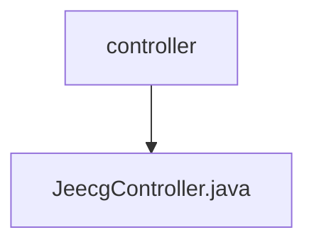

# 基础信息

|      |      |
|------|------|
| 名称 | controller |
| 编码语言 | .java |
| 代码路径 | JeecgBoot/jeecg-boot/jeecg-boot-base-core/src/main/java/org/jeecg/common/system/base/controller |
| 包名 | JeecgBoot.jeecg-boot.jeecg-boot-base-core.src.main.java.org.jeecg.common.system.base.controller |
| 概述说明 | JeecgController实现Excel多sheet导出、字段自定义及批量导入数据处理。 |

# 说明

JeecgController类提供了Excel文件的导出与导入功能，支持多sheet导出，允许用户自定义字段，并能够处理批量导入的数据。该功能设计灵活，适用于多种数据处理场景，确保数据的高效管理与操作。

### 包内部结构视图

该流程图展示了路径中的层级关系，`controller`文件夹下包含一个名为`JeecgController.java`的文件。路径结构简洁明了，清晰地反映了文件与文件夹之间的从属关系。

# 文件列表 File List

| 名称   | 类型  | 说明 |
|-------|------|-------------|
| [JeecgController.java](JeecgController.md) | file | JeecgController实现Excel多sheet导出、字段自定义及批量导入数据处理。 |

