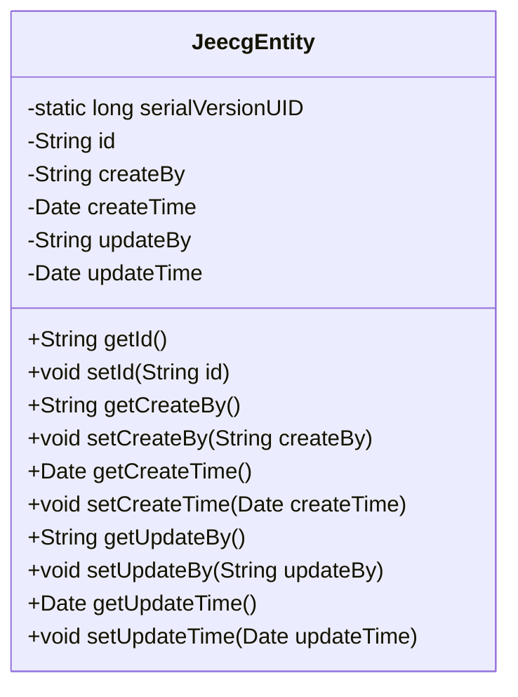

# 基础信息

|      |      |
|------|------|
| 名称 | JeecgEntity |
| 编码语言 | .java |
| 代码路径 | JeecgBoot/jeecg-boot/jeecg-boot-base-core/src/main/java/org/jeecg/common/system/base/entity/JeecgEntity.java |
| 包名 | org.jeecg.common.system.base.entity |
| 依赖项 | ['java.io.Serializable', 'io.swagger.v3.oas.annotations.media.Schema', 'org.jeecgframework.poi.excel.annotation.Excel', 'org.springframework.format.annotation.DateTimeFormat', 'com.baomidou.mybatisplus.annotation.IdType', 'com.baomidou.mybatisplus.annotation.TableId', 'com.fasterxml.jackson.annotation.JsonFormat', 'lombok.Data', 'lombok.EqualsAndHashCode', 'lombok.experimental.Accessors'] |
| 概述说明 | JeecgEntity类包含ID、创建人、创建时间、更新人、更新时间字段。 |

# 说明

JeecgEntity类是一个基础实体类，包含五个核心字段：ID用于唯一标识实体，创建人记录实体的创建者，创建时间记录实体的创建时间，更新人记录实体的最后修改者，更新时间记录实体的最后修改时间。这些字段有助于跟踪实体的生命周期和变更历史。

# 类列表 Class Summary

| 名称   | 类型  | 说明 |
|-------|------|-------------|
| JeecgEntity | class | JeecgEntity类包含ID、创建人、创建时间、更新人、更新时间字段。 |

## 类 JeecgEntity

|      |      |
|------|------|
| 访问范围 | @Data;@EqualsAndHashCode(callSuper = false);@Accessors(chain = true);public |
| 类型 | class |
| 名称 | JeecgEntity |
| 说明 | JeecgEntity类包含ID、创建人、创建时间、更新人、更新时间字段。 |

### UML类图

这段代码定义了一个名为 `JeecgEntity` 的类，该类实现了 `Serializable` 接口，表明其实例可以被序列化。类中包含多个私有字段，如 `id`、`createBy`、`createTime`、`updateBy` 和 `updateTime`，这些字段分别用于存储实体的唯一标识、创建人、创建时间、更新人和更新时间。每个字段都通过注解进行了描述和格式化，例如 `@Schema` 用于生成API文档，`@Excel` 用于Excel导出，`@JsonFormat` 和 `@DateTimeFormat` 用于日期格式化。类中还包含了这些字段的getter和setter方法，用于访问和修改这些字段的值。

### 内部方法调用关系图

```mermaid
graph TD
    A["类JeecgEntity"]
    B["属性: java.lang.String id"]
    C["属性: java.lang.String createBy"]
    D["属性: java.util.Date createTime"]
    E["属性: java.lang.String updateBy"]
    F["属性: java.util.Date updateTime"]
    G["注解: @TableId(type = IdType.ASSIGN_ID)"]
    H["注解: @Schema(description = 'ID')"]
    I["注解: @Schema(description = '创建人')"]
    J["注解: @Excel(name = '创建人', width = 15)"]
    K["注解: @Schema(description = '创建时间')"]
    L["注解: @Excel(name = '创建时间', width = 20, format = 'yyyy-MM-dd HH:mm:ss')"]
    M["注解: @JsonFormat(timezone = 'GMT+8', pattern = 'yyyy-MM-dd HH:mm:ss')"]
    N["注解: @DateTimeFormat(pattern = 'yyyy-MM-dd HH:mm:ss')"]
    O["注解: @Schema(description = '更新人')"]
    P["注解: @Excel(name = '更新人', width = 15)"]
    Q["注解: @Schema(description = '更新时间')"]
    R["注解: @Excel(name = '更新时间', width = 20, format = 'yyyy-MM-dd HH:mm:ss')"]
    S["注解: @JsonFormat(timezone = 'GMT+8', pattern = 'yyyy-MM-dd HH:mm:ss')"]
    T["注解: @DateTimeFormat(pattern = 'yyyy-MM-dd HH:mm:ss')"]

    A --> B
    A --> C
    A --> D
    A --> E
    A --> F
    B --> G
    B --> H
    C --> I
    C --> J
    D --> K
    D --> L
    D --> M
    D --> N
    E --> O
    E --> P
    F --> Q
    F --> R
    F --> S
    F --> T
```

该流程图展示了`JeecgEntity`类的结构及其属性与注解之间的关系。`JeecgEntity`类包含五个主要属性：`id`、`createBy`、`createTime`、`updateBy`和`updateTime`。每个属性都附带有多个注解，用于描述其用途、格式以及在Excel中的显示方式。这些注解包括`@TableId`、`@Schema`、`@Excel`、`@JsonFormat`和`@DateTimeFormat`，它们分别用于标识主键、描述字段、定义Excel列格式、设置JSON日期格式和日期时间格式。

### 字段列表 Field List

| 名称  | 类型  | 说明 |
|-------|-------|------|
| id | java.lang.String | 表ID字段使用ASSIGN_ID类型，描述为ID。 |
| serialVersionUID = 1L | long | 声明一个静态常量序列化版本号为1L。 |
| updateBy | java.lang.String | 更新人字段，类型为字符串，用于记录更新操作者。 |
| updateTime | java.util.Date | 更新时间字段，格式为yyyy-MM-dd HH:mm:ss，时区GMT+8。 |
| createTime | java.util.Date | 创建时间字段，格式为yyyy-MM-dd HH:mm:ss，GMT+8时区。 |
| createBy | java.lang.String | 字段“创建人”用于记录数据创建者姓名，类型为字符串。 |

### 方法列表 Method List

| 名称  | 类型  | 说明 |
|-------|-------|------|

