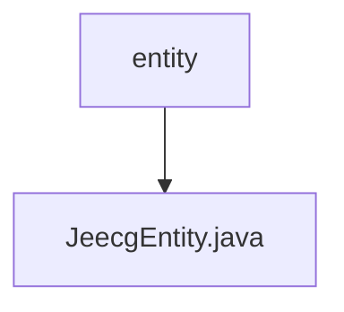

# 基础信息

|      |      |
|------|------|
| 名称 | entity |
| 编码语言 | .java |
| 代码路径 | JeecgBoot/jeecg-boot/jeecg-boot-base-core/src/main/java/org/jeecg/common/system/base/entity |
| 包名 | JeecgBoot.jeecg-boot.jeecg-boot-base-core.src.main.java.org.jeecg.common.system.base.entity |
| 概述说明 | JeecgEntity类包含ID、创建人、创建时间、更新人、更新时间字段。 |

# 说明

JeecgEntity类是一个基础实体类，包含五个核心字段：ID用于唯一标识实体，创建人记录实体的创建者，创建时间记录实体的创建时间，更新人记录实体的最后修改者，更新时间记录实体的最后修改时间。这些字段有助于跟踪实体的生命周期和变更历史。

### 包内部结构视图

该流程图展示了`entity`文件夹与`JeecgEntity.java`文件之间的层级关系。`entity`是父节点，`JeecgEntity.java`是子节点，表示文件位于该文件夹下。流程图简洁明了，符合路径信息的层级结构。

# 文件列表 File List

| 名称   | 类型  | 说明 |
|-------|------|-------------|
| [JeecgEntity.java](JeecgEntity.md) | file | JeecgEntity类包含ID、创建人、创建时间、更新人、更新时间字段。 |

