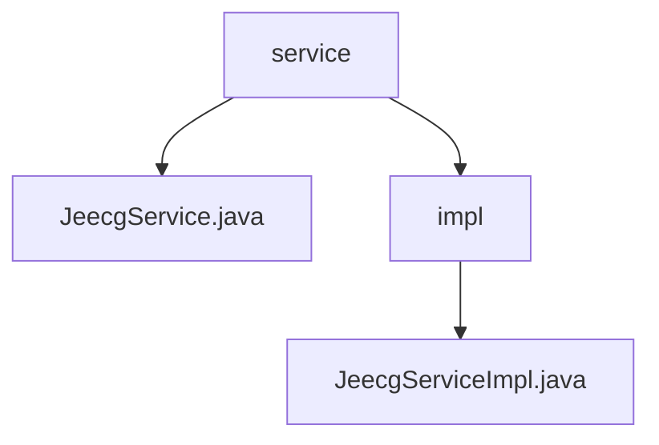

# 基础信息

|      |      |
|------|------|
| 名称 | service |
| 编码语言 | .java |
| 代码路径 | JeecgBoot/jeecg-boot/jeecg-boot-base-core/src/main/java/org/jeecg/common/system/base/service |
| 包名 | JeecgBoot.jeecg-boot.jeecg-boot-base-core.src.main.java.org.jeecg.common.system.base.service |
| 概述说明 | JeecgServiceImpl继承ServiceImpl并实现JeecgService接口，增强扩展性和维护性。 |

# 说明

## 概述
该代码模块是JeecgBoot框架的核心基础模块之一，主要提供了一些基础服务的实现。模块中的`JeecgServiceImpl`类继承了`ServiceImpl`类，并实现了`JeecgService`接口，从而具备了`ServiceImpl`类的功能，并遵循了`JeecgService`接口的规范。这种设计模式增强了代码的可扩展性和可维护性。

## 主要业务场景
该模块主要用于处理系统的基础业务逻辑，特别是在服务层的实现上。通过继承和实现的方式，`JeecgServiceImpl`类能够提供统一的业务逻辑处理，适用于多种业务场景。这种设计使得业务逻辑的实现更加灵活，能够适应不同的业务需求，同时保持了代码的整洁和可维护性。

### 包内部结构视图

该流程图展示了JeecgBoot项目中`service`目录的层级关系。`service`目录下包含`JeecgService.java`文件和一个`impl`子目录，而`impl`子目录中又包含`JeecgServiceImpl.java`文件。这种结构体现了服务接口与实现类的典型分层设计。

# 文件列表 File List

| 名称   | 类型  | 说明 |
|-------|------|-------------|
| [JeecgService.java](JeecgService.md) | file | 无内容可总结。 |
| [impl](impl/_module.md) | package | JeecgServiceImpl继承ServiceImpl并实现JeecgService接口。 |

