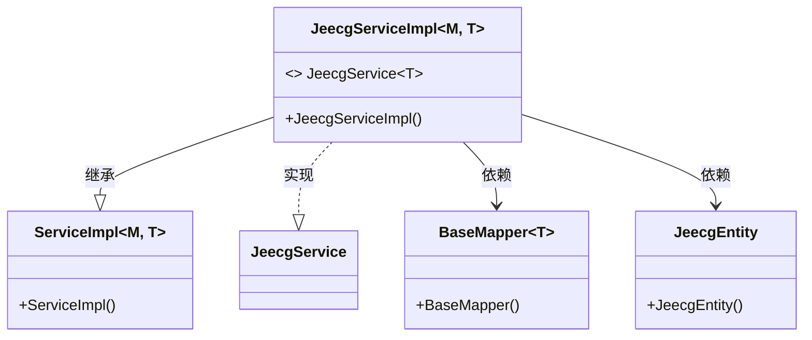
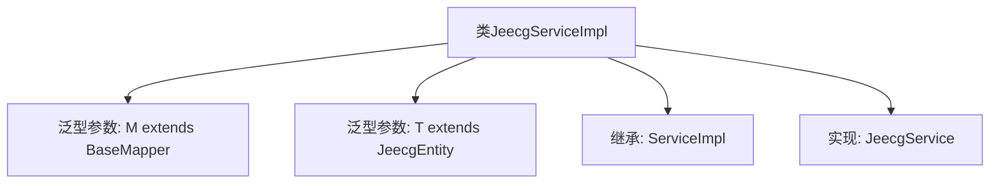

# 基础信息

|      |      |
|------|------|
| 名称 | JeecgServiceImpl |
| 编码语言 | .java |
| 代码路径 | JeecgBoot/jeecg-boot/jeecg-boot-base-core/src/main/java/org/jeecg/common/system/base/service/impl/JeecgServiceImpl.java |
| 包名 | org.jeecg.common.system.base.service.impl |
| 依赖项 | ['org.jeecg.common.system.base.entity.JeecgEntity', 'org.jeecg.common.system.base.service.JeecgService', 'com.baomidou.mybatisplus.core.mapper.BaseMapper', 'com.baomidou.mybatisplus.extension.service.impl.ServiceImpl', 'lombok.extern.slf4j.Slf4j'] |
| 概述说明 | JeecgServiceImpl继承ServiceImpl并实现JeecgService接口。 |

# 说明

JeecgServiceImpl类继承了ServiceImpl类，并实现了JeecgService接口。这表明JeecgServiceImpl类不仅具备了ServiceImpl类的功能，还遵循了JeecgService接口的规范，从而实现了特定的业务逻辑或功能。这种设计模式增强了代码的可扩展性和可维护性。

# 类列表 Class Summary

| 名称   | 类型  | 说明 |
|-------|------|-------------|
| JeecgServiceImpl | class | JeecgServiceImpl类继承ServiceImpl并实现JeecgService接口。 |

## 类 JeecgServiceImpl

|      |      |
|------|------|
| 访问范围 | @Slf4j;public |
| 类型 | class |
| 名称 | JeecgServiceImpl |
| 说明 | JeecgServiceImpl类继承ServiceImpl并实现JeecgService接口。 |

### UML类图

这段代码定义了一个泛型类 `JeecgServiceImpl`，它继承自 `ServiceImpl` 并实现了 `JeecgService` 接口。`JeecgServiceImpl` 依赖于 `BaseMapper` 和 `JeecgEntity`，其中 `M` 是 `BaseMapper` 的子类，`T` 是 `JeecgEntity` 的子类。该类的设计主要用于处理与 `JeecgEntity` 相关的业务逻辑，并通过 `BaseMapper` 进行数据访问。

### 内部方法调用关系图

这段代码定义了一个名为 `JeecgServiceImpl` 的类，该类继承自 `ServiceImpl` 并实现了 `JeecgService` 接口。`JeecgServiceImpl` 使用了两个泛型参数：`M` 和 `T`，其中 `M` 必须继承自 `BaseMapper<T>`，而 `T` 必须继承自 `JeecgEntity`。通过继承和实现，`JeecgServiceImpl` 类将具备 `ServiceImpl` 和 `JeecgService` 的功能，同时能够处理特定类型的实体和映射器。

### 字段列表 Field List

| 名称  | 类型  | 说明 |
|-------|-------|------|

### 方法列表 Method List

| 名称  | 类型  | 说明 |
|-------|-------|------|

