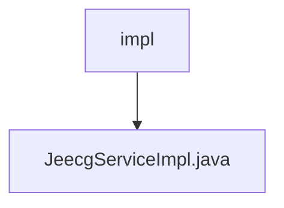

# 基础信息

|      |      |
|------|------|
| 名称 | impl |
| 编码语言 | .java |
| 代码路径 | JeecgBoot/jeecg-boot/jeecg-boot-base-core/src/main/java/org/jeecg/common/system/base/service/impl |
| 包名 | JeecgBoot.jeecg-boot.jeecg-boot-base-core.src.main.java.org.jeecg.common.system.base.service.impl |
| 概述说明 | JeecgServiceImpl继承ServiceImpl并实现JeecgService接口。 |

# 说明

JeecgServiceImpl类继承了ServiceImpl类，并实现了JeecgService接口。这表明JeecgServiceImpl类不仅具备了ServiceImpl类的功能，还遵循了JeecgService接口的规范，从而实现了特定的业务逻辑或功能。这种设计模式增强了代码的可扩展性和可维护性。

### 包内部结构视图

该流程图展示了路径的层级关系，`impl` 是上级目录，`JeecgServiceImpl.java` 是其下的文件。这种结构表示 `impl` 目录中包含一个名为 `JeecgServiceImpl.java` 的文件，体现了文件的组织方式。

# 文件列表 File List

| 名称   | 类型  | 说明 |
|-------|------|-------------|
| [JeecgServiceImpl.java](JeecgServiceImpl.md) | file | JeecgServiceImpl继承ServiceImpl并实现JeecgService接口。 |

