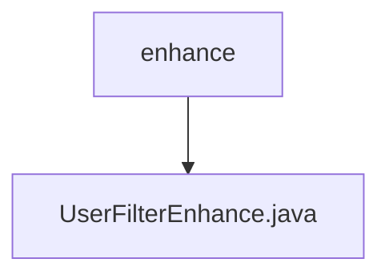

# 基础信息

|      |      |
|------|------|
| 名称 | enhance |
| 编码语言 | .java |
| 代码路径 | JeecgBoot/jeecg-boot/jeecg-boot-base-core/src/main/java/org/jeecg/common/system/enhance |
| 包名 | JeecgBoot.jeecg-boot.jeecg-boot-base-core.src.main.java.org.jeecg.common.system.enhance |
| 概述说明 | 信息为空，无法生成概要描述。 |

# 说明

未提供具体内容，无法进行总结描述。请提供详细内容以便生成准确的总结。

### 包内部结构视图

该流程图展示了`enhance`文件夹与其子文件`UserFilterEnhance.java`之间的层级关系。`enhance`作为父节点，包含了一个子节点`UserFilterEnhance.java`，表示该文件位于`enhance`文件夹内。

# 文件列表 File List

| 名称   | 类型  | 说明 |
|-------|------|-------------|
| [UserFilterEnhance.java](UserFilterEnhance.md) | file | 信息为空，无法生成概要描述。 |

