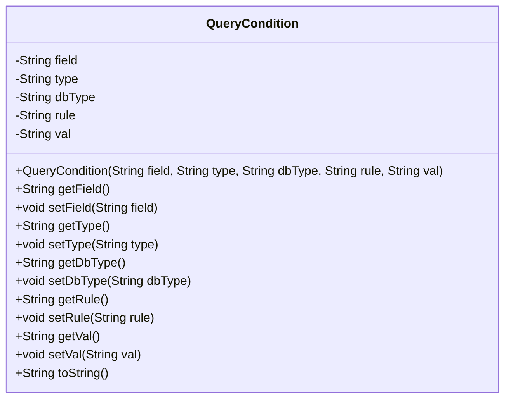

# 基础信息

|      |      |
|------|------|
| 名称 | QueryCondition |
| 编码语言 | .java |
| 代码路径 | JeecgBoot/jeecg-boot/jeecg-boot-base-core/src/main/java/org/jeecg/common/system/query/QueryCondition.java |
| 包名 | org.jeecg.common.system.query |
| 依赖项 | ['java.io.Serializable'] |
| 概述说明 | QueryCondition类包含字段、类型、数据库类型、规则和值，提供构造方法和getter/setter。 |

# 说明

QueryCondition类是一个用于封装查询条件的实体类，包含字段、类型、数据库类型、规则和值等关键属性。该类提供了构造方法用于初始化这些属性，并通过getter和setter方法实现对属性的访问和修改。这种设计使得查询条件的处理更加灵活和易于维护。

# 类列表 Class Summary

| 名称   | 类型  | 说明 |
|-------|------|-------------|
| QueryCondition | class | QueryCondition类包含字段、类型、数据库类型、规则和值，提供构造方法和getter/setter。 |

## 类 QueryCondition

|      |      |
|------|------|
| 访问范围 | public |
| 类型 | class |
| 名称 | QueryCondition |
| 说明 | QueryCondition类包含字段、类型、数据库类型、规则和值，提供构造方法和getter/setter。 |

### UML类图

这段代码定义了一个名为 `QueryCondition` 的类，该类实现了 `Serializable` 接口，用于序列化对象。类中包含五个私有字段：`field`、`type`、`dbType`、`rule` 和 `val`，分别表示查询条件的字段、组件类型、数据库字段类型、规则和值。类提供了这些字段的 getter 和 setter 方法，以及一个构造方法用于初始化这些字段。`toString` 方法用于将对象转换为字符串表示形式，当 `field` 为空时返回空字符串，否则返回包含所有字段信息的字符串。

### 内部方法调用关系图

```mermaid
graph TD
    A["类QueryCondition"]
    B["属性: String field"]
    C["属性: String type"]
    D["属性: String dbType"]
    E["属性: String rule"]
    F["属性: String val"]
    G["构造方法: QueryCondition(String field, String type, String dbType, String rule, String val)"]
    H["方法: String getField()"]
    I["方法: void setField(String field)"]
    J["方法: String getType()"]
    K["方法: void setType(String type)"]
    L["方法: String getDbType()"]
    M["方法: void setDbType(String dbType)"]
    N["方法: String getRule()"]
    O["方法: void setRule(String rule)"]
    P["方法: String getVal()"]
    Q["方法: void setVal(String val)"]
    R["重写方法: String toString()"]

    A --> B
    A --> C
    A --> D
    A --> E
    A --> F
    A --> G
    A --> H
    A --> I
    A --> J
    A --> K
    A --> L
    A --> M
    A --> N
    A --> O
    A --> P
    A --> Q
    A --> R
```

这段代码定义了一个名为 `QueryCondition` 的类，该类实现了 `Serializable` 接口，包含五个私有属性：`field`、`type`、`dbType`、`rule` 和 `val`。类中提供了这些属性的 getter 和 setter 方法，并重写了 `toString` 方法，用于生成对象的字符串表示。`toString` 方法在 `field` 为空时返回空字符串，否则返回包含所有属性值的字符串。

### 字段列表 Field List

| 名称  | 类型  | 说明 |
|-------|-------|------|
| serialVersionUID = 4740166316629191651L | long | 声明序列化版本号的私有静态常量。 |
| dbType | String | 定义私有字符串变量dbType。 |
| field | String | 定义了一个私有字符串类型的字段。 |
| rule | String | 定义一个私有字符串变量rule。 |
| type | String | 定义了一个私有字符串类型变量type。 |
| val | String | 定义了一个私有字符串变量val。 |

### 方法列表 Method List

| 名称  | 类型  | 说明 |
|-------|-------|------|
| setDbType | void | 设置数据库类型的方法。 |
| setType | void | 设置类型属性的方法。 |
| getRule | String | 方法返回规则字符串。 |
| getField | String | 返回字段值的公共方法。 |
| getDbType | String | 获取数据库类型的方法。 |
| getType | String | 该方法返回字符串类型的变量值。 |
| setVal | void | 设置字符串类型的val值。 |
| getVal | String | 获取变量值的公共方法。 |
| setRule | void | 该方法用于设置规则字符串。 |
| setField | void | 设置字段值的方法，将传入参数赋值给类成员变量。 |
| toString | String | 重写toString方法，拼接字段、规则、类型、数据库类型和值。 |

