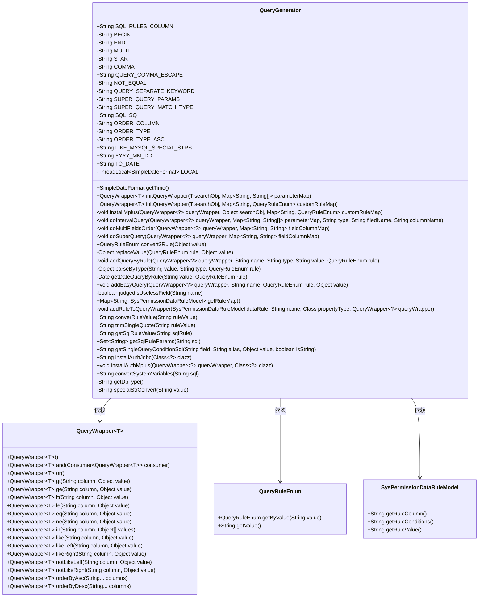

# 基础信息

|      |      |
|------|------|
| 名称 | QueryGenerator |
| 编码语言 | .java |
| 代码路径 | JeecgBoot/jeecg-boot/jeecg-boot-base-core/src/main/java/org/jeecg/common/system/query/QueryGenerator.java |
| 包名 | org.jeecg.common.system.query |
| 依赖项 | ['java.beans.PropertyDescriptor', 'java.io.UnsupportedEncodingException', 'java.math.BigDecimal', 'java.net.URLDecoder', 'java.text.ParseException', 'java.text.SimpleDateFormat', 'java.util', 'java.util.regex.Matcher', 'java.util.regex.Pattern', 'java.util.stream.Collectors', 'org.apache.commons.beanutils.PropertyUtils', 'org.jeecg.common.constant.CommonConstant', 'org.jeecg.common.constant.DataBaseConstant', 'org.jeecg.common.exception.JeecgBootException', 'org.jeecg.common.system.util.JeecgDataAutorUtils', 'org.jeecg.common.system.util.JwtUtil', 'org.jeecg.common.system.util.SqlConcatUtil', 'org.jeecg.common.system.vo.SysPermissionDataRuleModel', 'org.jeecg.common.util', 'org.springframework.util.NumberUtils', 'com.alibaba.fastjson.JSON', 'com.baomidou.mybatisplus.core.conditions.query.QueryWrapper', 'lombok.extern.slf4j.Slf4j'] |
| 概述说明 | QueryGenerator类生成MyBatis Plus查询条件，支持多种查询方式和特殊字符处理。 |

# 说明

QueryGenerator类是一个用于生成MyBatis Plus查询条件的工具类，具备多种查询功能。它支持区间查询、模糊查询和高级查询，并能处理排序操作。此外，该类还能有效处理特殊字符，并支持自定义查询规则，确保查询条件的灵活性和准确性。

# 类列表 Class Summary

| 名称   | 类型  | 说明 |
|-------|------|-------------|
| QueryGenerator | class | QueryGenerator类用于生成MyBatis Plus查询条件，支持区间查询、模糊查询、高级查询、排序等功能，并处理特殊字符和自定义查询规则。 |

## 类 QueryGenerator

|      |      |
|------|------|
| 访问范围 | @Slf4j;public |
| 类型 | class |
| 名称 | QueryGenerator |
| 说明 | QueryGenerator类用于生成MyBatis Plus查询条件，支持区间查询、模糊查询、高级查询、排序等功能，并处理特殊字符和自定义查询规则。 |

### UML类图

**描述：**

`QueryGenerator` 类主要用于生成数据库查询条件，支持多种查询规则（如等于、大于、小于、模糊查询等）。它通过 `QueryWrapper` 对象来构建查询条件，并支持自定义查询规则和权限控制。`QueryRuleEnum` 枚举类定义了不同的查询规则，而 `SysPermissionDataRuleModel` 类则用于存储权限规则相关的数据。`QueryGenerator` 通过解析前端传递的参数，结合权限规则，生成最终的查询条件，适用于复杂的数据库查询场景。

### 内部方法调用关系图

```mermaid
graph TD
    A["类QueryGenerator"]
    B["常量: SQL_RULES_COLUMN, BEGIN, END, MULTI, STAR, COMMA, QUERY_COMMA_ESCAPE, NOT_EQUAL, QUERY_SEPARATE_KEYWORD, SUPER_QUERY_PARAMS, SUPER_QUERY_MATCH_TYPE, SQL_SQ, ORDER_COLUMN, ORDER_TYPE, ORDER_TYPE_ASC, LIKE_MYSQL_SPECIAL_STRS, YYYY_MM_DD, TO_DATE"]
    C["ThreadLocal<SimpleDateFormat> LOCAL"]
    D["方法: SimpleDateFormat getTime()"]
    E["方法: QueryWrapper<T> initQueryWrapper(T searchObj, Map<String, String[]> parameterMap)"]
    F["方法: QueryWrapper<T> initQueryWrapper(T searchObj, Map<String, String[]> parameterMap, Map<String, QueryRuleEnum> customRuleMap)"]
    G["方法: void installMplus(QueryWrapper<?> queryWrapper, Object searchObj, Map<String, String[]> parameterMap, Map<String, QueryRuleEnum> customRuleMap)"]
    H["方法: void doIntervalQuery(QueryWrapper<?> queryWrapper, Map<String, String[]> parameterMap, String type, String filedName, String columnName)"]
    I["方法: void doMultiFieldsOrder(QueryWrapper<?> queryWrapper, Map<String, String[]> parameterMap, Map<String, String> fieldColumnMap)"]
    J["方法: void doSuperQuery(QueryWrapper<?> queryWrapper, Map<String, String[]> parameterMap, Map<String, String> fieldColumnMap)"]
    K["方法: QueryRuleEnum convert2Rule(Object value)"]
    L["方法: Object replaceValue(QueryRuleEnum rule, Object value)"]
    M["方法: void addQueryByRule(QueryWrapper<?> queryWrapper, String name, String type, String value, QueryRuleEnum rule)"]
    N["方法: Object parseByType(String value, String type, QueryRuleEnum rule)"]
    O["方法: Date getDateQueryByRule(String value, QueryRuleEnum rule)"]
    P["方法: void addEasyQuery(QueryWrapper<?> queryWrapper, String name, QueryRuleEnum rule, Object value)"]
    Q["方法: boolean judgedIsUselessField(String name)"]
    R["方法: Map<String, SysPermissionDataRuleModel> getRuleMap()"]
    S["方法: void addRuleToQueryWrapper(SysPermissionDataRuleModel dataRule, String name, Class propertyType, QueryWrapper<?> queryWrapper)"]
    T["方法: String converRuleValue(String ruleValue)"]
    U["方法: String trimSingleQuote(String ruleValue)"]
    V["方法: String getSqlRuleValue(String sqlRule)"]
    W["方法: Set<String> getSqlRuleParams(String sql)"]
    X["方法: String getSingleQueryConditionSql(String field, String alias, Object value, boolean isString)"]
    Y["方法: String installAuthJdbc(Class<?> clazz)"]
    Z["方法: void installAuthMplus(QueryWrapper<?> queryWrapper, Class<?> clazz)"]
    AA["方法: String convertSystemVariables(String sql)"]
    AB["方法: String getDbType()"]
    AC["方法: String specialStrConvert(String value)"]

    A --> B
    A --> C
    A --> D
    A --> E
    A --> F
    A --> G
    G --> H
    G --> I
    G --> J
    G --> K
    G --> L
    G --> M
    M --> N
    M --> O
    M --> P
    G --> Q
    G --> R
    G --> S
    S --> T
    S --> U
    S --> V
    V --> W
    S --> X
    S --> Y
    S --> Z
    S --> AA
    S --> AB
    S --> AC
```

这段代码定义了一个名为 `QueryGenerator` 的类，主要用于生成数据库查询条件。它包含了多个常量和方法，用于处理不同类型的查询条件，如区间查询、模糊查询、排序、高级查询等。代码还涉及权限查询和自定义查询规则的实现，通过 `QueryWrapper` 对象来构建复杂的查询条件。流程图中展示了类中的主要方法和它们之间的调用关系，帮助理解代码的逻辑结构。

### 字段列表 Field List

| 名称  | 类型  | 说明 |
|-------|-------|------|
| END = "_end" | String | 定义了一个私有的静态常量字符串END，值为"_end"。 |
| BEGIN = "_begin" | String | 定义常量BEGIN，值为"_begin"。 |
| COMMA = "," | String | 定义私有静态常量COMMA，值为逗号。 |
| QUERY_COMMA_ESCAPE = "++" | String | 定义常量QUERY_COMMA_ESCAPE为"++"。 |
| QUERY_SEPARATE_KEYWORD = " " | String | 定义静态常量字符串QUERY_SEPARATE_KEYWORD，值为空格。 |
| LOCAL = new ThreadLocal<SimpleDateFormat>() | ThreadLocal<SimpleDateFormat> | 线程本地变量存储SimpleDateFormat实例，确保线程安全。 |
| ORDER_COLUMN = "column" | String | 定义了一个私有静态常量字符串ORDER_COLUMN，值为"column"。 |
| TO_DATE = "to_date" | String | 定义静态常量TO_DATE，值为"to_date"。 |
| YYYY_MM_DD = "yyyy-MM-dd" | String | 定义日期格式常量为"yyyy-MM-dd"。 |
| SQL_SQ = "'" | String | 定义静态常量SQL_SQ，值为单引号字符串。 |
| NOT_EQUAL = "!" | String | 定义私有静态常量NOT_EQUAL，值为"!"。 |
| MULTI = "_MultiString" | String | 定义私有静态常量MULTI为"_MultiString"。 |
| SUPER_QUERY_PARAMS = "superQueryParams" | String | 定义私有静态常量SUPER_QUERY_PARAMS，值为"superQueryParams"。 |
| SQL_RULES_COLUMN = "SQL_RULES_COLUMN" | String | 定义常量SQL_RULES_COLUMN，值为"SQL_RULES_COLUMN"。 |
| ORDER_TYPE = "order" | String | 定义私有静态常量ORDER_TYPE，值为"order"。 |
| SUPER_QUERY_MATCH_TYPE = "superQueryMatchType" | String | 定义常量SUPER_QUERY_MATCH_TYPE为"superQueryMatchType"。 |
| LIKE_MYSQL_SPECIAL_STRS = "_,%" | String | 定义常量LIKE_MYSQL_SPECIAL_STRS，值为特殊字符"_"和"%" |
| ORDER_TYPE_ASC = "ASC" | String | 定义私有静态常量ORDER_TYPE_ASC，值为"ASC"。 |
| STAR = "*" | String | 定义私有静态常量STAR，值为"*"。 |

### 方法列表 Method List

| 名称  | 类型  | 说明 |
|-------|-------|------|
| getDbType | String | 私有方法返回数据库类型。 |
| allColumnExist | boolean | 检查列字符串是否全存在于字段集合中。 |
| trimSingleQuote | String | 去除字符串首尾单引号的静态方法。 |
| initQueryWrapper | QueryWrapper<T> | 初始化查询构造器，安装条件并记录耗时。 |
| initQueryWrapper | QueryWrapper<T> | 初始化查询条件构造器，记录耗时并返回结果。 |
| addRuleToQueryWrapper | void | 将数据规则添加到查询包装器，处理不同类型和条件。 |
| getSqlRuleParams | Set<String> | 方法提取SQL中#{}格式的参数并返回集合。 |
| getSingleQueryConditionSql | String | 生成单条件查询SQL语句的静态方法。 |
| doIntervalQuery | void | 方法doIntervalQuery根据参数映射添加区间和多值查询条件。 |
| convertSystemVariables | String | 静态方法convertSystemVariables调用getSqlRuleValue处理SQL变量。 |
| specialStrConvert | String | 该方法用于处理MySQL和MariaDB数据库中的特殊字符转义。 |
| getRuleMap | Map<String, SysPermissionDataRuleModel> | 方法获取权限数据规则映射，处理异常并返回规则映射。 |
| getDateQueryByRule | Date | 根据规则解析日期字符串并返回日期对象。 |
| addEasyQuery | void | 根据规则动态添加查询条件，支持多种查询操作符。 |
| addQueryByRule | void | 方法根据规则处理查询条件，支持多值查询和类型转换。 |
| getSqlRuleValue | String | 方法替换SQL规则中的变量参数并返回结果。 |
| getTime | SimpleDateFormat | 获取线程安全的SimpleDateFormat实例，格式为"yyyy-MM-dd HH:mm:ss"。 |
| installMplus | void | 方法实现查询条件组装，包括权限、区间、模糊、高级查询及排序处理。 |
| replaceValue | Object | 根据查询规则处理值，支持等号、模糊查询、特殊字符转换等。 |
| doSuperQuery | void | 该方法处理高级查询，解析参数并构建查询条件，支持多种数据类型和逻辑匹配。 |
| judgedIsUselessField | boolean | 判断字段名是否为无用字段，排除"class"、"ids"、"page"、"rows"。 |
| converRuleValue | String | 方法转换规则值，返回用户系统数据或原值。 |
| parseByType | Object | 根据类型解析字符串为对应对象，支持多种数据类型。 |
| doMultiFieldsOrder | void | 方法处理多字段排序，检查字段存在性，防止SQL注入，修正排序规则。 |
| installAuthJdbc | String | 生成权限查询SQL语句，包含字段规则和条件拼接。 |
| installAuthMplus | void | 该方法根据权限规则动态构建查询条件，应用于指定类实例的查询封装器。 |
| convert2Rule | QueryRuleEnum | 将对象值转换为查询规则，处理空值、空格、符号和特殊字符，返回对应规则。 |

