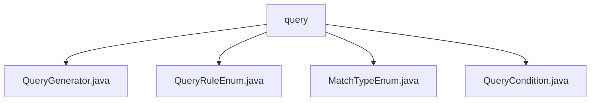

# 基础信息

|      |      |
|------|------|
| 名称 | query |
| 编码语言 | .java |
| 代码路径 | JeecgBoot/jeecg-boot/jeecg-boot-base-core/src/main/java/org/jeecg/common/system/query |
| 包名 | JeecgBoot.jeecg-boot.jeecg-boot-base-core.src.main.java.org.jeecg.common.system.query |
| 概述说明 | QueryGenerator类支持多种查询功能，处理特殊字符和自定义规则，QueryCondition类封装查询条件，灵活易维护。 |

# 说明

## 概述
该代码模块主要围绕MyBatis Plus查询条件的生成和处理展开，提供了多种查询功能的支持。核心类包括`QueryGenerator`、`QueryCondition`等，分别负责查询条件的生成和封装。通过这些类，开发者可以灵活地构建复杂的查询条件，并支持区间查询、模糊查询、高级查询以及排序操作。此外，模块还提供了对特殊字符的处理和自定义查询规则的支持，确保了查询条件的准确性和灵活性。

## 主要业务场景
1. **查询条件生成**：`QueryGenerator`类用于生成MyBatis Plus的查询条件，支持区间查询、模糊查询、高级查询等常见查询需求。
2. **查询条件封装**：`QueryCondition`类用于封装查询条件，包含字段、类型、数据库类型、规则和值等关键属性，使得查询条件的处理更加灵活和易于维护。
3. **特殊字符处理**：模块能够有效处理查询条件中的特殊字符，确保查询的准确性和安全性。
4. **自定义查询规则**：支持开发者根据业务需求自定义查询规则，进一步增强了查询的灵活性和适应性。
5. **排序操作**：模块支持对查询结果进行排序操作，满足不同场景下的排序需求。

### 包内部结构视图

该流程图展示了JeecgBoot项目中`query`目录下的文件结构。`query`作为根节点，包含了四个文件：`QueryGenerator.java`、`QueryRuleEnum.java`、`MatchTypeEnum.java`和`QueryCondition.java`。这些文件都与系统查询功能相关，用于生成查询条件、定义查询规则和匹配类型。

# 文件列表 File List

| 名称   | 类型  | 说明 |
|-------|------|-------------|
| [MatchTypeEnum.java](MatchTypeEnum.md) | file | 无内容提供，无法生成概要描述。 |
| [QueryRuleEnum.java](QueryRuleEnum.md) | file | 信息为空，无法生成概要描述。 |
| [QueryCondition.java](QueryCondition.md) | file | QueryCondition类包含字段、类型、数据库类型、规则和值，提供构造方法和getter/setter。 |
| [QueryGenerator.java](QueryGenerator.md) | file | QueryGenerator类生成MyBatis Plus查询条件，支持多种查询方式和特殊字符处理。 |

