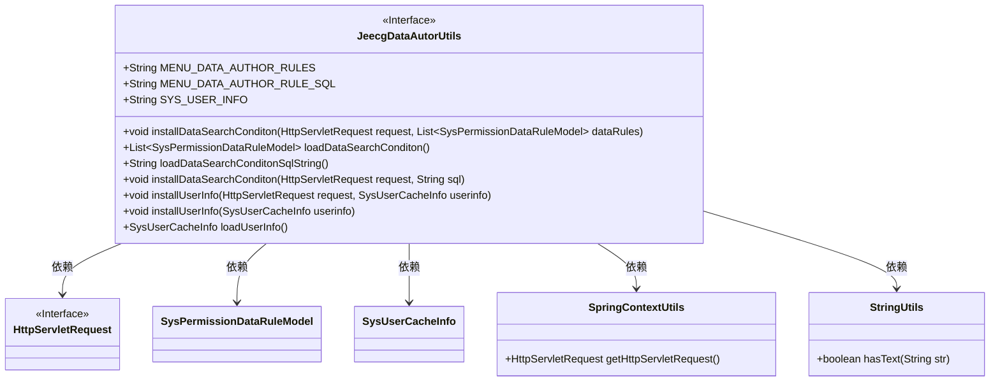

# 基础信息

|      |      |
|------|------|
| 名称 | JeecgDataAutorUtils |
| 编码语言 | .java |
| 代码路径 | JeecgBoot/jeecg-boot/jeecg-boot-base-core/src/main/java/org/jeecg/common/system/util/JeecgDataAutorUtils.java |
| 包名 | org.jeecg.common.system.util |
| 依赖项 | ['org.jeecg.common.system.vo.SysPermissionDataRuleModel', 'org.jeecg.common.system.vo.SysUserCacheInfo', 'org.jeecg.common.util.SpringContextUtils', 'org.springframework.util.StringUtils', 'javax.servlet.http.HttpServletRequest', 'java.util.ArrayList', 'java.util.List'] |
| 概述说明 | JeecgDataAutorUtils类管理数据权限和用户信息，支持查询、SQL规则及增删查操作。 |

# 说明

JeecgDataAutorUtils类是一个用于管理数据权限和用户信息的工具类，主要功能包括处理查询条件、SQL规则以及用户信息的增删查操作。该类支持对用户信息进行全面的管理，确保数据权限的有效控制，同时提供灵活的查询和SQL规则处理能力，适用于需要精细权限管理的应用场景。

# 类列表 Class Summary

| 名称   | 类型  | 说明 |
|-------|------|-------------|
| JeecgDataAutorUtils | class | JeecgDataAutorUtils类提供数据权限和用户信息管理功能，支持查询条件、SQL规则和用户信息的增删查操作。 |

## 类 JeecgDataAutorUtils

|      |      |
|------|------|
| 访问范围 | public |
| 类型 | class |
| 名称 | JeecgDataAutorUtils |
| 说明 | JeecgDataAutorUtils类提供数据权限和用户信息管理功能，支持查询条件、SQL规则和用户信息的增删查操作。 |

### UML类图

这段代码定义了一个名为 `JeecgDataAutorUtils` 的工具类，主要用于处理与数据权限相关的操作。该类通过 `HttpServletRequest` 对象在请求中存储和获取数据权限规则、SQL 查询条件以及用户信息。代码中使用了多个静态方法来实现这些功能，并且通过 `SpringContextUtils` 获取当前的 `HttpServletRequest` 对象。`StringUtils` 类用于检查字符串是否为空。整体设计简洁，功能明确，适用于在 Web 应用中管理数据权限和用户信息。

### 内部方法调用关系图

```mermaid
graph TD
    A["类JeecgDataAutorUtils"]
    B["常量: MENU_DATA_AUTHOR_RULES"]
    C["常量: MENU_DATA_AUTHOR_RULE_SQL"]
    D["常量: SYS_USER_INFO"]
    E["方法: installDataSearchConditon(HttpServletRequest request, List<SysPermissionDataRuleModel> dataRules)"]
    F["方法: loadDataSearchConditon()"]
    G["方法: loadDataSearchConditonSqlString()"]
    H["方法: installDataSearchConditon(HttpServletRequest request, String sql)"]
    I["方法: installUserInfo(HttpServletRequest request, SysUserCacheInfo userinfo)"]
    J["方法: installUserInfo(SysUserCacheInfo userinfo)"]
    K["方法: loadUserInfo()"]

    A --> B
    A --> C
    A --> D
    A --> E
    A --> F
    A --> G
    A --> H
    A --> I
    A --> J
    A --> K

    E --> F
    E -->|"如果list为空"| L["new ArrayList<SysPermissionDataRuleModel>()"]
    E -->|"遍历dataRules"| M["list.add(tsDataRule)"]
    E --> N["request.setAttribute(MENU_DATA_AUTHOR_RULES, list)"]
    F --> O["SpringContextUtils.getHttpServletRequest().getAttribute(MENU_DATA_AUTHOR_RULES)"]
    G --> P["SpringContextUtils.getHttpServletRequest().getAttribute(MENU_DATA_AUTHOR_RULE_SQL)"]
    H --> Q["loadDataSearchConditonSqlString()"]
    H -->|"如果ruleSql为空"| R["request.setAttribute(MENU_DATA_AUTHOR_RULE_SQL, sql)"]
    I --> S["request.setAttribute(SYS_USER_INFO, userinfo)"]
    J --> T["SpringContextUtils.getHttpServletRequest().setAttribute(SYS_USER_INFO, userinfo)"]
    K --> U["SpringContextUtils.getHttpServletRequest().getAttribute(SYS_USER_INFO)"]
```

这段代码定义了一个名为 `JeecgDataAutorUtils` 的工具类，主要用于处理与数据权限相关的操作。类中包含多个静态同步方法，用于在 `HttpServletRequest` 中设置和获取数据权限规则、SQL查询条件以及用户信息。这些方法通过 `SpringContextUtils` 获取当前的 `HttpServletRequest` 对象，并在其中存储或检索相关属性。代码通过常量定义了属性名称，确保了代码的一致性和可维护性。

### 字段列表 Field List

| 名称  | 类型  | 说明 |
|-------|-------|------|
| SYS_USER_INFO = "SYS_USER_INFO" | String | 系统用户信息常量定义为"SYS_USER_INFO"。 |
| MENU_DATA_AUTHOR_RULES = "MENU_DATA_AUTHOR_RULES" | String | 常量MENU_DATA_AUTHOR_RULES定义为字符串"MENU_DATA_AUTHOR_RULES"。 |
| MENU_DATA_AUTHOR_RULE_SQL = "MENU_DATA_AUTHOR_RULE_SQL" | String | 定义了常量MENU_DATA_AUTHOR_RULE_SQL，值为字符串本身。 |

### 方法列表 Method List

| 名称  | 类型  | 说明 |
|-------|-------|------|
| installUserInfo | void | 静态同步方法安装用户信息到请求属性中。 |
| installUserInfo | void | 静态同步方法安装用户信息到HTTP请求属性中。 |
| loadUserInfo | SysUserCacheInfo | 静态同步方法加载用户缓存信息。 |
| loadDataSearchConditon | List<SysPermissionDataRuleModel> | 同步方法加载数据搜索条件并返回权限规则列表。 |
| loadDataSearchConditonSqlString | String | 静态同步方法返回HTTP请求中存储的SQL字符串。 |
| installDataSearchConditon | void | 静态同步方法安装数据搜索条件，若规则SQL为空则设置请求属性。 |
| installDataSearchConditon | void | 从请求获取数据规则列表，不存在则新建，增量添加规则后存入请求属性。 |

