# 基础信息

|      |      |
|------|------|
| 名称 | JwtUtil |
| 编码语言 | .java |
| 代码路径 | JeecgBoot/jeecg-boot/jeecg-boot-base-core/src/main/java/org/jeecg/common/system/util/JwtUtil.java |
| 包名 | org.jeecg.common.system.util |
| 依赖项 | ['com.auth0.jwt.JWT', 'com.auth0.jwt.JWTVerifier', 'com.auth0.jwt.algorithms.Algorithm', 'com.auth0.jwt.exceptions.JWTDecodeException', 'com.auth0.jwt.interfaces.DecodedJWT', 'com.fasterxml.jackson.databind.ObjectMapper', 'java.io.IOException', 'java.io.OutputStream', 'java.util.Date', 'java.util.Objects', 'java.util.stream.Collectors', 'javax.servlet.ServletResponse', 'javax.servlet.http.HttpServletRequest', 'javax.servlet.http.HttpServletResponse', 'javax.servlet.http.HttpSession', 'lombok.extern.slf4j.Slf4j', 'org.apache.shiro.SecurityUtils', 'org.jeecg.common.api.vo.Result', 'org.jeecg.common.constant.CommonConstant', 'org.jeecg.common.constant.DataBaseConstant', 'org.jeecg.common.constant.SymbolConstant', 'org.jeecg.common.constant.TenantConstant', 'org.jeecg.common.exception.JeecgBootException', 'org.jeecg.common.system.vo.LoginUser', 'org.jeecg.common.system.vo.SysUserCacheInfo', 'org.jeecg.common.util.DateUtils', 'org.jeecg.common.util.SpringContextUtils', 'org.jeecg.common.util.oConvertUtils'] |
| 概述说明 | JwtUtil类实现JWT生成、验证、用户信息获取及错误处理功能。 |

# 说明

JwtUtil类是一个功能全面的工具类，专门用于处理JSON Web Token（JWT）的相关操作。它提供了JWT的生成功能，能够根据用户信息创建有效的JWT令牌。同时，该类还具备JWT的验证功能，可以验证传入的JWT令牌是否有效且未被篡改。此外，JwtUtil类还支持从JWT令牌中提取用户信息，便于在系统中识别用户身份。为了确保系统的健壮性，该类还集成了错误响应处理机制，能够在JWT生成或验证过程中出现错误时，提供适当的错误提示和处理策略。这些功能使得JwtUtil类在处理身份验证和授权相关任务时，成为一个高效且可靠的解决方案。

# 类列表 Class Summary

| 名称   | 类型  | 说明 |
|-------|------|-------------|
| JwtUtil | class | JwtUtil类提供JWT生成、验证、用户信息获取及错误响应处理功能。 |

## 类 JwtUtil

|      |      |
|------|------|
| 访问范围 | @Slf4j;public |
| 类型 | class |
| 名称 | JwtUtil |
| 说明 | JwtUtil类提供JWT生成、验证、用户信息获取及错误响应处理功能。 |

### UML类图

```mermaid
classDiagram
    class JwtUtil {
        <<Utility>>
        +long EXPIRE_TIME
        +String WELL_NUMBER
        +responseError(ServletResponse response, Integer code, String errorMsg)
        +verify(String token, String username, String secret) boolean
        +getUsername(String token) String
        +sign(String username, String secret) String
        +getUserNameByToken(HttpServletRequest request) String
        +getSessionData(String key) String
        +getUserSystemData(String key, SysUserCacheInfo user) String
    }

    class ServletResponse {
        <<Interface>>
    }

    class HttpServletResponse {
        <<Interface>>
    }

    class Result {
        +Integer code
        +String errorMsg
        +boolean success
        +setSuccess(boolean success)
    }

    class ObjectMapper {
        +writeValueAsString(Object obj) String
    }

    class Algorithm {
        <<Interface>>
        +HMAC256(String secret) Algorithm
    }

    class JWTVerifier {
        <<Interface>>
        +verify(String token) DecodedJWT
    }

    class DecodedJWT {
        <<Interface>>
        +getClaim(String claimName) Claim
    }

    class Claim {
        <<Interface>>
        +asString() String
    }

    class JWT {
        <<Interface>>
        +require(Algorithm algorithm) JWTVerifier
        +create() JWT
        +withClaim(String claimName, String claimValue) JWT
        +withExpiresAt(Date date) JWT
        +sign(Algorithm algorithm) String
    }

    class HttpServletRequest {
        <<Interface>>
        +getHeader(String name) String
    }

    class JeecgBootException {
        <<Exception>>
    }

    class HttpSession {
        <<Interface>>
        +getAttribute(String name) Object
    }

    class SpringContextUtils {
        +getHttpServletRequest() HttpServletRequest
    }

    class SysUserCacheInfo {
        +String sysUserCode
        +String sysUserId
        +String sysUserName
        +String sysOrgCode
        +String sysOrgId
        +List~String~ sysMultiOrgCode
        +String sysRoleCode
        +boolean isOneDepart()
    }

    class LoginUser {
        +String username
        +String id
        +String realname
        +String orgCode
        +String orgId
        +String roleCode
    }

    class SecurityUtils {
        +getSubject() Subject
    }

    class Subject {
        <<Interface>>
        +getPrincipal() Object
    }

    class DataBaseConstant {
        <<Constant>>
        +String SYS_DATE
        +String SYS_TIME
        +String BPM_STATUS
        +String SYS_USER_CODE
        +String SYS_USER_ID
        +String SYS_USER_NAME
        +String SYS_ORG_CODE
        +String SYS_ORG_ID
        +String SYS_MULTI_ORG_CODE
        +String SYS_ROLE_CODE
    }

    class TenantConstant {
        <<Constant>>
        +String TENANT_ID
    }

    class CommonConstant {
        <<Constant>>
        +String TENANT_ID
    }

    class DateUtils {
        +formatDate() String
        +now() String
    }

    JwtUtil --> ServletResponse : 依赖
    JwtUtil --> HttpServletResponse : 依赖
    JwtUtil --> Result : 依赖
    JwtUtil --> ObjectMapper : 依赖
    JwtUtil --> Algorithm : 依赖
    JwtUtil --> JWTVerifier : 依赖
    JwtUtil --> DecodedJWT : 依赖
    JwtUtil --> Claim : 依赖
    JwtUtil --> JWT : 依赖
    JwtUtil --> HttpServletRequest : 依赖
    JwtUtil --> JeecgBootException : 依赖
    JwtUtil --> HttpSession : 依赖
    JwtUtil --> SpringContextUtils : 依赖
    JwtUtil --> SysUserCacheInfo : 依赖
    JwtUtil --> LoginUser : 依赖
    JwtUtil --> SecurityUtils : 依赖
    JwtUtil --> DataBaseConstant : 依赖
    JwtUtil --> TenantConstant : 依赖
    JwtUtil --> CommonConstant : 依赖
    JwtUtil --> DateUtils : 依赖
```

**类图描述：**

`JwtUtil` 是一个工具类，主要用于处理 JWT（JSON Web Token）的生成、验证和解析。它提供了多个静态方法，如 `verify` 用于验证 token 的有效性，`sign` 用于生成新的 token，`getUsername` 用于从 token 中提取用户名等。此外，`JwtUtil` 还包含处理 HTTP 请求和响应的方法，如 `responseError` 用于返回错误信息，`getUserNameByToken` 用于从请求中获取用户名。该类依赖于多个接口和常量类，如 `HttpServletRequest`、`HttpServletResponse`、`DataBaseConstant` 等，以实现其功能。

### 内部方法调用关系图

该流程图展示了`JwtUtil`类的主要方法和内部逻辑。`JwtUtil`类用于处理JWT（JSON Web Token）的生成、验证和解析，以及从请求中获取用户信息。每个方法都有详细的步骤，包括异常处理和日志记录。流程图清晰地展示了各个方法之间的调用关系和内部逻辑，便于理解代码的执行流程。

### 字段列表 Field List

| 名称  | 类型  | 说明 |
|-------|-------|------|
| EXPIRE_TIME = (7 * 12) * 60 * 60 * 1000 | long | 常量EXPIRE_TIME定义为7天12小时的毫秒值。 |
| WELL_NUMBER = SymbolConstant.WELL_NUMBER + SymbolConstant.LEFT_CURLY_BRACKET | String | 定义静态常量WELL_NUMBER，值为SymbolConstant.WELL_NUMBER加左花括号。 |

### 方法列表 Method List

| 名称  | 类型  | 说明 |
|-------|-------|------|
| getSessionData | String | 获取会话数据，处理键值并返回结果。 |
| sign | String | 使用HMAC256算法生成带用户名和过期时间的JWT签名。 |
| verify | boolean | 验证JWT令牌有效性，基于用户名和密钥。 |
| responseError | void | 方法responseError处理HTTP错误响应，设置UTF-8编码，返回JSON格式错误信息。 |
| getUsername | String | 从JWT令牌中提取用户名，解码失败返回null。 |
| getUserNameByToken | String | 通过请求头获取令牌并返回用户名，若为空则抛出异常。 |
| getUserSystemData | String | 方法获取用户系统数据，处理异常，替换特定键值为用户信息或系统时间。 |

