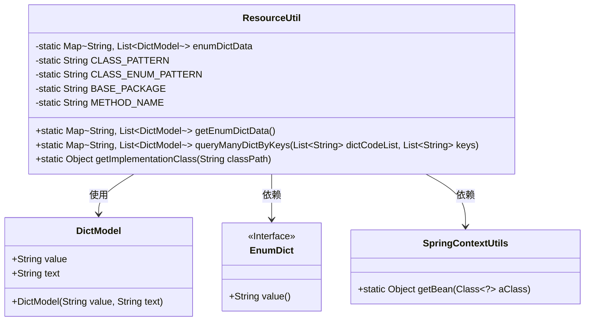
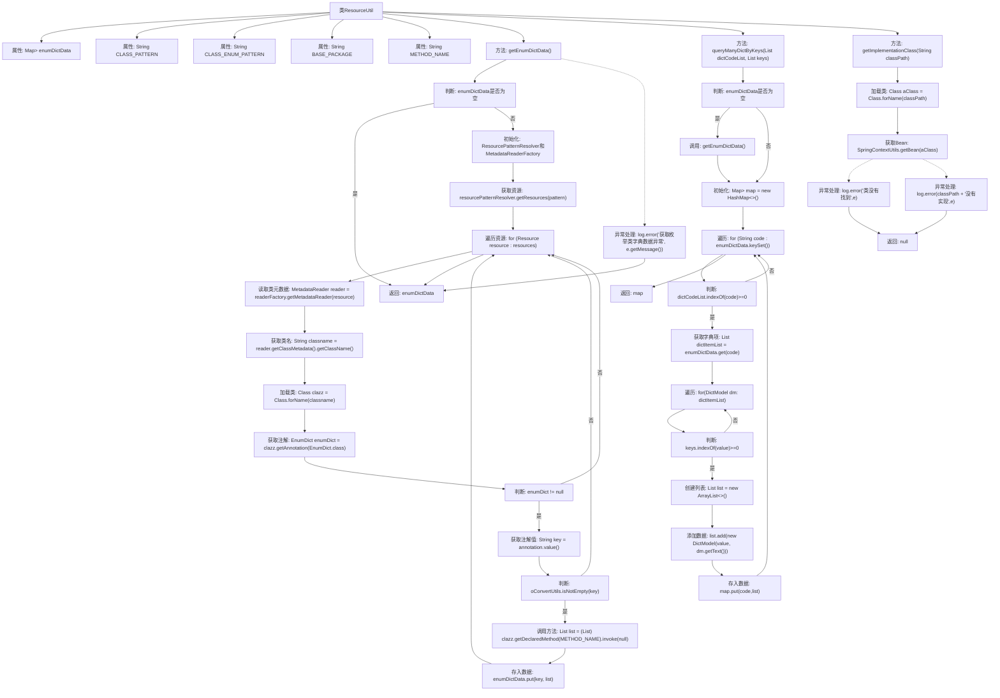

# 基础信息

|      |      |
|------|------|
| 名称 | ResourceUtil |
| 编码语言 | .java |
| 代码路径 | JeecgBoot/jeecg-boot/jeecg-boot-base-core/src/main/java/org/jeecg/common/system/util/ResourceUtil.java |
| 包名 | org.jeecg.common.system.util |
| 依赖项 | ['lombok.extern.slf4j.Slf4j', 'org.jeecg.common.system.annotation.EnumDict', 'org.jeecg.common.system.vo.DictModel', 'org.jeecg.common.util.SpringContextUtils', 'org.jeecg.common.util.oConvertUtils', 'org.springframework.beans.factory.NoSuchBeanDefinitionException', 'org.springframework.core.io.Resource', 'org.springframework.core.io.support.PathMatchingResourcePatternResolver', 'org.springframework.core.io.support.ResourcePatternResolver', 'org.springframework.core.type.classreading.CachingMetadataReaderFactory', 'org.springframework.core.type.classreading.MetadataReader', 'org.springframework.core.type.classreading.MetadataReaderFactory', 'org.springframework.util.ClassUtils', 'java.util.ArrayList', 'java.util.HashMap', 'java.util.List', 'java.util.Map'] |
| 概述说明 | ResourceUtil类用于获取枚举类字典数据，支持翻译和实现类获取。 |

# 说明

ResourceUtil类是一个用于处理枚举类字典数据的工具类，主要功能包括获取枚举类字典数据、支持字典翻译以及获取实现类。通过该类，用户可以方便地管理和操作枚举类相关的字典信息，实现数据的快速检索和翻译功能，同时还能获取具体的实现类，提升代码的灵活性和可维护性。

# 类列表 Class Summary

| 名称   | 类型  | 说明 |
|-------|------|-------------|
| ResourceUtil | class | ResourceUtil类用于获取枚举类字典数据，支持字典翻译和获取实现类。 |

## 类 ResourceUtil

|      |      |
|------|------|
| 访问范围 | @Slf4j;public |
| 类型 | class |
| 名称 | ResourceUtil |
| 说明 | ResourceUtil类用于获取枚举类字典数据，支持字典翻译和获取实现类。 |

### UML类图

这段代码定义了一个 `ResourceUtil` 类，主要用于处理枚举类的字典数据。`ResourceUtil` 类通过扫描指定包路径下的枚举类，获取带有 `EnumDict` 注解的类，并调用其 `getDictList` 方法获取字典数据。此外，`ResourceUtil` 还提供了根据字典代码和键值查询字典数据的功能，以及通过类路径获取实现类的功能。`DictModel` 类用于存储字典数据，`EnumDict` 是一个接口，用于标记枚举类，`SpringContextUtils` 类用于从 Spring 上下文中获取 Bean。

### 内部方法调用关系图

这段代码的流程图描述了`ResourceUtil`类的主要功能。该类主要用于获取枚举类的字典数据，并根据字典代码和键值查询字典项。流程从判断`enumDictData`是否为空开始，若为空则初始化资源解析器和元数据读取器，遍历资源文件，加载类并获取注解，最终将字典数据存入`enumDictData`中。查询方法则通过遍历`enumDictData`，根据提供的字典代码和键值筛选出对应的字典项并返回。获取实现类的方法则尝试加载类并获取Spring Bean，若失败则记录错误并返回`null`。

### 字段列表 Field List

| 名称  | 类型  | 说明 |
|-------|-------|------|
| CLASS_ENUM_PATTERN="/**/*Enum.class" | String | 私有静态常量定义枚举类文件路径模式。 |
| enumDictData = new HashMap<>(5) | Map<String, List<DictModel>> | 定义静态私有Map变量enumDictData，初始容量为5。 |
| BASE_PACKAGE = "org.jeecg" | String | 定义私有静态常量BASE_PACKAGE，值为"org.jeecg"。 |
| METHOD_NAME = "getDictList" | String | 定义私有静态常量字符串METHOD_NAME，值为"getDictList"。 |
| CLASS_PATTERN="/**/*.class" | String | 定义静态常量CLASS_PATTERN，值为"/**/*.class"。 |

### 方法列表 Method List

| 名称  | 类型  | 说明 |
|-------|-------|------|
| getImplementationClass | Object | 通过类路径获取Spring Bean实现类，处理异常并记录错误。 |
| queryManyDictByKeys | Map<String, List<DictModel>> | 根据字典代码和键值查询并返回匹配的字典项列表。 |
| getEnumDictData | Map<String, List<DictModel>> | 获取枚举类字典数据，若缓存存在则返回，否则扫描并加载枚举类数据。 |

