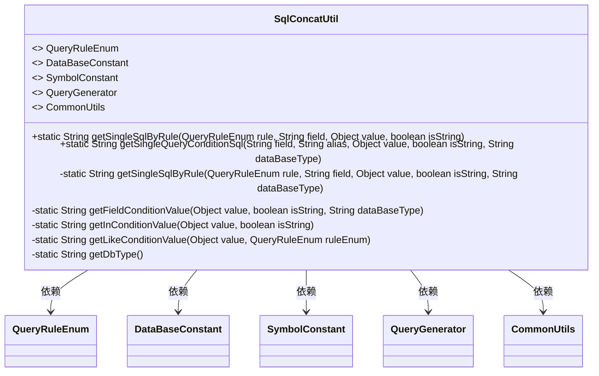
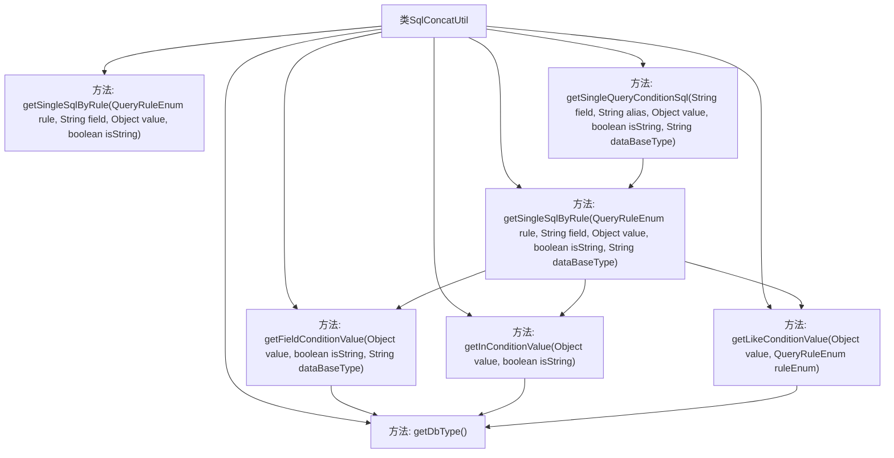

# 基础信息

|      |      |
|------|------|
| 名称 | SqlConcatUtil |
| 编码语言 | .java |
| 代码路径 | JeecgBoot/jeecg-boot/jeecg-boot-base-core/src/main/java/org/jeecg/common/system/util/SqlConcatUtil.java |
| 包名 | org.jeecg.common.system.util |
| 依赖项 | ['lombok.extern.slf4j.Slf4j', 'org.jeecg.common.constant.DataBaseConstant', 'org.jeecg.common.constant.SymbolConstant', 'org.jeecg.common.system.query.QueryGenerator', 'org.jeecg.common.system.query.QueryRuleEnum', 'org.jeecg.common.util.CommonUtils', 'org.jeecg.common.util.oConvertUtils', 'java.util.ArrayList', 'java.util.List'] |
| 概述说明 | SqlConcatUtil类用于生成SQL查询条件，支持多种规则和数据源类型。 |

# 说明

SqlConcatUtil类是一个用于生成SQL查询条件的工具类，具备处理多种规则和数据源类型的能力。它能够根据不同的输入条件和数据源，灵活地构建出符合需求的SQL查询语句，从而简化开发者在数据库操作中的查询条件生成过程。该类设计旨在提高代码的可维护性和可扩展性，适用于各种复杂的查询场景。

# 类列表 Class Summary

| 名称   | 类型  | 说明 |
|-------|------|-------------|
| SqlConcatUtil | class | SqlConcatUtil类用于生成SQL查询条件，支持多种规则和数据源类型。 |

## 类 SqlConcatUtil

|      |      |
|------|------|
| 访问范围 | @Slf4j;public |
| 类型 | class |
| 名称 | SqlConcatUtil |
| 说明 | SqlConcatUtil类用于生成SQL查询条件，支持多种规则和数据源类型。 |

### UML类图

这段代码定义了一个 `SqlConcatUtil` 工具类，主要用于生成SQL查询条件。它包含多个静态方法，用于处理不同类型的查询规则（如等于、大于、小于、模糊查询等），并根据数据库类型（如SQL Server）生成相应的SQL条件字符串。类中使用了多个枚举和常量接口来辅助处理逻辑，确保生成的SQL语句符合不同数据库的语法要求。

### 内部方法调用关系图

这段代码展示了`SqlConcatUtil`类的结构及其内部方法之间的调用关系。`SqlConcatUtil`类主要用于生成SQL查询条件，包含了多个静态方法，如`getSingleSqlByRule`、`getSingleQueryConditionSql`等。这些方法相互调用，根据不同的查询规则和数据类型生成相应的SQL条件语句。流程图清晰地展示了各个方法之间的调用路径，帮助理解代码的逻辑结构。

### 字段列表 Field List

| 名称  | 类型  | 说明 |
|-------|-------|------|

### 方法列表 Method List

| 名称  | 类型  | 说明 |
|-------|-------|------|
| getSingleSqlByRule | String | 静态方法生成基于规则的SQL查询字符串。 |
| getLikeConditionValue | String | 根据数据库类型和查询规则生成模糊查询条件字符串。 |
| getSingleQueryConditionSql | String | 生成SQL查询条件，处理字段别名、类型转换及空值判断。 |
| getInConditionValue | String | 方法处理查询条件值，根据类型生成SQL安全字符串。 |
| getFieldConditionValue | String | 方法处理字段条件值，根据前缀和数据库类型调整字符串格式并返回。 |
| getDbType | String | 获取数据库类型的私有静态方法。 |
| getSingleSqlByRule | String | 根据规则生成SQL条件语句，支持多种比较和匹配操作。 |

