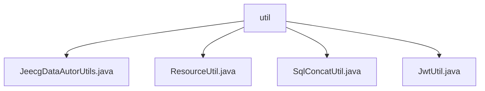

# 基础信息

|      |      |
|------|------|
| 名称 | util |
| 编码语言 | .java |
| 代码路径 | JeecgBoot/jeecg-boot/jeecg-boot-base-core/src/main/java/org/jeecg/common/system/util |
| 包名 | JeecgBoot.jeecg-boot.jeecg-boot-base-core.src.main.java.org.jeecg.common.system.util |
| 概述说明 | Jeecg工具类集，包括数据权限管理、枚举字典处理、SQL条件生成及JWT操作功能。 |

# 说明

## 概述
该代码模块主要包含一系列工具类，用于处理数据权限管理、枚举类字典数据操作、SQL查询条件生成以及JWT令牌的生成与验证。这些工具类旨在提高系统的灵活性、可维护性和安全性，适用于需要精细权限管理、复杂查询场景以及身份验证和授权的应用。

## 主要业务场景
1. **数据权限管理**：`JeecgDataAutorUtils`类用于处理数据权限和用户信息的管理，确保在查询和操作数据时，能够有效控制用户的访问权限，适用于需要精细权限管理的应用场景。
2. **枚举类字典数据处理**：`ResourceUtil`类用于管理和操作枚举类相关的字典信息，支持字典翻译和实现类的获取，适用于需要快速检索和翻译字典数据的场景。
3. **SQL查询条件生成**：`SqlConcatUtil`类用于根据不同的输入条件和数据源，灵活生成SQL查询语句，简化数据库操作中的查询条件生成过程，适用于各种复杂的查询场景。
4. **JWT令牌处理**：`JwtUtil`类用于生成、验证和提取JWT令牌，支持身份验证和授权相关的任务，适用于需要高效且可靠的身份验证和授权机制的系统。

### 包内部结构视图

该流程图展示了`util`文件夹与其内部文件之间的层级关系。`util`作为根节点，包含了四个子节点，分别是`JeecgDataAutorUtils.java`、`ResourceUtil.java`、`SqlConcatUtil.java`和`JwtUtil.java`。这些文件均位于`util`文件夹下，且没有进一步的子文件夹结构。

# 文件列表 File List

| 名称   | 类型  | 说明 |
|-------|------|-------------|
| [JwtUtil.java](JwtUtil.md) | file | JwtUtil类实现JWT生成、验证、用户信息获取及错误处理功能。 |
| [SqlConcatUtil.java](SqlConcatUtil.md) | file | SqlConcatUtil类用于生成SQL查询条件，支持多种规则和数据源类型。 |
| [ResourceUtil.java](ResourceUtil.md) | file | ResourceUtil类用于获取枚举类字典数据，支持翻译和实现类获取。 |
| [JeecgDataAutorUtils.java](JeecgDataAutorUtils.md) | file | JeecgDataAutorUtils类管理数据权限和用户信息，支持查询、SQL规则及增删查操作。 |

