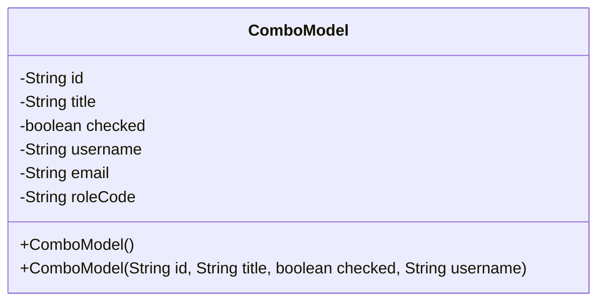
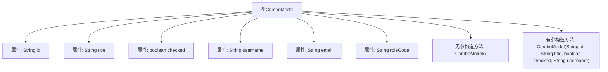

# 基础信息

|      |      |
|------|------|
| 名称 | ComboModel |
| 编码语言 | .java |
| 代码路径 | JeecgBoot/jeecg-boot/jeecg-boot-base-core/src/main/java/org/jeecg/common/system/vo/ComboModel.java |
| 包名 | org.jeecg.common.system.vo |
| 依赖项 | ['com.fasterxml.jackson.annotation.JsonIgnoreProperties', 'lombok.Data', 'lombok.EqualsAndHashCode', 'lombok.experimental.Accessors', 'java.io.Serializable'] |
| 概述说明 | ComboModel类含ID、标题、状态、用户名、邮箱和角色编码字段。 |

# 说明

ComboModel类是一个包含多个字段的模型类，用于存储和管理相关数据。该类包括ID字段，用于唯一标识每个实例；标题字段，用于描述或命名该实例；选中状态字段，用于表示该实例是否被选中；用户名字段，用于存储与该实例关联的用户名；邮箱字段，用于存储与该实例关联的电子邮件地址；角色编码字段，用于标识或分类该实例的角色或权限。这些字段共同构成了ComboModel类的基本数据结构，便于在应用程序中进行数据操作和管理。

# 类列表 Class Summary

| 名称   | 类型  | 说明 |
|-------|------|-------------|
| ComboModel | class | ComboModel类包含ID、标题、选中状态、用户名、邮箱和角色编码字段。 |

## 类 ComboModel

|      |      |
|------|------|
| 访问范围 | @Data;@EqualsAndHashCode(callSuper = false);@Accessors(chain = true);@JsonIgnoreProperties(ignoreUnknown = true);public |
| 类型 | class |
| 名称 | ComboModel |
| 说明 | ComboModel类包含ID、标题、选中状态、用户名、邮箱和角色编码字段。 |

### UML类图

**描述：**  
`ComboModel` 类是一个实现了 `Serializable` 接口的 Java 类，用于表示一个组合模型。它包含多个私有字段，如 `id`、`title`、`checked`、`username`、`email` 和 `roleCode`，分别用于存储模型的唯一标识、标题、选中状态、用户名、用户邮箱和角色编码。类中提供了两个构造函数，一个无参构造函数和一个带有 `id`、`title`、`checked` 和 `username` 参数的构造函数，用于初始化对象。该类主要用于文档管理中的表单表格数据存储和处理。

### 内部方法调用关系图

**描述：**
该代码定义了一个名为 `ComboModel` 的类，该类实现了 `Serializable` 接口，表示该类可以被序列化。类中包含多个属性，如 `id`、`title`、`checked`、`username`、`email` 和 `roleCode`，分别用于存储不同的数据。类中定义了两个构造方法，一个无参构造方法用于创建默认对象，另一个有参构造方法用于初始化部分属性。该类通过注解 `@Data`、`@EqualsAndHashCode`、`@Accessors` 和 `@JsonIgnoreProperties` 提供了自动生成的方法和序列化控制。

### 字段列表 Field List

| 名称  | 类型  | 说明 |
|-------|-------|------|
| title | String | 定义了一个私有的字符串类型变量title。 |
| email | String | 定义私有字符串类型变量email。 |
| checked | boolean | 定义了一个私有的布尔类型变量checked。 |
| id | String | 定义了一个私有的字符串类型变量id。 |
| roleCode | String | 定义私有字符串变量roleCode。 |
| username | String | 定义了一个私有的字符串类型变量username。 |

### 方法列表 Method List

| 名称  | 类型  | 说明 |
|-------|-------|------|

