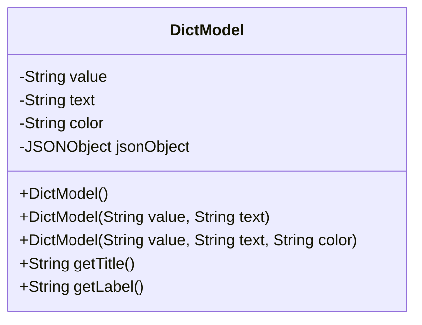
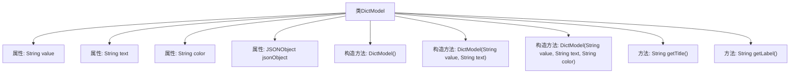

# 基础信息

|      |      |
|------|------|
| 名称 | DictModel |
| 编码语言 | .java |
| 代码路径 | JeecgBoot/jeecg-boot/jeecg-boot-base-core/src/main/java/org/jeecg/common/system/vo/DictModel.java |
| 包名 | org.jeecg.common.system.vo |
| 依赖项 | ['java.io.Serializable', 'com.alibaba.fastjson.JSONObject', 'com.fasterxml.jackson.annotation.JsonIgnoreProperties', 'lombok.Data', 'lombok.EqualsAndHashCode', 'lombok.experimental.Accessors'] |
| 概述说明 | DictModel类含value、text、color属性和getTitle、getLabel方法，支持序列化。 |

# 说明

DictModel类是一个支持序列化的数据结构，包含三个主要属性：value、text和color。value属性用于存储数据值，text属性用于存储文本描述，color属性用于存储颜色信息。此外，该类还提供了两个方法：getTitle用于获取标题信息，getLabel用于获取标签信息。这些属性和方法使得DictModel类能够灵活地处理和管理数据，同时支持序列化操作，便于数据的存储和传输。

# 类列表 Class Summary

| 名称   | 类型  | 说明 |
|-------|------|-------------|
| DictModel | class | DictModel类包含value、text、color属性和getTitle、getLabel方法，支持序列化。 |

## 类 DictModel

|      |      |
|------|------|
| 访问范围 | @Data;@EqualsAndHashCode(callSuper = false);@Accessors(chain = true);@JsonIgnoreProperties(ignoreUnknown = true);public |
| 类型 | class |
| 名称 | DictModel |
| 说明 | DictModel类包含value、text、color属性和getTitle、getLabel方法，支持序列化。 |

### UML类图

类图描述：`DictModel` 类是一个用于表示字典数据的模型类，包含 `value`、`text`、`color` 和 `jsonObject` 四个私有属性。该类提供了三个构造函数，分别用于初始化不同的属性组合。此外，`DictModel` 类还提供了 `getTitle` 和 `getLabel` 两个公有方法，用于获取字典文本，适用于不同的应用场景。

### 内部方法调用关系图

这段代码定义了一个名为 `DictModel` 的类，该类实现了 `Serializable` 接口，用于序列化对象。类中包含三个构造方法，分别用于初始化 `value`、`text` 和 `color` 属性。此外，类中还定义了两个方法 `getTitle` 和 `getLabel`，它们都返回 `text` 属性的值。类中还包含一个 `JSONObject` 类型的属性 `jsonObject`，用于存储表单设计器中的关联记录表数据。

### 字段列表 Field List

| 名称  | 类型  | 说明 |
|-------|-------|------|
| serialVersionUID = 1L | long | 声明序列化版本号为1L的私有静态常量。 |
| jsonObject | JSONObject | 私有JSON对象声明。 |
| value | String | 定义私有字符串变量value。 |
| color | String | 定义私有字符串变量color。 |
| text | String | 定义一个私有字符串变量`text`。 |

### 方法列表 Method List

| 名称  | 类型  | 说明 |
|-------|-------|------|
| getTitle | String | 获取当前对象的文本标题。 |
| getLabel | String | 该方法返回当前对象的文本标签。 |

