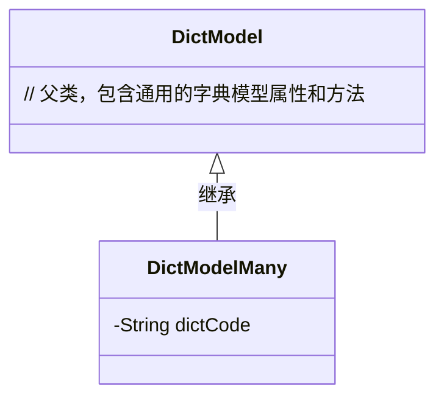
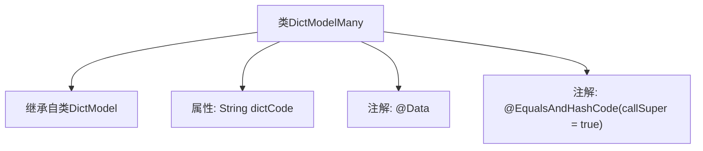

# 基础信息

|      |      |
|------|------|
| 名称 | DictModelMany |
| 编码语言 | .java |
| 代码路径 | JeecgBoot/jeecg-boot/jeecg-boot-base-core/src/main/java/org/jeecg/common/system/vo/DictModelMany.java |
| 包名 | org.jeecg.common.system.vo |
| 依赖项 | ['lombok.Data', 'lombok.EqualsAndHashCode'] |
| 概述说明 | DictModelMany继承DictModel，新增dictCode字段用于区分字典选项。 |

# 说明

DictModelMany类继承自DictModel类，并新增了一个名为dictCode的字段，该字段用于区分不同的字典选项。通过引入dictCode字段，DictModelMany能够更精确地管理和标识字典数据，从而提升数据处理的灵活性和准确性。

# 类列表 Class Summary

| 名称   | 类型  | 说明 |
|-------|------|-------------|
| DictModelMany | class | DictModelMany继承DictModel，包含用于区分字典选项的dictCode字段。 |

## 类 DictModelMany

|      |      |
|------|------|
| 访问范围 | @Data;@EqualsAndHashCode(callSuper = true);public |
| 类型 | class |
| 名称 | DictModelMany |
| 说明 | DictModelMany继承DictModel，包含用于区分字典选项的dictCode字段。 |

### UML类图

这段代码定义了一个名为 `DictModelMany` 的类，它继承自 `DictModel` 类。`DictModelMany` 类包含一个私有属性 `dictCode`，用于在根据多个字段 code 查询时区分不同的字典选项。类图中清晰地展示了 `DictModelMany` 与 `DictModel` 之间的继承关系，`DictModelMany` 继承了 `DictModel` 的所有属性和方法，并添加了新的属性 `dictCode`。

### 内部方法调用关系图

这段代码定义了一个名为`DictModelMany`的类，该类继承自`DictModel`，并包含一个私有属性`dictCode`，用于存储字典代码。类上使用了`@Data`和`@EqualsAndHashCode(callSuper = true)`注解，分别用于自动生成getter、setter、toString等方法，并确保在生成`equals`和`hashCode`方法时考虑父类的字段。

### 字段列表 Field List

| 名称  | 类型  | 说明 |
|-------|-------|------|
| dictCode | String | 私有字符串变量dictCode声明。 |

### 方法列表 Method List

| 名称  | 类型  | 说明 |
|-------|-------|------|

