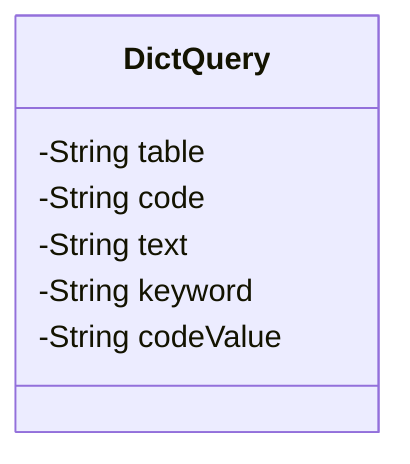
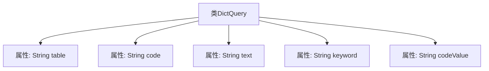

# 基础信息

|      |      |
|------|------|
| 名称 | DictQuery |
| 编码语言 | .java |
| 代码路径 | JeecgBoot/jeecg-boot/jeecg-boot-base-core/src/main/java/org/jeecg/common/system/vo/DictQuery.java |
| 包名 | org.jeecg.common.system.vo |
| 依赖项 | ['lombok.Data'] |
| 概述说明 | DictQuery类包含表名、存储列、显示列、关键字查询和存储列值。 |

# 说明

DictQuery类是一个用于数据查询的工具，主要包含五个关键属性。表名属性指定了查询的目标数据表。存储列属性定义了数据表中用于存储的列。显示列属性则指定了查询结果中需要展示的列。关键字查询属性用于根据特定关键词进行数据筛选。存储列值属性则用于存储查询结果中相应列的具体数值。通过这些属性，DictQuery类能够高效地管理和执行数据查询操作。

# 类列表 Class Summary

| 名称   | 类型  | 说明 |
|-------|------|-------------|
| DictQuery | class | DictQuery类包含表名、存储列、显示列、关键字查询和存储列值。 |

## 类 DictQuery

|      |      |
|------|------|
| 访问范围 | @Data;public |
| 类型 | class |
| 名称 | DictQuery |
| 说明 | DictQuery类包含表名、存储列、显示列、关键字查询和存储列值。 |

### UML类图

这段代码定义了一个名为 `DictQuery` 的类，用于封装字典查询的相关信息。类中包含五个私有成员变量：`table` 表示表名，`code` 表示存储列，`text` 表示显示列，`keyword` 表示关键字查询，`codeValue` 表示存储列的值，用于回显查询。这些成员变量都是私有的，意味着它们只能在类内部访问，外部代码需要通过公共方法（如果有的话）来获取或修改这些值。

### 内部方法调用关系图

这段代码定义了一个名为`DictQuery`的类，包含了五个私有属性：`table`、`code`、`text`、`keyword`和`codeValue`。这些属性分别用于存储表名、存储列、显示列、关键字查询以及存储列的值。代码使用了`@Data`注解，通常用于自动生成getter、setter、toString等方法，但代码中并未显式展示这些方法。流程图清晰地展示了类的结构及其属性之间的关系。

### 字段列表 Field List

| 名称  | 类型  | 说明 |
|-------|-------|------|
| table | String | 定义了一个私有字符串变量table。 |
| keyword | String | 定义私有字符串变量keyword。 |
| codeValue | String | 定义了一个私有字符串变量codeValue。 |
| code | String | 声明一个私有字符串变量code。 |
| text | String | 定义了一个私有字符串变量text。 |

### 方法列表 Method List

| 名称  | 类型  | 说明 |
|-------|-------|------|

