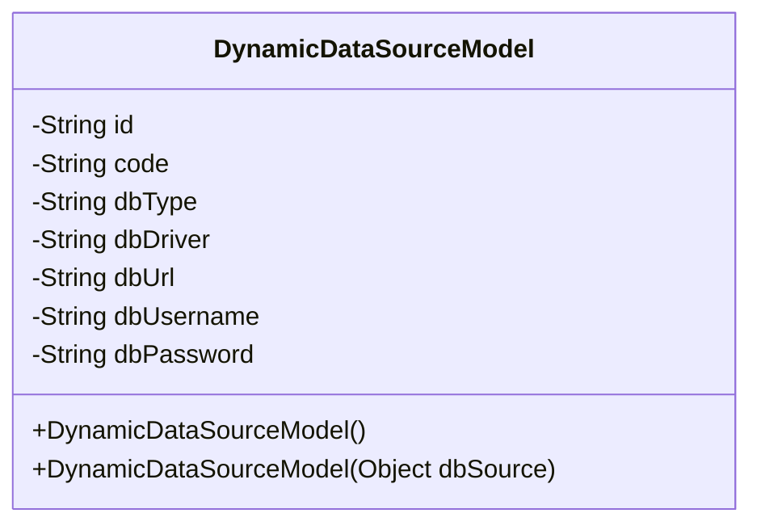
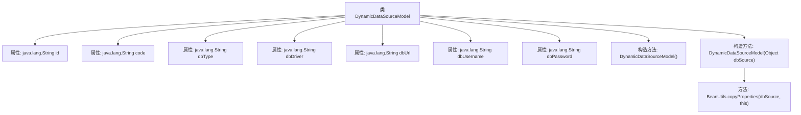

# 基础信息

|      |      |
|------|------|
| 名称 | DynamicDataSourceModel |
| 编码语言 | .java |
| 代码路径 | JeecgBoot/jeecg-boot/jeecg-boot-base-core/src/main/java/org/jeecg/common/system/vo/DynamicDataSourceModel.java |
| 包名 | org.jeecg.common.system.vo |
| 依赖项 | ['lombok.Data', 'org.springframework.beans.BeanUtils'] |
| 概述说明 | 动态数据源模型类包含ID、编码、类型、驱动、地址、用户名和密码属性。 |

# 说明

动态数据源模型类是一个用于管理数据源的类，包含多个关键属性。这些属性包括ID，用于唯一标识数据源；编码，用于表示数据源的特定标识符；类型，用于描述数据源的种类或分类；驱动，用于指定连接数据源所需的驱动程序；地址，用于表示数据源的连接位置或URL；用户名，用于认证访问数据源的用户身份；密码，用于保护数据源访问的安全性。这些属性共同构成了一个全面的数据源管理模型，便于在系统中动态配置和操作各种数据源。

# 类列表 Class Summary

| 名称   | 类型  | 说明 |
|-------|------|-------------|
| DynamicDataSourceModel | class | 动态数据源模型类，包含ID、编码、类型、驱动、地址、用户名和密码属性。 |

## 类 DynamicDataSourceModel

|      |      |
|------|------|
| 访问范围 | @Data;public |
| 类型 | class |
| 名称 | DynamicDataSourceModel |
| 说明 | 动态数据源模型类，包含ID、编码、类型、驱动、地址、用户名和密码属性。 |

### UML类图

这段代码定义了一个名为 `DynamicDataSourceModel` 的类，用于表示动态数据源的模型。类中包含多个私有属性，如 `id`、`code`、`dbType` 等，用于存储数据源的相关信息。类提供了两个构造函数：一个无参构造函数和一个接受 `Object` 类型参数的构造函数，后者在参数不为空时，使用 `BeanUtils.copyProperties` 方法将参数对象的属性复制到当前对象中。

### 内部方法调用关系图

这段代码定义了一个名为 `DynamicDataSourceModel` 的类，用于表示动态数据源的模型。该类包含多个属性，如 `id`、`code`、`dbType` 等，用于存储数据源的相关信息。类中提供了两个构造方法：一个无参构造方法 `DynamicDataSourceModel()` 和一个带参构造方法 `DynamicDataSourceModel(Object dbSource)`，后者在传入的 `dbSource` 不为空时，使用 `BeanUtils.copyProperties` 方法将 `dbSource` 的属性复制到当前对象中。该类的设计旨在简化数据源模型的创建和属性复制操作。

### 字段列表 Field List

| 名称  | 类型  | 说明 |
|-------|-------|------|
| dbPassword | java.lang.String | 私有字符串变量dbPassword用于存储数据库密码。 |
| dbType | java.lang.String | 私有字符串变量dbType，用于存储数据库类型。 |
| code | java.lang.String | 包含一个私有的Java字符串类型变量code。 |
| dbUsername | java.lang.String | 定义了一个私有的字符串类型变量dbUsername。 |
| id | java.lang.String | Java类中定义了一个私有的字符串类型变量id。 |
| dbDriver | java.lang.String | 私有字符串变量dbDriver，用于存储数据库驱动信息。 |
| dbUrl | java.lang.String | 私有字符串变量dbUrl，用于存储数据库URL。 |

### 方法列表 Method List

| 名称  | 类型  | 说明 |
|-------|-------|------|

