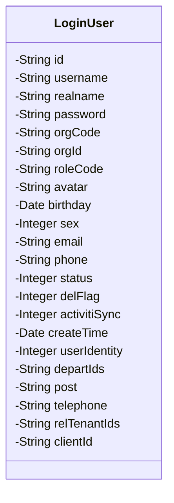

# 基础信息

|      |      |
|------|------|
| 名称 | LoginUser |
| 编码语言 | .java |
| 代码路径 | JeecgBoot/jeecg-boot/jeecg-boot-base-core/src/main/java/org/jeecg/common/system/vo/LoginUser.java |
| 包名 | org.jeecg.common.system.vo |
| 依赖项 | ['com.fasterxml.jackson.annotation.JsonFormat', 'lombok.Data', 'lombok.EqualsAndHashCode', 'lombok.experimental.Accessors', 'org.jeecg.common.desensitization.annotation.SensitiveField', 'org.springframework.format.annotation.DateTimeFormat', 'java.util.Date'] |
| 概述说明 | LoginUser类存储用户登录信息，包括ID、账号、密码等敏感字段。 |

# 说明

LoginUser类用于存储用户登录信息，包含多个关键字段。这些字段包括用户的唯一标识ID、登录账号、密码、所属部门、角色权限、头像、生日、性别、电子邮箱、联系电话以及账户状态。这些信息多为敏感数据，涉及用户隐私和账户安全，需妥善管理和保护。

# 类列表 Class Summary

| 名称   | 类型  | 说明 |
|-------|------|-------------|
| LoginUser | class | LoginUser类包含用户登录信息，如ID、账号、密码、部门、角色、头像、生日、性别、邮箱、电话、状态等敏感字段。 |

## 类 LoginUser

|      |      |
|------|------|
| 访问范围 | @Data;@EqualsAndHashCode(callSuper = false);@Accessors(chain = true);public |
| 类型 | class |
| 名称 | LoginUser |
| 说明 | LoginUser类包含用户登录信息，如ID、账号、密码、部门、角色、头像、生日、性别、邮箱、电话、状态等敏感字段。 |

### UML类图

### 描述
`LoginUser` 类是一个用于表示登录用户信息的实体类，包含了用户的身份信息、联系方式、状态、创建时间等属性。该类使用注解 `@SensitiveField` 标记敏感字段，以确保这些字段在序列化或日志输出时得到适当的处理。此外，类中还包含了一些与用户身份、部门、角色等相关的字段，以及用于同步工作流引擎的标志字段。整体设计旨在全面记录和管理用户的登录信息。

### 内部方法调用关系图

```mermaid
graph TD
    A["类LoginUser"]
    B["属性: String id"]
    C["属性: String username"]
    D["属性: String realname"]
    E["属性: String password"]
    F["属性: String orgCode"]
    G["属性: String orgId"]
    H["属性: String roleCode"]
    I["属性: String avatar"]
    J["属性: Date birthday"]
    K["属性: Integer sex"]
    L["属性: String email"]
    M["属性: String phone"]
    N["属性: Integer status"]
    O["属性: Integer delFlag"]
    P["属性: Integer activitiSync"]
    Q["属性: Date createTime"]
    R["属性: Integer userIdentity"]
    S["属性: String departIds"]
    T["属性: String post"]
    U["属性: String telephone"]
    V["属性: String relTenantIds"]
    W["属性: String clientId"]

    A --> B
    A --> C
    A --> D
    A --> E
    A --> F
    A --> G
    A --> H
    A --> I
    A --> J
    A --> K
    A --> L
    A --> M
    A --> N
    A --> O
    A --> P
    A --> Q
    A --> R
    A --> S
    A --> T
    A --> U
    A --> V
    A --> W
```

这段代码定义了一个名为 `LoginUser` 的类，该类包含多个属性，用于存储用户登录相关的信息。属性包括用户的ID、账号、姓名、密码、部门信息、角色代码、头像、生日、性别、电子邮件、电话、状态、删除标志、工作流同步状态、创建时间、用户身份、管理部门ID、职务、座机号、多租户ID和设备ID。这些属性大多被标记为敏感字段，部分属性还带有日期格式和注解，用于特定的业务逻辑处理。

### 字段列表 Field List

| 名称  | 类型  | 说明 |
|-------|-------|------|
| status | Integer | 私有整型变量status，用于存储状态信息。 |
| id | String | 包含敏感字段的私有字符串ID。 |
| sex | Integer | 定义私有整型变量sex。 |
| email | String | 包含敏感字段email的私有字符串声明。 |
| roleCode | String | 敏感字段：私有角色代码。 |
| realname | String | 敏感字段：私有的真实姓名字符串。 |
| phone | String | 敏感字段，私有字符串类型，存储电话号码。 |
| clientId | String | 定义了一个私有字符串变量clientId。 |
| delFlag | Integer | 私有整型变量delFlag，用于标识删除状态。 |
| userIdentity | Integer | 定义私有整型变量userIdentity。 |
| relTenantIds | String | 敏感字段包含私有字符串relTenantIds。 |
| createTime | Date | 创建时间字段，类型为Date。 |
| username | String | 敏感字段：私有用户名变量。 |
| password | String | 包含敏感字段的密码信息。 |
| post | String | 敏感字段包含私有的字符串类型变量post。 |
| avatar | String | 敏感字段包含私有字符串类型变量avatar。 |
| departIds | String | 敏感字段departIds为私有字符串类型。 |
| orgCode | String | 敏感字段`orgCode`为私有字符串类型。 |
| birthday | Date | 代码定义了一个生日字段，使用GMT+8时区，格式为yyyy-MM-dd。 |
| orgId | String | 敏感字段orgId为私有字符串类型。 |
| telephone | String | 敏感字段：私有的电话号码字符串。 |
| activitiSync | Integer | 私有整型变量activitiSync用于同步操作。 |

### 方法列表 Method List

| 名称  | 类型  | 说明 |
|-------|-------|------|

