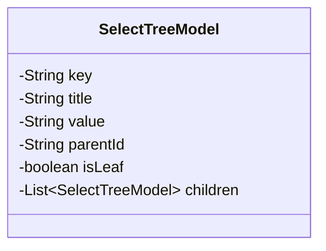
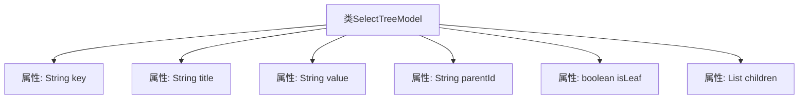

# 基础信息

|      |      |
|------|------|
| 名称 | SelectTreeModel |
| 编码语言 | .java |
| 代码路径 | JeecgBoot/jeecg-boot/jeecg-boot-base-core/src/main/java/org/jeecg/common/system/vo/SelectTreeModel.java |
| 包名 | org.jeecg.common.system.vo |
| 依赖项 | ['lombok.Data', 'java.io.Serializable', 'java.util.List'] |
| 概述说明 | SelectTreeModel类含键、标题、值、父ID、叶节点标识和子节点列表。 |

# 说明

SelectTreeModel类是一个用于表示树形结构数据的模型类，包含多个关键属性。其中，键属性用于唯一标识节点，标题属性用于显示节点的名称，值属性存储节点的实际数据，父ID属性用于标识节点的父节点，叶节点标识属性用于判断节点是否为叶子节点，子节点列表属性则用于存储当前节点的所有子节点。这些属性共同构成了一个完整的树形结构，便于数据的组织和管理。

# 类列表 Class Summary

| 名称   | 类型  | 说明 |
|-------|------|-------------|
| SelectTreeModel | class | SelectTreeModel类包含键、标题、值、父ID、叶节点标识和子节点列表。 |

## 类 SelectTreeModel

|      |      |
|------|------|
| 访问范围 | @Data;public |
| 类型 | class |
| 名称 | SelectTreeModel |
| 说明 | SelectTreeModel类包含键、标题、值、父ID、叶节点标识和子节点列表。 |

### UML类图

**描述：**  
`SelectTreeModel` 类是一个用于表示树形结构数据的模型类，包含了节点的键值、标题、值、父节点ID、是否是叶节点以及子节点列表。通过 `Serializable` 接口，该类支持序列化操作，便于在网络传输或持久化存储中使用。子节点列表 `children` 是一个递归结构，允许构建多层次的树形数据。

### 内部方法调用关系图

这段代码定义了一个名为`SelectTreeModel`的类，该类实现了`Serializable`接口，表示它可以被序列化。类中包含多个属性：`key`、`title`、`value`、`parentId`、`isLeaf`和`children`。其中，`children`是一个`SelectTreeModel`类型的列表，用于存储子节点。这个类通常用于构建树形结构的数据模型，便于在应用程序中管理和展示层级数据。

### 字段列表 Field List

| 名称  | 类型  | 说明 |
|-------|-------|------|
| title | String | 声明一个私有的字符串类型变量title。 |
| value | String | 定义私有字符串变量value。 |
| children | List<SelectTreeModel> | 私有列表存储子节点数据。 |
| key | String | 定义了一个私有的字符串类型变量key。 |
| isLeaf | boolean | 该代码定义了一个私有布尔变量isLeaf。 |
| parentId | String | 定义私有字符串变量parentId。 |

### 方法列表 Method List

| 名称  | 类型  | 说明 |
|-------|-------|------|

