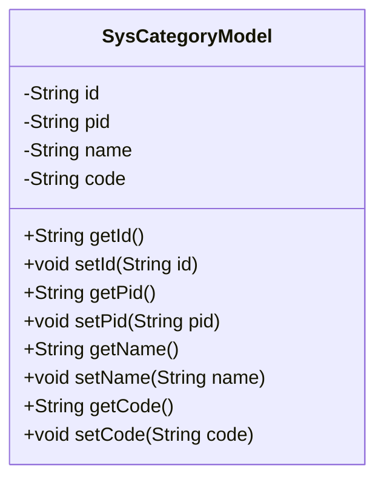

# 基础信息

|      |      |
|------|------|
| 名称 | SysCategoryModel |
| 编码语言 | .java |
| 代码路径 | JeecgBoot/jeecg-boot/jeecg-boot-base-core/src/main/java/org/jeecg/common/system/vo/SysCategoryModel.java |
| 包名 | org.jeecg.common.system.vo |
| 依赖项 | ['org.jeecgframework.poi.excel.annotation.Excel'] |
| 概述说明 | SysCategoryModel类含主键、父节点、名称、编码字段及其getter和setter方法。 |

# 说明

SysCategoryModel类是一个包含四个主要字段的模型类，分别是主键、父节点、名称和编码。每个字段都有对应的getter和setter方法，用于获取和设置这些字段的值。主键字段用于唯一标识该类的实例，父节点字段用于表示该实例在层级结构中的上级节点，名称字段用于存储该实例的名称信息，编码字段则用于存储该实例的编码信息。这些字段和方法共同构成了SysCategoryModel类的基本结构和功能。

# 类列表 Class Summary

| 名称   | 类型  | 说明 |
|-------|------|-------------|
| SysCategoryModel | class | SysCategoryModel类包含主键、父节点、名称和编码字段及其getter和setter方法。 |

## 类 SysCategoryModel

|      |      |
|------|------|
| 访问范围 | public |
| 类型 | class |
| 名称 | SysCategoryModel |
| 说明 | SysCategoryModel类包含主键、父节点、名称和编码字段及其getter和setter方法。 |

### UML类图

**描述：**  
`SysCategoryModel` 类是一个简单的数据模型类，用于表示系统分类信息。它包含四个私有属性：`id`（主键）、`pid`（父级节点）、`name`（类型名称）和 `code`（类型编码）。每个属性都有对应的 `getter` 和 `setter` 方法，用于访问和修改这些属性。该类主要用于存储和管理分类数据，适用于需要处理层级分类的系统。

### 内部方法调用关系图

```mermaid
graph TD
    A["类SysCategoryModel"]
    B["属性: java.lang.String id"]
    C["属性: java.lang.String pid"]
    D["属性: java.lang.String name"]
    E["属性: java.lang.String code"]
    F["方法: String getId()"]
    G["方法: void setId(String id)"]
    H["方法: String getPid()"]
    I["方法: void setPid(String pid)"]
    J["方法: String getName()"]
    K["方法: void setName(String name)"]
    L["方法: String getCode()"]
    M["方法: void setCode(String code)"]

    A --> B
    A --> C
    A --> D
    A --> E
    A --> F
    A --> G
    A --> H
    A --> I
    A --> J
    A --> K
    A --> L
    A --> M
```

这段代码定义了一个名为 `SysCategoryModel` 的类，该类包含四个私有属性：`id`、`pid`、`name` 和 `code`，分别表示主键、父级节点、类型名称和类型编码。类中为每个属性提供了对应的 `getter` 和 `setter` 方法，用于获取和设置这些属性的值。通过 `mermaid` 流程图展示了类的结构及其方法之间的关系，清晰地反映了类的内部组成和功能。

### 字段列表 Field List

| 名称  | 类型  | 说明 |
|-------|-------|------|
| id | java.lang.String | 私有字符串类型变量id声明。 |
| name | java.lang.String | 私有字符串变量name声明。 |
| code | java.lang.String | 定义了一个私有的字符串类型变量code。 |
| pid | java.lang.String | Java类中声明了一个私有字符串变量pid。 |

### 方法列表 Method List

| 名称  | 类型  | 说明 |
|-------|-------|------|
| getPid | String | 获取pid值的字符串方法。 |
| setPid | void | 设置对象pid属性的方法。 |
| getCode | String | 该方法返回字符串类型的变量`code`。 |
| setId | void | 设置对象ID的方法。 |
| getName | String | 该方法返回对象的名称属性值。 |
| getId | String | 获取对象的唯一标识符。 |
| setCode | void | 该方法用于设置字符串类型的变量code。 |
| setName | void | 该方法用于设置对象名称属性。 |

