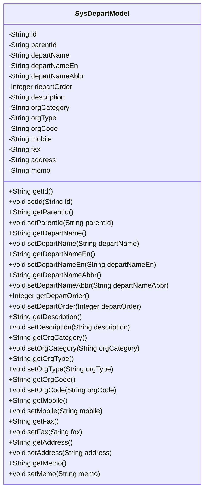

# 基础信息

|      |      |
|------|------|
| 名称 | SysDepartModel |
| 编码语言 | .java |
| 代码路径 | JeecgBoot/jeecg-boot/jeecg-boot-base-core/src/main/java/org/jeecg/common/system/vo/SysDepartModel.java |
| 包名 | org.jeecg.common.system.vo |
| 依赖项 | [] |
| 概述说明 | SysDepartModel定义部门模型，含ID、父ID、名称、排序、类别、类型、编码等属性。 |

# 说明

SysDepartModel类用于定义部门模型，包含多个关键属性。这些属性包括部门的唯一标识ID，用于表示层级关系的父部门ID，部门的名称，用于排序的序号，部门的类别，部门的类型，以及部门的编码。这些属性共同构成了部门模型的基础，用于描述和管理部门的相关信息。

# 类列表 Class Summary

| 名称   | 类型  | 说明 |
|-------|------|-------------|
| SysDepartModel | class | SysDepartModel类定义部门模型，包含ID、父ID、名称、排序、类别、类型、编码等属性。 |

## 类 SysDepartModel

|      |      |
|------|------|
| 访问范围 | public |
| 类型 | class |
| 名称 | SysDepartModel |
| 说明 | SysDepartModel类定义部门模型，包含ID、父ID、名称、排序、类别、类型、编码等属性。 |

### UML类图

**描述：**  
`SysDepartModel` 类是一个用于表示系统部门或机构信息的模型类。它包含多个私有属性，如部门ID、父部门ID、部门名称、英文名、缩写、排序、描述、机构类别、机构类型、机构编码、手机号、传真、地址和备注。每个属性都有对应的 `getter` 和 `setter` 方法，用于获取和设置这些属性的值。该类主要用于封装部门或机构的相关信息，并提供对这些信息的访问和修改接口。

### 内部方法调用关系图

这段代码定义了一个名为`SysDepartModel`的类，该类包含多个属性，如`id`、`parentId`、`departName`等，并为每个属性提供了对应的`getter`和`setter`方法。这些方法用于获取和设置类中各个属性的值。类的主要作用是管理和操作部门或机构的相关信息，适用于需要处理组织结构的应用场景。

### 字段列表 Field List

| 名称  | 类型  | 说明 |
|-------|-------|------|
| parentId | String | 父ID字段用于存储上级标识符。 |
| orgCode | String | 定义私有字符串变量orgCode。 |
| id | String | 定义一个私有字符串类型的变量id。 |
| orgType | String | 定义私有字符串变量orgType。 |
| departName | String | 定义了一个私有字符串变量departName。 |
| departNameAbbr | String | 私有字符串变量departNameAbbr。 |
| address | String | 声明一个私有的字符串类型变量address。 |
| mobile | String | 定义了一个私有的字符串类型变量mobile。 |
| departNameEn | String | 私有字符串变量存储部门英文名称。 |
| orgCategory | String | 定义私有字符串变量orgCategory。 |
| description | String | 描述字段用于存储字符串类型的信息。 |
| fax | String | 私有字符串变量fax用于存储传真信息。 |
| departOrder | Integer | 定义私有整型变量departOrder。 |
| memo | String | 声明了一个私有的字符串类型变量memo。 |

### 方法列表 Method List

| 名称  | 类型  | 说明 |
|-------|-------|------|
| setDepartOrder | void | 设置部门顺序的方法。 |
| getDepartNameEn | String | 获取部门英文名称的方法。 |
| setDepartNameEn | void | 设置部门英文名称的方法。 |
| getDepartName | String | 该方法返回部门名称字符串。 |
| setId | void | 该方法用于设置对象的ID属性。 |
| getAddress | String | 该方法返回地址字符串。 |
| getDepartNameAbbr | String | 获取部门名称缩写的方法。 |
| getParentId | String | 获取父ID的Java方法。 |
| getDescription | String | 该方法返回字符串类型的描述信息。 |
| getMobile | String | 获取手机号码的公共方法。 |
| getOrgCategory | String | 获取组织类别的方法。 |
| setDepartNameAbbr | void | 设置部门名称缩写的方法。 |
| setFax | void | 设置传真号码的方法。 |
| setMobile | void | 设置手机号的Java方法。 |
| getOrgType | String | 方法返回组织类型。 |
| getDepartOrder | Integer | 获取部门顺序的整数值。 |
| setAddress | void | 设置地址的公共方法。 |
| getMemo | String | 获取memo字符串的方法。 |
| setDepartName | void | 设置部门名称的方法，将输入参数赋值给类成员变量。 |
| getOrgCode | String | 获取组织代码的方法，返回orgCode变量值。 |
| getId | String | 方法`getId`返回字符串类型的`id`。 |
| setOrgCategory | void | 设置组织类别的方法，将传入的orgCategory赋值给当前对象的orgCategory属性。 |
| setParentId | void | 设置父ID的方法，将传入的parentId赋值给当前对象的parentId属性。 |
| getFax | String | 该方法返回传真号码字符串。 |
| setDescription | void | 设置描述属性的方法。 |
| setOrgType | void | 设置组织类型的方法，将传入的orgType赋值给当前对象的orgType属性。 |
| setMemo | void | 设置memo属性的方法，参数为String类型。 |
| setOrgCode | void | 设置组织代码的方法。 |

