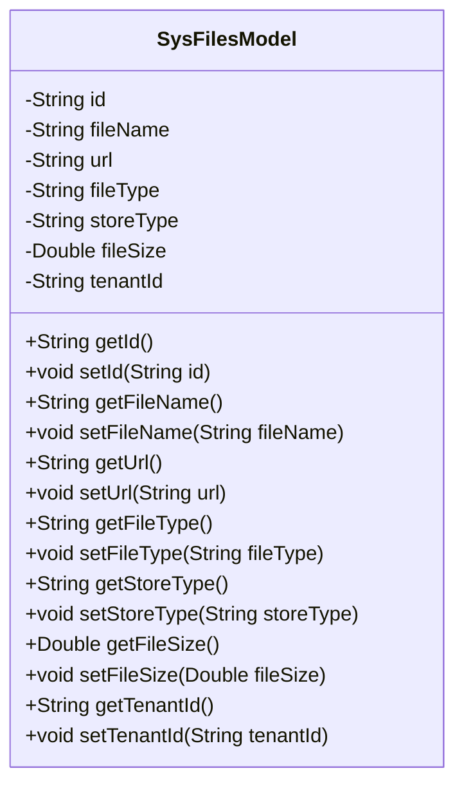

# 基础信息

|      |      |
|------|------|
| 名称 | SysFilesModel |
| 编码语言 | .java |
| 代码路径 | JeecgBoot/jeecg-boot/jeecg-boot-base-core/src/main/java/org/jeecg/common/system/vo/SysFilesModel.java |
| 包名 | org.jeecg.common.system.vo |
| 依赖项 | [] |
| 概述说明 | SysFilesModel类包含文件ID、名称、地址、类型、存储方式、大小及租户ID。 |

# 说明

SysFilesModel类是一个用于管理系统文件的数据模型，包含了多个关键属性。这些属性包括文件ID，用于唯一标识每个文件；文件名称，表示文件的命名；文件地址，指明文件的存储位置；文件类型，描述文件的格式或类别；存储方式，指定文件的存储机制；文件大小，记录文件的数据量；以及租户ID，用于区分不同租户的文件。这些属性共同构成了一个全面的文件管理模型，便于对文件进行有效的管理和操作。

# 类列表 Class Summary

| 名称   | 类型  | 说明 |
|-------|------|-------------|
| SysFilesModel | class | SysFilesModel类包含文件ID、名称、地址、类型、存储方式、大小及租户ID。 |

## 类 SysFilesModel

|      |      |
|------|------|
| 访问范围 | public |
| 类型 | class |
| 名称 | SysFilesModel |
| 说明 | SysFilesModel类包含文件ID、名称、地址、类型、存储方式、大小及租户ID。 |

### UML类图

**描述：**  
`SysFilesModel` 类用于表示系统中的文件模型，包含文件的基本信息如主键ID、文件名称、文件地址、文件类型、存储类型、文件大小和租户ID。类中提供了对每个私有字段的获取和设置方法，确保数据的封装性和可访问性。该类的设计适用于文件管理系统中对文件信息的存储和操作。

### 内部方法调用关系图

```mermaid
graph TD
    A["类SysFilesModel"]
    B["属性: String id"]
    C["属性: String fileName"]
    D["属性: String url"]
    E["属性: String fileType"]
    F["属性: String storeType"]
    G["属性: Double fileSize"]
    H["属性: String tenantId"]
    I["方法: String getId()"]
    J["方法: void setId(String id)"]
    K["方法: String getFileName()"]
    L["方法: void setFileName(String fileName)"]
    M["方法: String getUrl()"]
    N["方法: void setUrl(String url)"]
    O["方法: String getFileType()"]
    P["方法: void setFileType(String fileType)"]
    Q["方法: String getStoreType()"]
    R["方法: void setStoreType(String storeType)"]
    S["方法: Double getFileSize()"]
    T["方法: void setFileSize(Double fileSize)"]
    U["方法: String getTenantId()"]
    V["方法: void setTenantId(String tenantId)"]

    A --> B
    A --> C
    A --> D
    A --> E
    A --> F
    A --> G
    A --> H
    A --> I
    A --> J
    A --> K
    A --> L
    A --> M
    A --> N
    A --> O
    A --> P
    A --> Q
    A --> R
    A --> S
    A --> T
    A --> U
    A --> V
```

这段代码定义了一个名为 `SysFilesModel` 的类，该类包含了多个属性，如 `id`、`fileName`、`url` 等，并提供了相应的 `getter` 和 `setter` 方法来访问和修改这些属性。类的主要作用是表示一个文件模型，包含文件的基本信息，如名称、地址、类型、存储类型、大小和租户ID等。通过 `getter` 和 `setter` 方法，可以方便地获取和设置这些属性的值。

### 字段列表 Field List

| 名称  | 类型  | 说明 |
|-------|-------|------|
| fileName | String | 定义私有字符串变量fileName。 |
| storeType | String | 定义私有字符串变量storeType。 |
| fileType | String | 文件类型定义字符串变量。 |
| tenantId | String | 定义了一个私有字符串类型的租户ID变量。 |
| url | String | 定义了一个私有字符串变量`url`。 |
| id | String | 定义一个私有字符串类型的变量id。 |
| fileSize | Double | 文件大小定义为双精度浮点数类型。 |

### 方法列表 Method List

| 名称  | 类型  | 说明 |
|-------|-------|------|
| getStoreType | String | 方法返回商店类型字符串。 |
| getFileType | String | 获取文件类型的方法。 |
| getUrl | String | 获取URL字符串的方法。 |
| setStoreType | void | 设置存储类型的公共方法。 |
| setUrl | void | 设置URL属性的方法。 |
| getTenantId | String | 获取租户ID的方法。 |
| setFileSize | void | 该方法用于设置文件大小属性。 |
| getFileName | String | 获取文件名的Java方法。 |
| getId | String | 获取对象ID的方法。 |
| setId | void | 该方法用于设置对象的ID属性。 |
| setFileType | void | 设置文件类型的方法，参数为字符串fileType。 |
| setFileName | void | 设置文件名的公共方法，将传入参数赋值给成员变量fileName。 |
| getFileSize | Double | 获取文件大小的方法，返回值为Double类型。 |
| setTenantId | void | 设置租户ID的方法，将传入的tenantId赋值给当前对象的tenantId属性。 |

