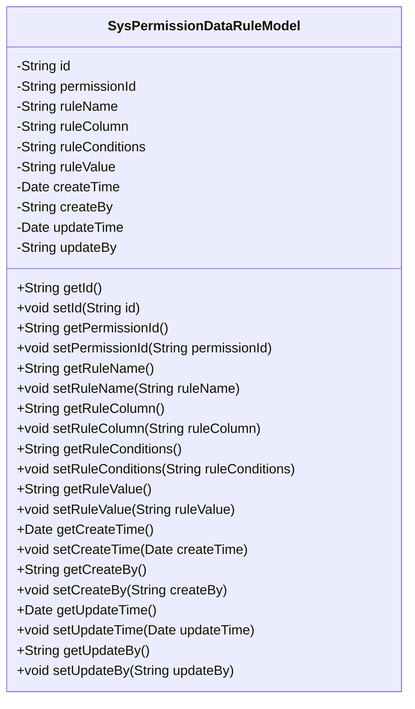

# 基础信息

|      |      |
|------|------|
| 名称 | SysPermissionDataRuleModel |
| 编码语言 | .java |
| 代码路径 | JeecgBoot/jeecg-boot/jeecg-boot-base-core/src/main/java/org/jeecg/common/system/vo/SysPermissionDataRuleModel.java |
| 包名 | org.jeecg.common.system.vo |
| 依赖项 | ['com.baomidou.mybatisplus.annotation.IdType', 'com.baomidou.mybatisplus.annotation.TableId', 'lombok.Data', 'lombok.EqualsAndHashCode', 'lombok.experimental.Accessors', 'java.io.Serializable', 'java.util.Date'] |
| 概述说明 | SysPermissionDataRuleModel类管理权限数据规则字段和方法。 |

# 说明

SysPermissionDataRuleModel类是一个用于管理权限数据规则的模型类。该类包含了与权限数据规则相关的字段和方法，用于定义和操作权限数据的规则。这些字段和方法可能包括规则的名称、描述、条件、操作类型等，以及用于验证、应用和更新规则的逻辑。通过该类，用户可以有效地管理和控制权限数据的规则，确保系统的安全性和合规性。

# 类列表 Class Summary

| 名称   | 类型  | 说明 |
|-------|------|-------------|
| SysPermissionDataRuleModel | class | SysPermissionDataRuleModel类包含权限数据规则相关字段及方法。 |

## 类 SysPermissionDataRuleModel

|      |      |
|------|------|
| 访问范围 | public |
| 类型 | class |
| 名称 | SysPermissionDataRuleModel |
| 说明 | SysPermissionDataRuleModel类包含权限数据规则相关字段及方法。 |

### UML类图

**描述**：`SysPermissionDataRuleModel` 类用于表示系统中的权限数据规则模型。它包含了与权限规则相关的各种属性，如规则名称、规则字段、规则条件、规则值等，并提供了对这些属性的访问和修改方法。该类的设计旨在封装权限规则的详细信息，便于在系统中进行管理和操作。

### 内部方法调用关系图

```mermaid
graph TD
    A["类SysPermissionDataRuleModel"]
    B["属性: String id"]
    C["属性: String permissionId"]
    D["属性: String ruleName"]
    E["属性: String ruleColumn"]
    F["属性: String ruleConditions"]
    G["属性: String ruleValue"]
    H["属性: Date createTime"]
    I["属性: String createBy"]
    J["属性: Date updateTime"]
    K["属性: String updateBy"]
    L["方法: String getId()"]
    M["方法: void setId(String id)"]
    N["方法: String getPermissionId()"]
    O["方法: void setPermissionId(String permissionId)"]
    P["方法: String getRuleName()"]
    Q["方法: void setRuleName(String ruleName)"]
    R["方法: String getRuleColumn()"]
    S["方法: void setRuleColumn(String ruleColumn)"]
    T["方法: String getRuleConditions()"]
    U["方法: void setRuleConditions(String ruleConditions)"]
    V["方法: String getRuleValue()"]
    W["方法: void setRuleValue(String ruleValue)"]
    X["方法: Date getCreateTime()"]
    Y["方法: void setCreateTime(Date createTime)"]
    Z["方法: String getCreateBy()"]
    AA["方法: void setCreateBy(String createBy)"]
    AB["方法: Date getUpdateTime()"]
    AC["方法: void setUpdateTime(Date updateTime)"]
    AD["方法: String getUpdateBy()"]
    AE["方法: void setUpdateBy(String updateBy)"]

    A --> B
    A --> C
    A --> D
    A --> E
    A --> F
    A --> G
    A --> H
    A --> I
    A --> J
    A --> K
    A --> L
    A --> M
    A --> N
    A --> O
    A --> P
    A --> Q
    A --> R
    A --> S
    A --> T
    A --> U
    A --> V
    A --> W
    A --> X
    A --> Y
    A --> Z
    A --> AA
    A --> AB
    A --> AC
    A --> AD
    A --> AE
```

这段代码定义了一个名为 `SysPermissionDataRuleModel` 的类，该类包含多个属性（如 `id`、`permissionId`、`ruleName` 等）以及对应的 getter 和 setter 方法。这些方法用于获取和设置这些属性的值。类的主要作用是封装与权限数据规则相关的信息，并提供对这些信息的访问和修改接口。

### 字段列表 Field List

| 名称  | 类型  | 说明 |
|-------|-------|------|
| ruleName | String | 私有字符串变量规则名称。 |
| ruleValue | String | 私有字符串类型变量ruleValue。 |
| updateTime | Date | 私有日期类型变量updateTime。 |
| permissionId | String | 定义了一个私有字符串变量permissionId。 |
| updateBy | String | 更新操作由指定用户执行。 |
| createBy | String | 私有字符串变量，用于存储创建者信息。 |
| createTime | Date | 私有日期类型变量createTime。 |
| id | String | 定义了一个私有的字符串类型变量id。 |
| ruleConditions | String | 规则条件定义为私有字符串变量。 |
| ruleColumn | String | 定义私有字符串变量ruleColumn。 |

### 方法列表 Method List

| 名称  | 类型  | 说明 |
|-------|-------|------|
| getPermissionId | String | 该方法返回权限ID字符串。 |
| setId | void | 设置对象的ID属性。 |
| getCreateBy | String | 获取创建者信息的方法。 |
| getRuleConditions | String | 该方法返回规则条件字符串。 |
| setUpdateTime | void | 设置更新时间的Java方法。 |
| setPermissionId | void | 设置权限ID的方法。 |
| getRuleColumn | String | 获取规则列的方法。 |
| getId | String | 该方法返回对象的ID字符串。 |
| getUpdateTime | Date | 获取更新时间的方法，返回updateTime变量。 |
| setRuleColumn | void | 设置规则列属性值为指定字符串。 |
| getUpdateBy | String | 该方法返回更新者的字符串信息。 |
| getRuleName | String | 获取规则名称的方法。 |
| setCreateTime | void | 设置创建时间的方法，接受Date类型参数。 |
| setUpdateBy | void | 定义方法设置更新者属性。 |
| getRuleValue | String | 该方法返回规则值字符串。 |
| getCreateTime | Date | 获取创建时间的方法，返回createTime变量。 |
| setRuleValue | void | 该方法用于设置规则值，将传入的字符串赋值给类成员变量ruleValue。 |
| setCreateBy | void | 设置创建者属性的方法。 |
| setRuleConditions | void | 设置规则条件的方法，将参数赋值给类的成员变量。 |
| setRuleName | void | 设置规则名称的方法，将传入的字符串赋值给类成员变量ruleName。 |

