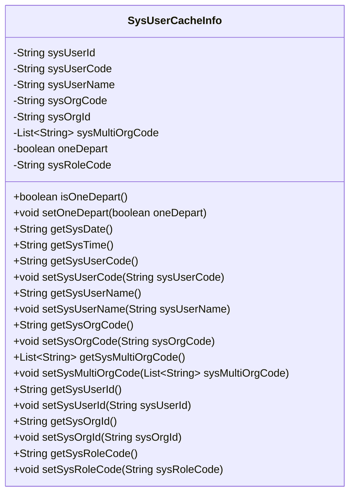

# 基础信息

|      |      |
|------|------|
| 名称 | SysUserCacheInfo |
| 编码语言 | .java |
| 代码路径 | JeecgBoot/jeecg-boot/jeecg-boot-base-core/src/main/java/org/jeecg/common/system/vo/SysUserCacheInfo.java |
| 包名 | org.jeecg.common.system.vo |
| 依赖项 | ['java.util.List', 'org.jeecg.common.util.DateUtils'] |
| 概述说明 | SysUserCacheInfo类存储用户ID、代码、名称、部门代码、角色代码，并提供对应getter和setter方法。 |

# 说明

SysUserCacheInfo类是一个用于存储用户缓存信息的类，包含用户ID、代码、名称、部门代码和角色代码等关键属性。该类提供了获取和设置这些属性的方法，即getter和setter方法，以便在程序中方便地访问和修改用户信息。这些属性和方法共同构成了一个完整的用户缓存信息管理工具。

# 类列表 Class Summary

| 名称   | 类型  | 说明 |
|-------|------|-------------|
| SysUserCacheInfo | class | SysUserCacheInfo类包含用户ID、代码、名称、部门代码、角色代码等属性，并提供相关getter和setter方法。 |

## 类 SysUserCacheInfo

|      |      |
|------|------|
| 访问范围 | public |
| 类型 | class |
| 名称 | SysUserCacheInfo |
| 说明 | SysUserCacheInfo类包含用户ID、代码、名称、部门代码、角色代码等属性，并提供相关getter和setter方法。 |

### UML类图

这段代码定义了一个名为 `SysUserCacheInfo` 的类，用于存储系统用户的相关信息。类中包含多个私有属性，如用户ID、用户代码、用户名称、组织代码等，并提供了相应的getter和setter方法来访问和修改这些属性。此外，类中还包含两个方法 `getSysDate` 和 `getSysTime`，分别用于获取系统日期和时间。该类主要用于缓存用户信息，方便在系统中快速访问和更新用户数据。

### 内部方法调用关系图

这段代码定义了一个名为`SysUserCacheInfo`的类，包含了多个属性和方法。属性用于存储用户信息，如用户ID、用户代码、用户名称、组织代码等。方法则用于获取和设置这些属性的值，同时还提供了获取系统日期和时间的功能。通过流程图可以清晰地看到类中各属性和方法之间的关系，以及如何通过这些方法来管理和操作用户信息。

### 字段列表 Field List

| 名称  | 类型  | 说明 |
|-------|-------|------|
| sysUserId | String | 定义了私有字符串变量sysUserId。 |
| sysUserCode | String | 定义私有字符串变量sysUserCode。 |
| sysOrgId | String | 定义私有字符串变量sysOrgId。 |
| oneDepart | boolean | 私有布尔变量oneDepart。 |
| sysOrgCode | String | 定义了一个私有字符串变量sysOrgCode。 |
| sysUserName | String | 定义一个私有字符串变量sysUserName。 |
| sysMultiOrgCode | List<String> | 私有列表变量sysMultiOrgCode，存储字符串类型数据。 |
| sysRoleCode | String | 私有字符串变量sysRoleCode定义。 |

### 方法列表 Method List

| 名称  | 类型  | 说明 |
|-------|-------|------|
| setSysOrgCode | void | 设置系统组织代码的方法。 |
| getSysUserCode | String | 获取系统用户代码的方法。 |
| setSysUserName | void | 设置系统用户名的方法。 |
| setSysOrgId | void | 设置系统组织ID的方法。 |
| getSysOrgCode | String | 该方法返回系统组织代码。 |
| getSysRoleCode | String | 获取系统角色代码的方法。 |
| getSysDate | String | 获取系统日期并格式化返回。 |
| getSysMultiOrgCode | List<String> | 获取系统多组织代码列表的方法。 |
| setSysMultiOrgCode | void | 设置系统多组织代码列表。 |
| setSysUserCode | void | 设置系统用户代码的方法。 |
| getSysTime | String | 获取系统当前时间的方法。 |
| setSysUserId | void | 设置系统用户ID的方法。 |
| setSysRoleCode | void | 该方法用于设置系统角色代码。 |
| getSysUserId | String | 获取系统用户ID的方法。 |
| getSysUserName | String | 获取系统用户名称的方法。 |
| getSysOrgId | String | 该方法返回系统组织ID。 |
| setOneDepart | void | 设置单部门状态的Java方法。 |
| isOneDepart | boolean | 判断是否为单一部门的方法。 |

