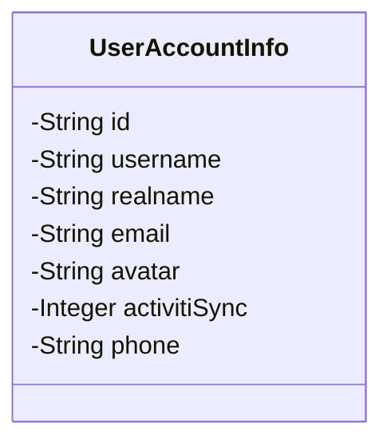
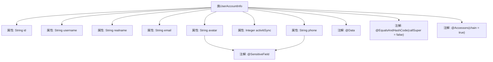

# 基础信息

|      |      |
|------|------|
| 名称 | UserAccountInfo |
| 编码语言 | .java |
| 代码路径 | JeecgBoot/jeecg-boot/jeecg-boot-base-core/src/main/java/org/jeecg/common/system/vo/UserAccountInfo.java |
| 包名 | org.jeecg.common.system.vo |
| 依赖项 | ['com.fasterxml.jackson.annotation.JsonFormat', 'lombok.Data', 'lombok.EqualsAndHashCode', 'lombok.experimental.Accessors', 'org.jeecg.common.desensitization.annotation.SensitiveField', 'org.springframework.format.annotation.DateTimeFormat', 'java.util.Date'] |
| 概述说明 | 用户账户信息包含ID、账号、姓名、邮箱、头像、同步状态和电话字段。 |

# 说明

用户账户信息类是一个用于存储和管理用户账户数据的结构，包含多个关键字段。这些字段包括用户的唯一标识ID、登录账号、用户姓名、电子邮箱地址、用户头像信息、账户同步状态以及联系电话。通过这些字段，可以全面记录和追踪用户的基本信息及其账户的当前状态，确保数据的完整性和可管理性。

# 类列表 Class Summary

| 名称   | 类型  | 说明 |
|-------|------|-------------|
| UserAccountInfo | class | 用户账户信息类，包含ID、账号、姓名、邮箱、头像、同步状态和电话字段。 |

## 类 UserAccountInfo

|      |      |
|------|------|
| 访问范围 | @Data;@EqualsAndHashCode(callSuper = false);@Accessors(chain = true);public |
| 类型 | class |
| 名称 | UserAccountInfo |
| 说明 | 用户账户信息类，包含ID、账号、姓名、邮箱、头像、同步状态和电话字段。 |

### UML类图

这段代码定义了一个名为 `UserAccountInfo` 的类，用于存储用户账户的相关信息。类中包含多个私有字段，分别表示用户的唯一标识 `id`、用户名 `username`、真实姓名 `realname`、电子邮件 `email`、头像 `avatar`、是否同步工作流引擎的标志 `activitiSync` 以及电话号码 `phone`。这些字段通过注解 `@SensitiveField` 标记了敏感信息，表明在处理这些数据时需要特别注意隐私保护。

### 内部方法调用关系图

这段代码定义了一个名为 `UserAccountInfo` 的类，包含了多个属性，如 `id`、`username`、`realname`、`email`、`avatar`、`activitiSync` 和 `phone`。类上使用了 `@Data`、`@EqualsAndHashCode(callSuper = false)` 和 `@Accessors(chain = true)` 注解，这些注解分别用于自动生成 getter/setter 方法、重写 `equals` 和 `hashCode` 方法以及支持链式调用。此外，`avatar` 和 `phone` 属性上还使用了 `@SensitiveField` 注解，可能用于标记敏感字段。

### 字段列表 Field List

| 名称  | 类型  | 说明 |
|-------|-------|------|
| id | String | 定义了一个私有字符串变量id。 |
| username | String | 定义私有字符串类型变量username。 |
| phone | String | 敏感字段：私有字符串类型电话。 |
| realname | String | 定义了一个私有字符串变量realname。 |
| avatar | String | 敏感字段定义：私有字符串类型头像。 |
| email | String | 定义私有字符串类型变量email。 |
| activitiSync | Integer | 私有整型变量activitiSync用于同步操作。 |

### 方法列表 Method List

| 名称  | 类型  | 说明 |
|-------|-------|------|

