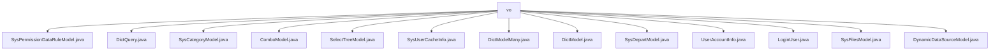

# 基础信息

|      |      |
|------|------|
| 名称 | vo |
| 编码语言 | .java |
| 代码路径 | JeecgBoot/jeecg-boot/jeecg-boot-base-core/src/main/java/org/jeecg/common/system/vo |
| 包名 | JeecgBoot.jeecg-boot.jeecg-boot-base-core.src.main.java.org.jeecg.common.system.vo |
| 概述说明 | SysPermissionDataRuleModel管理权限规则，DictQuery执行数据查询，SysCategoryModel处理分类，ComboModel存储数据，SelectTreeModel表示树形结构，SysUserCacheInfo存储用户缓存，DictModelMany管理字典，DictModel处理数据，SysDepartModel定义部门，UserAccountInfo存储账户信息，LoginUser存储登录信息，SysFilesModel管理文件，DynamicDataSourceModel管理数据源。 |

# 说明

## 概述
该代码模块是一个基于JeecgBoot框架的核心模块，主要用于管理系统中的各种数据和业务逻辑。模块中包含多个模型类，涵盖了权限管理、数据查询、用户信息、部门管理、文件管理、数据源管理等多个方面。这些模型类通过定义字段和方法，提供了对系统数据的结构化管理和操作支持，确保系统的安全性、合规性和高效性。

## 主要业务场景
1. **权限管理**：通过`SysPermissionDataRuleModel`类，定义和管理权限数据规则，确保系统的安全性和合规性。
2. **数据查询**：使用`DictQuery`类进行高效的数据查询操作，支持表名、存储列、显示列等属性的配置。
3. **用户信息管理**：通过`SysUserCacheInfo`、`UserAccountInfo`、`LoginUser`等类，存储和管理用户的缓存信息、账户信息及登录信息，确保用户数据的安全性和完整性。
4. **部门管理**：`SysDepartModel`类用于定义和管理部门信息，支持层级关系和部门属性的配置。
5. **文件管理**：`SysFilesModel`类用于管理系统文件，支持文件ID、名称、地址、类型等属性的管理。
6. **数据源管理**：`DynamicDataSourceModel`类用于动态配置和管理数据源，支持ID、编码、类型、驱动等属性的配置。
7. **字典管理**：`DictModel`和`DictModelMany`类用于管理和标识字典数据，支持数据值、文本描述、颜色等属性的配置。
8. **树形结构管理**：`SelectTreeModel`类用于表示和管理树形结构数据，支持节点标识、标题、父ID等属性的配置。
9. **组合数据管理**：`ComboModel`类用于存储和管理组合数据，支持ID、标题、选中状态、用户名等属性的配置。
10. **分类管理**：`SysCategoryModel`类用于定义和管理分类信息，支持主键、父节点、名称、编码等属性的配置。

这些业务场景共同构成了该模块的核心功能，为系统提供了全面的数据管理和业务逻辑支持。

### 包内部结构视图

该流程图展示了在`vo`目录下的多个文件层级关系。`vo`作为根节点，包含了多个系统相关的模型文件，如`SysPermissionDataRuleModel.java`、`DictQuery.java`、`SysCategoryModel.java`等。这些文件均位于同一层级，直接归属于`vo`目录，反映了系统模块中不同功能的模型定义。

# 文件列表 File List

| 名称   | 类型  | 说明 |
|-------|------|-------------|
| [LoginUser.java](LoginUser.md) | file | LoginUser类存储用户登录信息，包括ID、账号、密码等敏感字段。 |
| [DictModelMany.java](DictModelMany.md) | file | DictModelMany继承DictModel，新增dictCode字段用于区分字典选项。 |
| [SysCategoryModel.java](SysCategoryModel.md) | file | SysCategoryModel类含主键、父节点、名称、编码字段及其getter和setter方法。 |
| [DictQuery.java](DictQuery.md) | file | DictQuery类包含表名、存储列、显示列、关键字查询和存储列值。 |
| [SysPermissionDataRuleModel.java](SysPermissionDataRuleModel.md) | file | SysPermissionDataRuleModel类管理权限数据规则字段和方法。 |
| [DynamicDataSourceModel.java](DynamicDataSourceModel.md) | file | 动态数据源模型类包含ID、编码、类型、驱动、地址、用户名和密码属性。 |
| [SysFilesModel.java](SysFilesModel.md) | file | SysFilesModel类包含文件ID、名称、地址、类型、存储方式、大小及租户ID。 |
| [UserAccountInfo.java](UserAccountInfo.md) | file | 用户账户信息包含ID、账号、姓名、邮箱、头像、同步状态和电话字段。 |
| [SysDepartModel.java](SysDepartModel.md) | file | SysDepartModel定义部门模型，含ID、父ID、名称、排序、类别、类型、编码等属性。 |
| [DictModel.java](DictModel.md) | file | DictModel类含value、text、color属性和getTitle、getLabel方法，支持序列化。 |
| [SysUserCacheInfo.java](SysUserCacheInfo.md) | file | SysUserCacheInfo类存储用户ID、代码、名称、部门代码、角色代码，并提供对应getter和setter方法。 |
| [SelectTreeModel.java](SelectTreeModel.md) | file | SelectTreeModel类含键、标题、值、父ID、叶节点标识和子节点列表。 |
| [ComboModel.java](ComboModel.md) | file | ComboModel类含ID、标题、状态、用户名、邮箱和角色编码字段。 |

