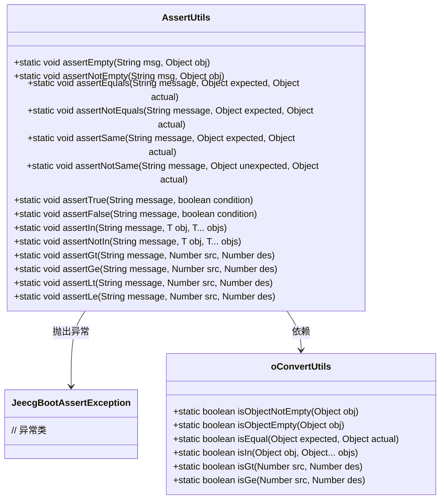

# 基础信息

|      |      |
|------|------|
| 名称 | AssertUtils |
| 编码语言 | .java |
| 代码路径 | JeecgBoot/jeecg-boot/jeecg-boot-base-core/src/main/java/org/jeecg/common/util/AssertUtils.java |
| 包名 | org.jeecg.common.util |
| 依赖项 | ['org.jeecg.common.exception.JeecgBootAssertException'] |
| 概述说明 | AssertUtils类提供多种断言方法，用于验证对象状态并抛出异常。 |

# 说明

AssertUtils类是一个工具类，提供多种断言方法，主要用于验证对象的状态是否符合预期。如果对象状态不符合预期条件，这些断言方法会抛出异常，从而帮助开发者在调试和测试过程中快速定位问题。通过使用这些方法，开发者可以确保程序在运行时状态的正确性，提升代码的健壮性和可靠性。

# 类列表 Class Summary

| 名称   | 类型  | 说明 |
|-------|------|-------------|
| AssertUtils | class | AssertUtils类提供多种断言方法，用于验证对象状态并抛出异常。 |

## 类 AssertUtils

|      |      |
|------|------|
| 访问范围 | public |
| 类型 | class |
| 名称 | AssertUtils |
| 说明 | AssertUtils类提供多种断言方法，用于验证对象状态并抛出异常。 |

### UML类图

**描述**：`AssertUtils` 类提供了一系列静态方法，用于验证对象的状态，如是否为空、是否相等、是否在集合中等。这些方法在验证失败时会抛出 `JeecgBootAssertException` 异常。`oConvertUtils` 类提供了辅助方法，用于判断对象的状态，如是否为空、是否相等等。`AssertUtils` 类依赖于 `oConvertUtils` 和 `JeecgBootAssertException` 来实现其功能。

### 内部方法调用关系图

```mermaid
graph TD
    A["类AssertUtils"]
    B["方法: assertEmpty(String msg, Object obj)"]
    C["方法: assertNotEmpty(String msg, Object obj)"]
    D["方法: assertEquals(String message, Object expected, Object actual)"]
    E["方法: assertNotEquals(String message, Object expected, Object actual)"]
    F["方法: assertSame(String message, Object expected, Object actual)"]
    G["方法: assertNotSame(String message, Object unexpected, Object actual)"]
    H["方法: assertTrue(String message, boolean condition)"]
    I["方法: assertFalse(String message, boolean condition)"]
    J["方法: assertIn(String message, T obj, T... objs)"]
    K["方法: assertNotIn(String message, T obj, T... objs)"]
    L["方法: assertGt(String message, Number src, Number des)"]
    M["方法: assertGe(String message, Number src, Number des)"]
    N["方法: assertLt(String message, Number src, Number des)"]
    O["方法: assertLe(String message, Number src, Number des)"]

    A --> B
    A --> C
    A --> D
    A --> E
    A --> F
    A --> G
    A --> H
    A --> I
    A --> J
    A --> K
    A --> L
    A --> M
    A --> N
    A --> O
```

这段代码定义了一个名为 `AssertUtils` 的类，其中包含了多个静态方法，用于进行各种断言操作。这些方法主要用于验证对象的状态、相等性、大小关系等，并在条件不满足时抛出 `JeecgBootAssertException` 异常。每个方法都接收一个消息字符串作为参数，用于在异常抛出时提供详细的错误信息。这些方法的设计旨在帮助开发者在代码中进行快速且有效的条件检查，确保程序的健壮性和正确性。

### 字段列表 Field List

| 名称  | 类型  | 说明 |
|-------|-------|------|

### 方法列表 Method List

| 名称  | 类型  | 说明 |
|-------|-------|------|
| assertNotEmpty | void | 检查对象是否为空，若为空则抛出异常。 |
| assertSame | void | 断言两个对象相同，否则抛出异常。 |
| assertLe | void | 断言src不大于des，否则抛出异常。 |
| assertEquals | void | 断言方法，比较预期和实际值，不等则抛出异常。 |
| assertNotEquals | void | 断言两个对象不相等，若相等则抛出异常。 |
| assertGt | void | 该方法用于断言源数值大于目标数值，否则抛出异常。 |
| assertFalse | void | assertFalse方法通过调用assertTrue验证条件为假。 |
| assertNotSame | void | 该方法用于断言两个对象不同，若相同则抛出异常。 |
| assertLt | void | 该方法用于断言源数值小于目标数值，否则抛出异常。 |
| assertEmpty | void | 该方法用于检查对象是否为空，若不为空则抛出异常。 |
| assertTrue | void | 静态方法assertTrue验证条件，失败抛出JeecgBootAssertException异常。 |
| assertGe | void | 静态方法assertGe用于比较两个数值，若src不小于des则返回，否则抛出异常。 |
| assertIn | void | 静态方法assertIn用于检查对象是否在指定集合中，若不在则抛出异常。 |
| assertNotIn | void | 静态方法assertNotIn检查对象不在指定集合中，否则抛出异常。 |

