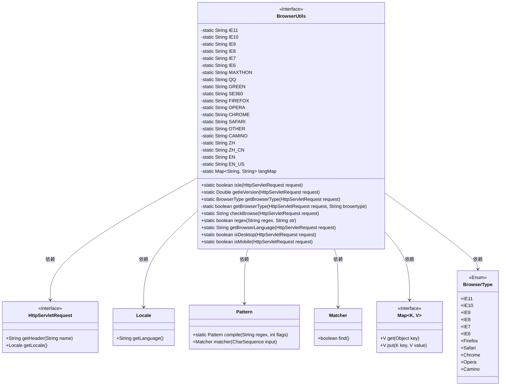
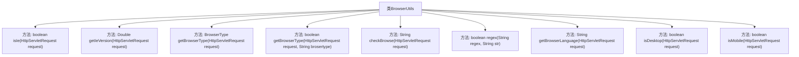

# 基础信息

|      |      |
|------|------|
| 名称 | BrowserUtils |
| 编码语言 | .java |
| 代码路径 | JeecgBoot/jeecg-boot/jeecg-boot-base-core/src/main/java/org/jeecg/common/util/BrowserUtils.java |
| 包名 | org.jeecg.common.util |
| 依赖项 | ['java.util.HashMap', 'java.util.Map', 'java.util.regex.Matcher', 'java.util.regex.Pattern', 'javax.servlet.http.HttpServletRequest'] |
| 概述说明 | 该工具可检测浏览器类型、版本、语言及设备信息。 |

# 说明

该类具备检测浏览器类型、版本、语言及设备类型的功能。通过其提供的接口，用户可以获取当前浏览器的详细信息，包括浏览器种类、具体版本号、使用的语言以及设备类型。这些信息对于开发者进行兼容性优化、用户行为分析以及设备适配等方面具有重要价值。该类的功能全面且实用，能够帮助开发者更好地理解和适应不同用户的使用环境。

# 类列表 Class Summary

| 名称   | 类型  | 说明 |
|-------|------|-------------|
| BrowserUtils | class | 该类提供浏览器类型、版本、语言及设备类型的检测功能。 |

## 类 BrowserUtils

|      |      |
|------|------|
| 访问范围 | public |
| 类型 | class |
| 名称 | BrowserUtils |
| 说明 | 该类提供浏览器类型、版本、语言及设备类型的检测功能。 |

### UML类图

**描述**：`BrowserUtils` 类提供了一系列静态方法，用于处理与浏览器相关的操作，如判断浏览器类型、获取IE版本、检查浏览器语言、判断请求是否来自移动端等。该类依赖于 `HttpServletRequest`、`Locale`、`Pattern`、`Matcher` 和 `Map` 等接口和类，通过解析请求头中的 `User-Agent` 信息来实现功能。`BrowserType` 枚举类定义了支持的浏览器类型。

### 内部方法调用关系图

这段代码定义了一个名为 `BrowserUtils` 的工具类，主要用于处理与浏览器相关的操作。代码包含多个方法，用于判断浏览器类型、获取浏览器版本、检查浏览器语言以及判断请求是否来自移动端或桌面端。通过这些方法，开发者可以轻松地获取和处理与浏览器相关的信息，从而实现更精确的用户体验优化和功能适配。

### 字段列表 Field List

| 名称  | 类型  | 说明 |
|-------|-------|------|
| SE360 = "360SE" | String | 定义私有静态常量SE360，值为"360SE"。 |
| EN = "en" | String | 定义私有静态常量EN，值为"en"。 |
| IE9 = "MSIE 9.0" | String | 定义私有静态常量IE9，值为"MSIE 9.0"。 |
| GREEN = "GreenBrowser" | String | 定义静态字符串常量GREEN，值为"GreenBrowser"。 |
| langMap = new HashMap<String, String>() | Map<String, String> | 私有静态Map用于存储字符串键值对。 |
| ZH_CN = "zh-cn" | String | 定义私有静态常量字符串ZH_CN为"zh-cn"。 |
| ZH = "zh" | String | 定义私有静态常量字符串变量ZH，值为"zh"。 |
| MAXTHON = "Maxthon" | String | MAXTHON 是一个私有静态常量字符串。 |
| IE11 = "rv:11.0" | String | 定义私有静态常量IE11，值为"rv:11.0"。 |
| IE6 = "MSIE 6.0" | String | 定义常量字符串IE6，值为MSIE 6.0。 |
| FIREFOX = "Firefox" | String | 定义了一个私有静态常量字符串，值为"Firefox"。 |
| OTHER = "其它" | String | 定义私有静态常量OTHER，值为"其它"。 |
| EN_US = "en" | String | 定义了一个私有静态常量EN_US，值为"en"。 |
| OPERA = "Opera" | String | 定义私有静态常量字符串OPERA，值为"Opera"。 |
| IE8 = "MSIE 8.0" | String | 定义IE8常量字符串值为"MSIE 8.0"。 |
| CAMINO = "Camino" | String | 定义私有静态常量字符串变量CAMINO，值为"Camino"。 |
| SAFARI = "Safari" | String | 定义私有静态常量SAFARI，值为"Safari"。 |
| IE10 = "MSIE 10.0" | String | 定义常量字符串IE10，值为"MSIE 10.0"。 |
| CHROME = "Chrome" | String | 定义了一个私有静态常量字符串CHROME，值为"Chrome"。 |
| IE7 = "MSIE 7.0" | String | 定义常量字符串IE7，值为"MSIE 7.0"。 |
| QQ = "QQBrowser" | String | 定义了一个私有的静态常量字符串变量QQ，值为QQBrowser。 |

### 方法列表 Method List

| 名称  | 类型  | 说明 |
|-------|-------|------|
| isIe | boolean | 检查请求头判断是否为IE浏览器。 |
| regex | boolean | 静态方法检查字符串是否匹配正则表达式。 |
| getBrowserType | boolean | 该方法通过请求头判断浏览器类型，返回布尔值。 |
| checkBrowse | String | 通过用户代理字符串检测浏览器类型并返回结果。 |
| getIeVersion | Double | 根据请求判断IE浏览器版本并返回对应版本号。 |
| getBrowserType | BrowserType | 根据请求判断浏览器类型并返回对应枚举值。 |
| isMobile | boolean | 该方法通过检查请求头中的User-Agent判断是否为移动设备。 |
| getBrowserLanguage | String | 获取浏览器语言代码，默认返回EN_US。 |
| isDesktop | boolean | 该方法判断请求是否来自桌面设备，通过调用isMobile方法取反实现。 |

