# 基础信息

|      |      |
|------|------|
| 名称 | CommonUtils |
| 编码语言 | .java |
| 代码路径 | JeecgBoot/jeecg-boot/jeecg-boot-base-core/src/main/java/org/jeecg/common/util/CommonUtils.java |
| 包名 | org.jeecg.common.util |
| 依赖项 | ['com.alibaba.fastjson.JSONObject', 'com.baomidou.dynamic.datasource.creator.DataSourceProperty', 'com.baomidou.dynamic.datasource.spring.boot.autoconfigure.DynamicDataSourceProperties', 'com.baomidou.mybatisplus.annotation.DbType', 'com.baomidou.mybatisplus.extension.toolkit.JdbcUtils', 'lombok.extern.slf4j.Slf4j', 'org.apache.commons.lang.StringUtils', 'org.jeecg.common.constant.CommonConstant', 'org.jeecg.common.constant.DataBaseConstant', 'org.jeecg.common.constant.ServiceNameConstants', 'org.jeecg.common.constant.SymbolConstant', 'org.jeecg.common.exception.JeecgBootException', 'org.jeecg.common.util.filter.SsrfFileTypeFilter', 'org.jeecg.common.util.oss.OssBootUtil', 'org.jeecgframework.poi.util.PoiPublicUtil', 'org.springframework.jdbc.datasource.DriverManagerDataSource', 'org.springframework.util.FileCopyUtils', 'org.springframework.web.multipart.MultipartFile', 'javax.servlet.http.HttpServletRequest', 'javax.sql.DataSource', 'java.io.ByteArrayInputStream', 'java.io.File', 'java.io.IOException', 'java.io.InputStream', 'java.sql.Connection', 'java.sql.DatabaseMetaData', 'java.sql.SQLException', 'java.util.List', 'java.util.Map', 'java.util.Set', 'java.util.regex.Matcher', 'java.util.regex.Pattern'] |
| 概述说明 | CommonUtils类提供文件上传、文件名处理、中文检测、数据库类型获取及URL生成等功能。 |

# 说明

CommonUtils类是一个多功能工具类，集成了文件上传、文件名处理、中文检测、数据库类型获取和URL生成等实用功能。文件上传功能支持处理文件的上传操作；文件名处理功能用于规范化和处理文件名；中文检测功能用于识别和验证文本中的中文字符；数据库类型获取功能用于确定当前使用的数据库类型；URL生成功能用于创建和生成URL链接。这些功能共同提供了全面的工具支持，简化了开发过程中的常见操作。

# 类列表 Class Summary

| 名称   | 类型  | 说明 |
|-------|------|-------------|
| CommonUtils | class | CommonUtils类包含文件上传、文件名处理、中文检测、数据库类型获取、URL生成等功能。 |

## 类 CommonUtils

|      |      |
|------|------|
| 访问范围 | @Slf4j;public |
| 类型 | class |
| 名称 | CommonUtils |
| 说明 | CommonUtils类包含文件上传、文件名处理、中文检测、数据库类型获取、URL生成等功能。 |

### UML类图

```mermaid
classDiagram
    class CommonUtils {
        -Pattern ZHONGWEN_PATTERN
        -String FILE_NAME_REGEX
        -String DB_TYPE
        -DbType dbTypeEnum
        +String uploadOnlineImage(byte[] data, String basePath, String bizPath, String uploadType)
        +String getFileName(String fileName)
        +boolean ifContainChinese(String str)
        +String upload(MultipartFile file, String bizPath, String uploadType)
        +String uploadLocal(MultipartFile mf, String bizPath, String uploadpath)
        +String upload(MultipartFile file, String bizPath, String uploadType, String customBucket)
        +String getDatabaseType()
        +DbType getDatabaseTypeEnum()
        +DataSourceProperty getDataSourceProperty(String sourceKey)
        +Connection getDataSourceConnect(String sourceKey) throws SQLException
        +String getDatabaseTypeByDataSource(DataSource dataSource) throws SQLException
        +String getBaseUrl(HttpServletRequest request)
        +JSONObject mergeJSON(JSONObject target, JSONObject... sources)
        +JSONObject mergeJSON(JSONObject target, JSONObject source)
        +String getSplitText(List~String~ list, String separator)
        +String getFilterSqlByTableSql(String tableSql)
        +String getTableNameByTableSql(String tableSql)
        +boolean hasIntersection(Set~String~ set1, String[] arr2)
        +void logInfo(String msg, Object... objects)
    }

    class MinioUtil {
        +String upload(InputStream in, String relativePath)
        +String upload(MultipartFile file, String bizPath)
        +String upload(MultipartFile file, String bizPath, String customBucket)
    }

    class OssBootUtil {
        +String upload(InputStream in, String relativePath)
        +String upload(MultipartFile file, String bizPath)
        +String upload(MultipartFile file, String bizPath, String customBucket)
    }

    class PoiPublicUtil {
        +String getFileExtendName(byte[] data)
    }

    class SpringContextUtils {
        +ApplicationContext getApplicationContext()
    }

    class DynamicDataSourceProperties {
        +Map~String, DataSourceProperty~ getDatasource()
    }

    class DataSourceProperty {
        -String driverClassName
        -String url
        -String username
        -String password
    }

    class DriverManagerDataSource {
        +void setDriverClassName(String driverClassName)
        +void setUrl(String url)
        +void setUsername(String username)
        +void setPassword(String password)
        +Connection getConnection() throws SQLException
    }

    class JdbcUtils {
        +DbType getDbType(String url)
    }

    class DataBaseConstant {
        <<Interface>>
        +String DB_TYPE_MYSQL
        +String DB_TYPE_ORACLE
        +String DB_TYPE_SQLSERVER
        +String DB_TYPE_POSTGRESQL
        +String DB_TYPE_MARIADB
    }

    class ServiceNameConstants {
        <<Interface>>
        +String X_GATEWAY_BASE_PATH
    }

    class CommonConstant {
        <<Interface>>
        +String UPLOAD_TYPE_LOCAL
        +String UPLOAD_TYPE_MINIO
        +String UPLOAD_TYPE_OSS
        +String X_FORWARDED_SCHEME
    }

    class SymbolConstant {
        <<Interface>>
        +String SPOT
        +String DOUBLE_BACKSLASH
    }

    class SsrfFileTypeFilter {
        +void checkUploadFileType(MultipartFile mf)
    }

    class oConvertUtils {
        +boolean isEmpty(String str)
        +boolean isNotEmpty(String str)
    }

    class FileCopyUtils {
        +void copy(byte[] data, File file)
        +void copy(byte[] data, File file) throws IOException
    }

    class JeecgBootException {
        +JeecgBootException(String message)
    }

    class JSONObject {
        +void put(String key, Object value)
        +boolean containsKey(String key)
        +JSONObject getJSONObject(String key)
        +Set~String~ keySet()
        +Object get(String key)
    }

    class StringUtils {
        +String join(List~String~ list, String separator)
    }

    CommonUtils --> MinioUtil : 依赖
    CommonUtils --> OssBootUtil : 依赖
    CommonUtils --> PoiPublicUtil : 依赖
    CommonUtils --> SpringContextUtils : 依赖
    CommonUtils --> DynamicDataSourceProperties : 依赖
    CommonUtils --> JdbcUtils : 依赖
    CommonUtils --> DataBaseConstant : 依赖
    CommonUtils --> ServiceNameConstants : 依赖
    CommonUtils --> CommonConstant : 依赖
    CommonUtils --> SymbolConstant : 依赖
    CommonUtils --> SsrfFileTypeFilter : 依赖
    CommonUtils --> oConvertUtils : 依赖
    CommonUtils --> FileCopyUtils : 依赖
    CommonUtils --> JeecgBootException : 依赖
    CommonUtils --> JSONObject : 依赖
    CommonUtils --> StringUtils : 依赖
    DynamicDataSourceProperties --> DataSourceProperty : 依赖
    DriverManagerDataSource --> DataSourceProperty : 依赖
```

该类图展示了 `CommonUtils` 类及其依赖的其他类和接口。`CommonUtils` 类是一个工具类，提供了文件上传、文件名处理、数据库类型获取、日志记录等功能。它依赖于多个工具类和接口，如 `MinioUtil`、`OssBootUtil`、`PoiPublicUtil` 等，用于处理文件上传、数据库操作和日志记录等任务。通过这种方式，`CommonUtils` 类将复杂的功能模块化，便于维护和扩展。

### 内部方法调用关系图

```mermaid
graph TD
    A["类CommonUtils"]
    B["属性: Pattern ZHONGWEN_PATTERN"]
    C["属性: String FILE_NAME_REGEX"]
    D["方法: String uploadOnlineImage(byte[] data, String basePath, String bizPath, String uploadType)"]
    E["方法: String getFileName(String fileName)"]
    F["方法: boolean ifContainChinese(String str)"]
    G["方法: String upload(MultipartFile file, String bizPath, String uploadType)"]
    H["方法: String uploadLocal(MultipartFile mf, String bizPath, String uploadpath)"]
    I["方法: String upload(MultipartFile file, String bizPath, String uploadType, String customBucket)"]
    J["属性: String DB_TYPE"]
    K["属性: DbType dbTypeEnum"]
    L["方法: String getDatabaseType()"]
    M["方法: DbType getDatabaseTypeEnum()"]
    N["方法: DataSourceProperty getDataSourceProperty(String sourceKey)"]
    O["方法: Connection getDataSourceConnect(String sourceKey)"]
    P["方法: String getDatabaseTypeByDataSource(DataSource dataSource)"]
    Q["方法: String getBaseUrl(HttpServletRequest request)"]
    R["方法: JSONObject mergeJSON(JSONObject target, JSONObject... sources)"]
    S["方法: JSONObject mergeJSON(JSONObject target, JSONObject source)"]
    T["方法: String getSplitText(List<String> list, String separator)"]
    U["方法: String getFilterSqlByTableSql(String tableSql)"]
    V["方法: String getTableNameByTableSql(String tableSql)"]
    W["方法: boolean hasIntersection(Set<String> set1, String[] arr2)"]
    X["方法: void logInfo(String msg, Object... objects)"]

    A --> B
    A --> C
    A --> D
    A --> E
    A --> F
    A --> G
    A --> H
    A --> I
    A --> J
    A --> K
    A --> L
    A --> M
    A --> N
    A --> O
    A --> P
    A --> Q
    A --> R
    A --> S
    A --> T
    A --> U
    A --> V
    A --> W
    A --> X
```

**描述：**  
`CommonUtils` 类是一个工具类，提供了多种实用的静态方法，包括文件上传、文件名处理、字符串中文字符判断、数据库类型获取、URL生成、JSON对象合并等功能。该类封装了常见的工具方法，便于在项目中复用，减少了代码冗余，提高了开发效率。

### 字段列表 Field List

| 名称  | 类型  | 说明 |
|-------|-------|------|
| ZHONGWEN_PATTERN = Pattern.compile("[\u4e00-\u9fa5]") | Pattern | 定义正则表达式匹配中文字符。 |
| dbTypeEnum = null | DbType | 私有静态DbType类型变量dbTypeEnum初始化为null。 |
| DB_TYPE = "" | String | 定义私有静态字符串变量DB_TYPE，初始值为空。 |
| FILE_NAME_REGEX = "[^A-Za-z\\.\\(\\)\\-（）\\_0-9\\u4e00-\\u9fa5]" | String | 定义文件名正则表达式，允许字母、数字、中文、点、括号、横线和下划线。 |

### 方法列表 Method List

| 名称  | 类型  | 说明 |
|-------|-------|------|
| getDataSourceProperty | DataSourceProperty | 通过源键获取动态数据源属性。 |
| uploadOnlineImage | String | 上传在线图片，支持本地、MinIO和OSS存储。 |
| hasIntersection | boolean | 检查集合与数组是否有交集，存在则返回真。 |
| logInfo | void | 静态方法logInfo记录信息，异常时记录警告。 |
| mergeJSON | JSONObject | 合并多个JSON对象到目标对象并返回。 |
| getDatabaseTypeByDataSource | String | 通过数据源获取并识别数据库类型，支持多种数据库。 |
| ifContainChinese | boolean | 判断字符串是否包含中文字符，返回布尔值。 |
| getDatabaseTypeEnum | DbType | 静态方法获取数据库类型，若未缓存则从数据源中提取。 |
| getFilterSqlByTableSql | String | 该方法根据SQL语句提取WHERE子句内容，若无则返回空字符串。 |
| getDataSourceConnect | Connection | 获取指定数据源连接，默认主数据源，返回连接对象。 |
| getSplitText | String | 静态方法通过分隔符连接列表元素，若列表为空返回空字符串。 |
| getBaseUrl | String | 获取请求基础URL，兼容微服务及SSL，返回主机域名路径。 |
| uploadLocal | String | 上传本地文件，过滤类型，创建目录，生成唯一文件名，保存并返回路径。 |
| getFileName | String | 提取文件名并去除路径和特殊字符，确保文件名规范。 |
| getTableNameByTableSql | String | 根据SQL语句提取表名，若无WHERE子句则返回原语句。 |
| mergeJSON | JSONObject | 合并两个JSON对象，递归处理嵌套对象，覆盖重复键值。 |
| upload | String | 上传文件方法，根据上传类型选择Minio或Oss工具，返回文件URL。 |
| getDatabaseType | String | 已弃用的方法，用于获取数据库类型，优先返回预设类型，否则通过数据源获取。 |
| upload | String | 上传文件方法，根据上传类型选择Minio或OSS，返回文件URL。 |

