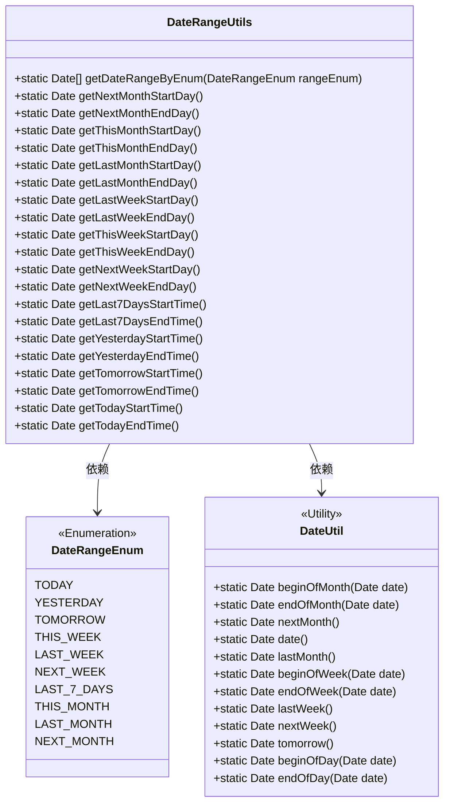
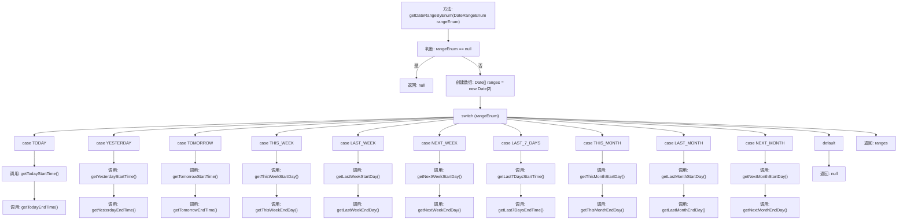

# 基础信息

|      |      |
|------|------|
| 名称 | DateRangeUtils |
| 编码语言 | .java |
| 代码路径 | JeecgBoot/jeecg-boot/jeecg-boot-base-core/src/main/java/org/jeecg/common/util/DateRangeUtils.java |
| 包名 | org.jeecg.common.util |
| 依赖项 | ['cn.hutool.core.date.DateUtil', 'org.jeecg.common.constant.enums.DateRangeEnum', 'java.util.Calendar', 'java.util.Date'] |
| 概述说明 | DateRangeUtils类通过枚举获取多种日期范围。 |

# 说明

DateRangeUtils类提供了一种通过枚举来获取多种日期范围的方法，支持包括今天、昨天、明天、本周、上周、下周、本月、上月、下月以及过去七天在内的多种日期范围选择。该类简化了日期范围获取的过程，适用于需要处理不同时间段的场景。

# 类列表 Class Summary

| 名称   | 类型  | 说明 |
|-------|------|-------------|
| DateRangeUtils | class | DateRangeUtils类通过枚举获取日期范围，支持今天、昨天、明天、本周、上周、下周、本月、上月、下月及过去七天等日期范围。 |

## 类 DateRangeUtils

|      |      |
|------|------|
| 访问范围 | public |
| 类型 | class |
| 名称 | DateRangeUtils |
| 说明 | DateRangeUtils类通过枚举获取日期范围，支持今天、昨天、明天、本周、上周、下周、本月、上月、下月及过去七天等日期范围。 |

### UML类图

### 描述
`DateRangeUtils` 类是一个工具类，用于根据 `DateRangeEnum` 枚举类型获取不同的日期范围。它提供了多种静态方法来获取特定时间段的开始和结束时间，如今天、昨天、明天、本周、上周、下周、本月、上月、下月以及过去七天等。`DateRangeEnum` 枚举定义了这些时间段的类型，而 `DateUtil` 类则提供了日期处理的实用方法。`DateRangeUtils` 类依赖于 `DateRangeEnum` 和 `DateUtil` 来完成其功能。

### 内部方法调用关系图

这段代码是一个工具类 `DateRangeUtils`，主要用于根据日期范围枚举 `DateRangeEnum` 获取相应的日期范围。通过 `getDateRangeByEnum` 方法，代码会根据传入的枚举值调用不同的方法来获取起始和结束时间，最终返回一个包含这两个时间的数组。代码中包含了多个辅助方法，如 `getTodayStartTime`、`getYesterdayEndTime` 等，这些方法用于计算不同时间段的起始和结束时间。整个流程通过 `switch` 语句进行控制，确保根据不同的枚举值执行相应的逻辑。

### 字段列表 Field List

| 名称  | 类型  | 说明 |
|-------|-------|------|

### 方法列表 Method List

| 名称  | 类型  | 说明 |
|-------|-------|------|
| getNextMonthStartDay | Date | 获取下个月第一天的日期。 |
| getLastWeekEndDay | Date | 获取上周最后一天的日期。 |
| getLastWeekStartDay | Date | 获取上周第一天的日期。 |
| getNextWeekEndDay | Date | 获取下周最后一天的日期。 |
| getLastMonthEndDay | Date | 获取上个月最后一天的日期。 |
| getNextMonthEndDay | Date | 获取下个月最后一天的日期。 |
| getThisMonthStartDay | Date | 获取当前月份的第一天日期。 |
| getTodayEndTime | Date | 获取当天结束时间的静态方法。 |
| getLastMonthStartDay | Date | 获取上个月第一天的日期。 |
| getNextWeekStartDay | Date | 获取下周起始日期的静态方法。 |
| getYesterdayEndTime | Date | 静态方法获取昨天结束时间。 |
| getLast7DaysEndTime | Date | 获取过去7天的结束时间。 |
| getYesterdayStartTime | Date | 获取昨天开始时间的静态方法。 |
| getThisWeekStartDay | Date | 获取本周起始日期的静态方法。 |
| getThisWeekEndDay | Date | 该方法返回本周最后一天的日期。 |
| getTomorrowStartTime | Date | 获取明天开始时间的静态方法。 |
| getLast7DaysStartTime | Date | 获取当前时间前7天的起始时间。 |
| getDateRangeByEnum | Date[] | 根据枚举类型返回日期范围数组。 |
| getTomorrowEndTime | Date | 该方法返回明天结束时间，使用DateUtil工具类计算。 |
| getThisMonthEndDay | Date | 获取当前月份最后一天的日期。 |
| getTodayStartTime | Date | 该方法返回当天起始时间的日期对象。 |

