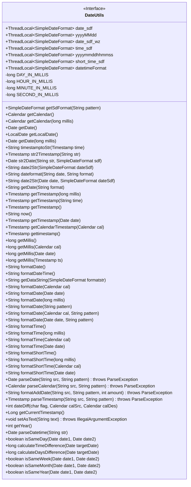

# 基础信息

|      |      |
|------|------|
| 名称 | DateUtils |
| 编码语言 | .java |
| 代码路径 | JeecgBoot/jeecg-boot/jeecg-boot-base-core/src/main/java/org/jeecg/common/util/DateUtils.java |
| 包名 | org.jeecg.common.util |
| 依赖项 | ['org.jeecg.common.constant.SymbolConstant', 'org.springframework.util.StringUtils', 'java.beans.PropertyEditorSupport', 'java.sql.Timestamp', 'java.text.DateFormat', 'java.text.ParseException', 'java.text.SimpleDateFormat', 'java.time.Duration', 'java.time.LocalDate', 'java.time.LocalDateTime', 'java.time.ZoneId', 'java.time.temporal.ChronoUnit', 'java.util.Calendar', 'java.util.Date', 'java.util.GregorianCalendar'] |
| 概述说明 | DateUtils类实现日期时间格式化、转换、计算和比较功能。 |

# 说明

DateUtils类是一个功能丰富的工具类，主要用于处理日期和时间相关的操作。它提供了日期时间的格式化功能，可以将日期时间转换为特定格式的字符串。此外，该类还支持日期时间的转换，例如将字符串解析为日期时间对象。DateUtils类还具备日期时间的计算能力，能够进行日期时间的加减操作。最后，该类还提供了日期时间的比较功能，可以比较两个日期时间的先后顺序或判断它们是否相等。这些功能使得DateUtils类在处理日期时间相关需求时非常实用和高效。

# 类列表 Class Summary

| 名称   | 类型  | 说明 |
|-------|------|-------------|
| DateUtils | class | DateUtils类提供日期时间格式化、转换、计算及比较功能。 |

## 类 DateUtils

|      |      |
|------|------|
| 访问范围 | public |
| 类型 | class |
| 名称 | DateUtils |
| 说明 | DateUtils类提供日期时间格式化、转换、计算及比较功能。 |

### UML类图

这段代码定义了一个名为 `DateUtils` 的类，继承自 `PropertyEditorSupport`，主要用于处理日期和时间的格式化、转换、计算等操作。类中包含了多个静态的 `ThreadLocal<SimpleDateFormat>` 对象，用于线程安全的日期格式化。此外，类中提供了大量的静态方法，用于获取当前日期、格式化日期、解析字符串为日期、计算日期差值等功能。该类还支持将字符串转换为日期、时间戳等操作，并提供了判断两个日期是否在同一天、同一周、同一月或同一年的方法。

### 内部方法调用关系图

该流程图展示了`DateUtils`类的结构，包括其静态属性、常量和方法。`DateUtils`类主要用于处理日期和时间的格式化、转换、计算等操作。通过多个静态方法和属性，该类提供了丰富的日期处理功能，如获取当前日期、格式化日期、转换时间戳、计算日期差等。

### 字段列表 Field List

| 名称  | 类型  | 说明 |
|-------|-------|------|
| DAY_IN_MILLIS = 24 * 3600 * 1000 | long | 定义常量DAY_IN_MILLIS表示一天的毫秒数。 |
| yyyyMMdd = new ThreadLocal<SimpleDateFormat>() {        @Override        protected SimpleDateFormat initialValue() {            return new SimpleDateFormat("yyyyMMdd");        }    } | ThreadLocal<SimpleDateFormat> | 使用ThreadLocal确保线程安全的SimpleDateFormat实例，格式为yyyyMMdd。 |
| datetimeFormat = new ThreadLocal<SimpleDateFormat>() {        @Override        protected SimpleDateFormat initialValue() {            return new SimpleDateFormat("yyyy-MM-dd HH:mm:ss");        }    } | ThreadLocal<SimpleDateFormat> | 定义线程安全的SimpleDateFormat实例，格式为yyyy-MM-dd HH:mm:ss。 |
| short_time_sdf = new ThreadLocal<SimpleDateFormat>() {        @Override        protected SimpleDateFormat initialValue() {            return new SimpleDateFormat("HH:mm");        }    } | ThreadLocal<SimpleDateFormat> | 定义线程局部变量short_time_sdf，初始化为HH:mm格式的SimpleDateFormat。 |
| date_sdf_wz = new ThreadLocal<SimpleDateFormat>() {        @Override        protected SimpleDateFormat initialValue() {            return new SimpleDateFormat("yyyy年MM月dd日");        }    } | ThreadLocal<SimpleDateFormat> | 定义线程局部变量，初始化日期格式为"yyyy年MM月dd日"。 |
| HOUR_IN_MILLIS = 3600 * 1000 | long | 定义常量HOUR_IN_MILLIS，表示1小时的毫秒数。 |
| SECOND_IN_MILLIS = 1000 | long | 定义常量SECOND_IN_MILLIS，值为1000，表示一秒的毫秒数。 |
| date_sdf = new ThreadLocal<SimpleDateFormat>() {        @Override        protected SimpleDateFormat initialValue() {            return new SimpleDateFormat("yyyy-MM-dd");        }    } | ThreadLocal<SimpleDateFormat> | 线程本地变量存储日期格式化对象，格式为yyyy-MM-dd。 |
| yyyymmddhhmmss = new ThreadLocal<SimpleDateFormat>() {        @Override        protected SimpleDateFormat initialValue() {            return new SimpleDateFormat("yyyyMMddHHmmss");        }    } | ThreadLocal<SimpleDateFormat> | 定义线程安全的SimpleDateFormat对象，格式为"yyyyMMddHHmmss"。 |
| time_sdf = new ThreadLocal<SimpleDateFormat>() {        @Override        protected SimpleDateFormat initialValue() {            return new SimpleDateFormat("yyyy-MM-dd HH:mm");        }    } | ThreadLocal<SimpleDateFormat> | 定义线程局部变量，初始化为指定日期格式的SimpleDateFormat对象。 |
| MINUTE_IN_MILLIS = 60 * 1000 | long | 定义常量MINUTE_IN_MILLIS，表示一分钟的毫秒数。 |

### 方法列表 Method List

| 名称  | 类型  | 说明 |
|-------|-------|------|
| formatDate | String | 静态方法formatDate将日期对象格式化为字符串。 |
| getMillis | long | 获取当前系统时间的毫秒值。 |
| getTimestamp | Timestamp | 静态方法将字符串时间转换为时间戳对象。 |
| getSdFormat | SimpleDateFormat | 定义静态方法获取指定格式的SimpleDateFormat对象。 |
| getMillis | long | 获取Calendar对象的时间戳毫秒数。 |
| getCalendarTimestamp | Timestamp | 将Calendar对象转换为Timestamp对象并返回。 |
| getDate | Date | 静态方法getDate通过毫秒数返回Date对象。 |
| getDataString | String | 同步方法返回格式化后的当前时间字符串。 |
| formatDate | String | 静态方法将毫秒数转换为格式化日期字符串。 |
| formatShortTime | String | 静态方法返回格式化后的短时间字符串。 |
| getTimestamp | Timestamp | 静态方法获取指定毫秒数的时间戳实例。 |
| formatAddDate | String | 静态方法格式化日期并增加指定天数。 |
| str2Timestamp | Timestamp | 将字符串转换为Timestamp对象。 |
| formatTime | String | 静态方法formatTime返回格式化后的当前时间字符串。 |
| getDate | String | 静态方法获取当前日期并按指定格式返回。 |
| getDate | Date | 静态方法返回当前日期对象。 |
| formatTime | String | 静态方法formatTime用于格式化日期对象为字符串。 |
| formatDateTime | String | 静态方法formatDateTime返回格式化后的当前日期时间字符串。 |
| isSameDay | boolean | 判断两个日期是否为同一天。 |
| getYear | int | 静态方法getYear返回当前年份。 |
| str2Date | Date | 将字符串转换为日期，若为空或异常则返回空。 |
| date2Str | String | 同步方法将日期格式化为字符串，若日期为空则返回空值。 |
| getTimestamp | Timestamp | 静态方法获取当前时间戳。 |
| formatDate | String | 静态方法formatDate用于按指定模式格式化日期对象。 |
| gettimestamp | Timestamp | 静态方法获取当前时间戳并返回SQL格式时间戳。 |
| dateformat | String | 静态方法dateformat将日期字符串按指定格式解析并重新格式化。 |
| now | String | 静态方法now返回当前时间格式化字符串。 |
| isSameWeek | boolean | 判断两个日期是否在同一周。 |
| parseTimestamp | Timestamp | 静态方法将字符串按指定格式解析为时间戳。 |
| getMillis | long | 获取Timestamp对象的时间戳毫秒值。 |
| date2Str | String | 静态方法将日期格式化为字符串，线程安全处理空日期。 |
| formatTime | String | 格式化日历时间为字符串。 |
| getMillis | long | 获取日期对象的毫秒时间戳。 |
| getCalendar | Calendar | 根据毫秒数获取Calendar实例并设置时间。 |
| getLocalDate | LocalDate | 静态方法返回当前日期。 |
| calculateTimeDifference | long | 计算目标日期与当前时间的毫秒差。 |
| isSameMonth | boolean | 判断两个日期是否在同一个月。 |
| formatDate | String | 静态方法formatDate用于格式化Calendar对象为日期字符串。 |
| formatDate | String | 静态方法formatDate根据指定模式格式化当前日期并返回字符串。 |
| formatShortTime | String | 静态方法formatShortTime将Calendar对象格式化为短时间字符串。 |
| formatDate | String | 静态方法formatDate通过日历对象和格式模式返回格式化日期字符串。 |
| parseDatetime | Date | 静态方法parseDatetime解析字符串为日期，失败返回null。 |
| formatTime | String | 静态方法formatTime将毫秒数转换为格式化时间字符串。 |
| isSameYear | boolean | 该方法判断两个日期是否为同一年。 |
| calculateDaysDifference | long | 计算目标日期与当前日期的天数差。 |
| formatDate | String | 静态方法formatDate返回格式化后的当前日期字符串。 |
| parseCalendar | Calendar | 静态方法解析字符串为日历对象，支持自定义格式。 |
| getCurrentTimestamp | Long | 获取当前时间戳并返回长整型数值。 |
| setAsText | void | 解析日期字符串，支持10位和19位格式，格式错误抛出异常。 |
| dateDiff | int | 计算两个日历日期的时间差，支持年、日、时、分、秒。 |
| formatShortTime | String | 静态方法formatShortTime将毫秒数转换为短时间格式字符串。 |
| timestamptoStr | String | 将Timestamp转换为字符串，若不为空则处理日期转换。 |
| formatShortTime | String | 静态方法格式化日期为短时间字符串。 |
| parseDate | Date | 静态方法parseDate解析字符串为日期，使用指定格式，可能抛出ParseException。 |
| getTimestamp | Timestamp | 静态方法将Date对象转换为Timestamp对象。 |
| getCalendar | Calendar | 获取当前日历实例的静态方法。 |

