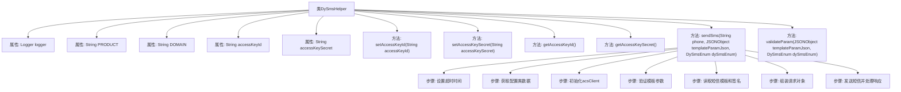

# 基础信息

|      |      |
|------|------|
| 名称 | DySmsHelper |
| 编码语言 | .java |
| 代码路径 | JeecgBoot/jeecg-boot/jeecg-boot-base-core/src/main/java/org/jeecg/common/util/DySmsHelper.java |
| 包名 | org.jeecg.common.util |
| 依赖项 | ['cn.hutool.core.collection.CollectionUtil', 'com.alibaba.fastjson.JSONObject', 'com.aliyuncs.DefaultAcsClient', 'com.aliyuncs.IAcsClient', 'com.aliyuncs.dysmsapi.model.v20170525.SendSmsRequest', 'com.aliyuncs.dysmsapi.model.v20170525.SendSmsResponse', 'com.aliyuncs.exceptions.ClientException', 'com.aliyuncs.profile.DefaultProfile', 'com.aliyuncs.profile.IClientProfile', 'org.apache.commons.lang3.StringUtils', 'org.jeecg.common.constant.enums.DySmsEnum', 'org.jeecg.config.JeecgSmsTemplateConfig', 'org.jeecg.config.StaticConfig', 'org.slf4j.Logger', 'org.slf4j.LoggerFactory', 'java.util.Map'] |
| 概述说明 | DySmsHelper类负责短信发送，含AK配置、参数验证及发送功能。 |

# 说明

DySmsHelper类是一个专门用于发送短信的工具类，主要功能包括AK配置、参数验证以及短信发送。AK配置用于设置短信服务的认证密钥，确保发送请求的安全性。参数验证功能用于检查短信内容、接收号码等输入数据的有效性，防止无效或错误数据导致发送失败。短信发送功能则负责将验证通过的消息发送给指定接收者。该类通过集成这些功能，提供了一个高效、可靠的短信发送解决方案。

# 类列表 Class Summary

| 名称   | 类型  | 说明 |
|-------|------|-------------|
| DySmsHelper | class | DySmsHelper类用于发送短信，包含AK配置、参数验证和短信发送功能。 |

## 类 DySmsHelper

|      |      |
|------|------|
| 访问范围 | public |
| 类型 | class |
| 名称 | DySmsHelper |
| 说明 | DySmsHelper类用于发送短信，包含AK配置、参数验证和短信发送功能。 |

### UML类图

```mermaid
classDiagram
    class DySmsHelper {
        -Logger logger
        -static String PRODUCT
        -static String DOMAIN
        -static String accessKeyId
        -static String accessKeySecret
        +static void setAccessKeyId(String accessKeyId)
        +static void setAccessKeySecret(String accessKeySecret)
        +static String getAccessKeyId()
        +static String getAccessKeySecret()
        +static boolean sendSms(String phone, JSONObject templateParamJson, DySmsEnum dySmsEnum) throws ClientException
        -static void validateParam(JSONObject templateParamJson, DySmsEnum dySmsEnum)
    }

    class StaticConfig {
        +String getAccessKeyId()
        +String getAccessKeySecret()
    }

    class SpringContextUtils {
        +static ~T~ getBean(Class~T~ clazz)
    }

    class JeecgSmsTemplateConfig {
        +Map~String, String~ getTemplateCode()
        +String getSignature()
    }

    class IClientProfile {
        <<Interface>>
    }

    class DefaultProfile {
        +static IClientProfile getProfile(String regionId, String accessKeyId, String accessKeySecret)
        +static void addEndpoint(String regionId, String product, String domain)
    }

    class IAcsClient {
        <<Interface>>
        +SendSmsResponse getAcsResponse(SendSmsRequest request)
    }

    class DefaultAcsClient {
        +DefaultAcsClient(IClientProfile profile)
    }

    class SendSmsRequest {
        +void setPhoneNumbers(String phoneNumbers)
        +void setSignName(String signName)
        +void setTemplateCode(String templateCode)
        +void setTemplateParam(String templateParam)
    }

    class SendSmsResponse {
        +String getCode()
        +String getMessage()
        +String getRequestId()
        +String getBizId()
    }

    class DySmsEnum {
        <<Enum>>
        +String getTemplateCode()
        +String getSignName()
        +String getKeys()
    }

    class JSONObject {
        +void put(String key, Object value)
        +boolean containsKey(String key)
        +String toJSONString()
    }

    DySmsHelper --> StaticConfig : 依赖
    DySmsHelper --> SpringContextUtils : 依赖
    DySmsHelper --> JeecgSmsTemplateConfig : 依赖
    DySmsHelper --> IClientProfile : 依赖
    DySmsHelper --> DefaultProfile : 依赖
    DySmsHelper --> IAcsClient : 依赖
    DySmsHelper --> DefaultAcsClient : 依赖
    DySmsHelper --> SendSmsRequest : 依赖
    DySmsHelper --> SendSmsResponse : 依赖
    DySmsHelper --> DySmsEnum : 依赖
    DySmsHelper --> JSONObject : 依赖
    DefaultProfile --> IClientProfile : 实现
    DefaultAcsClient --> IAcsClient : 实现
```

**描述：**
`DySmsHelper` 是一个用于发送短信的工具类，主要依赖阿里云的短信服务。它通过 `StaticConfig` 和 `SpringContextUtils` 获取配置信息，使用 `IClientProfile` 和 `DefaultProfile` 初始化客户端，并通过 `SendSmsRequest` 和 `SendSmsResponse` 发送和接收短信。`DySmsEnum` 用于定义短信模板和签名，`JSONObject` 用于处理模板参数。

### 内部方法调用关系图

这段代码定义了一个名为 `DySmsHelper` 的类，用于发送短信。代码的主要功能包括设置短信发送的超时时间、获取配置类数据、初始化短信客户端、验证模板参数、读取短信模板和签名、组装请求对象以及发送短信并处理响应。流程图展示了类中的属性、方法以及方法之间的调用关系，清晰地描述了短信发送的整个流程。

### 字段列表 Field List

| 名称  | 类型  | 说明 |
|-------|-------|------|
| accessKeySecret | String | 定义静态字符串变量accessKeySecret。 |
| PRODUCT = "Dysmsapi" | String | 静态常量PRODUCT值为"Dysmsapi"。 |
| accessKeyId | String | 定义静态字符串变量accessKeyId。 |
| logger=LoggerFactory.getLogger(DySmsHelper.class) | Logger | DySmsHelper类中定义了一个私有的静态Logger对象。 |
| DOMAIN = "dysmsapi.aliyuncs.com" | String | 定义静态常量DOMAIN为阿里云短信API域名。 |

### 方法列表 Method List

| 名称  | 类型  | 说明 |
|-------|-------|------|
| setAccessKeySecret | void | 设置访问密钥的静态方法。 |
| sendSms | boolean | 发送短信方法，配置超时，获取密钥，验证参数，设置模板和签名，发送请求并返回结果。 |
| setAccessKeyId | void | 设置短信助手的访问密钥ID。 |
| validateParam | void | 验证模板参数，缺失时抛出异常。 |
| getAccessKeySecret | String | 该方法返回accessKeySecret的值。 |
| getAccessKeyId | String | 获取访问密钥ID的静态方法。 |

