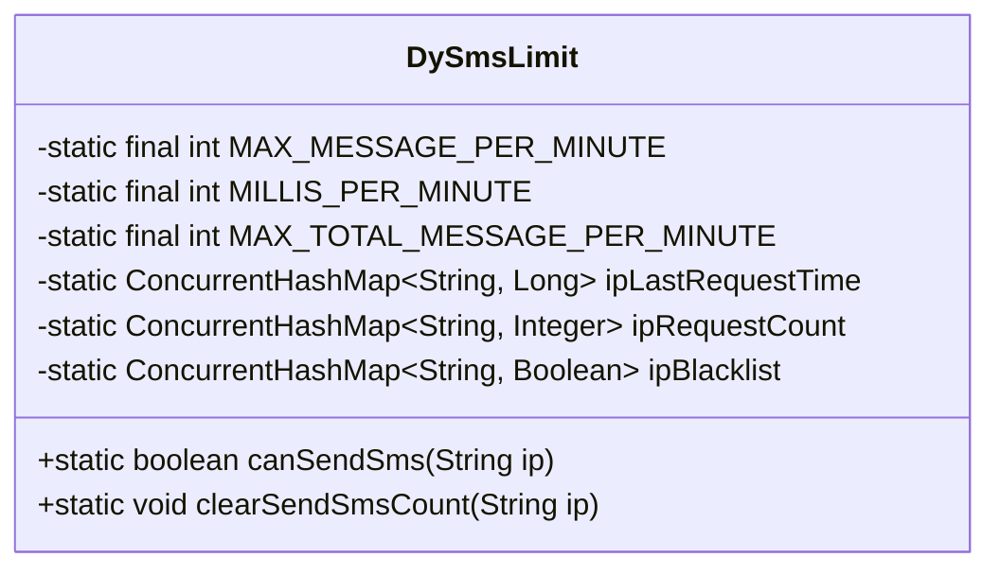
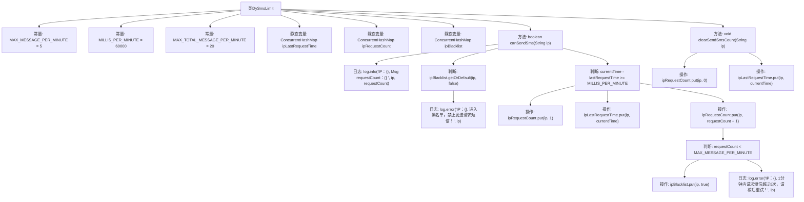

# 基础信息

|      |      |
|------|------|
| 名称 | DySmsLimit |
| 编码语言 | .java |
| 代码路径 | JeecgBoot/jeecg-boot/jeecg-boot-base-core/src/main/java/org/jeecg/common/util/DySmsLimit.java |
| 包名 | org.jeecg.common.util |
| 依赖项 | ['lombok.extern.slf4j.Slf4j', 'java.util.concurrent.ConcurrentHashMap'] |
| 概述说明 | DySmsLimit类限制IP每分钟最多发送5条短信，超20条加入黑名单，支持清空计数。 |

# 说明

DySmsLimit类用于限制单一IP地址在每分钟内最多发送5条短信。如果同一IP地址在短时间内发送的短信数量超过20条，该IP将被自动加入黑名单。此外，该类还支持清空发送计数功能，以便在需要时重置计数状态。这一机制有效防止了短信滥发行为，保障了系统的安全性和稳定性。

# 类列表 Class Summary

| 名称   | 类型  | 说明 |
|-------|------|-------------|
| DySmsLimit | class | DySmsLimit类限制单一IP每分钟最多发送5条短信，超过20条则加入黑名单，并支持清空计数。 |

## 类 DySmsLimit

|      |      |
|------|------|
| 访问范围 | @Slf4j;public |
| 类型 | class |
| 名称 | DySmsLimit |
| 说明 | DySmsLimit类限制单一IP每分钟最多发送5条短信，超过20条则加入黑名单，并支持清空计数。 |

### UML类图

**描述：**  
`DySmsLimit` 类用于限制单一IP地址在一分钟内发送短信的次数。通过三个静态的 `ConcurrentHashMap` 分别记录IP的最后请求时间、请求次数以及黑名单状态。`canSendSms` 方法根据IP的请求频率决定是否允许发送短信，若请求次数超过限制，则将该IP加入黑名单。`clearSendSmsCount` 方法用于清空某个IP的请求计数，通常在验证成功后调用。该类通过并发数据结构确保线程安全。

### 内部方法调用关系图

该流程图描述了`DySmsLimit`类的结构和主要方法`canSendSms`和`clearSendSmsCount`的逻辑流程。`canSendSms`方法首先检查IP是否在黑名单中，如果在则禁止发送短信；否则，根据请求时间和次数判断是否允许发送短信，若请求次数超过限制则加入黑名单。`clearSendSmsCount`方法用于清空指定IP的请求计数和最后请求时间。流程图清晰地展示了各个判断和操作步骤之间的逻辑关系。

### 字段列表 Field List

| 名称  | 类型  | 说明 |
|-------|-------|------|
| ipBlacklist = new ConcurrentHashMap<>() | ConcurrentHashMap<String, Boolean> | 私有静态并发哈希表存储IP黑名单。 |
| ipRequestCount = new ConcurrentHashMap<>() | ConcurrentHashMap<String, Integer> | 使用ConcurrentHashMap记录IP请求次数，确保线程安全。 |
| MAX_MESSAGE_PER_MINUTE = 5 | int | 静态常量MAX_MESSAGE_PER_MINUTE限制每分钟最多发送5条消息。 |
| ipLastRequestTime = new ConcurrentHashMap<>() | ConcurrentHashMap<String, Long> | 使用ConcurrentHashMap存储IP地址与最后请求时间的映射。 |
| MILLIS_PER_MINUTE = 60000 | int | 定义常量MILLIS_PER_MINUTE为每分钟的毫秒数60000。 |
| MAX_TOTAL_MESSAGE_PER_MINUTE = 20 | int | 每分钟最大消息数限制为20。 |

### 方法列表 Method List

| 名称  | 类型  | 说明 |
|-------|-------|------|
| clearSendSmsCount | void | 清除指定IP的短信发送计数并更新最后请求时间。 |
| canSendSms | boolean | 检查IP短信请求频率，超限则加入黑名单，限制发送。 |

