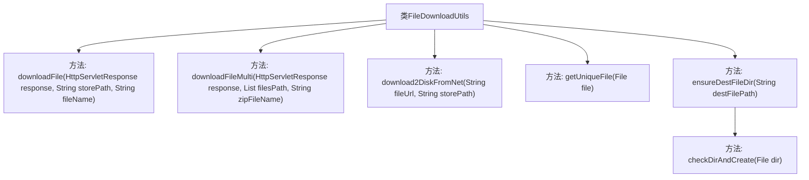

# 基础信息

|      |      |
|------|------|
| 名称 | FileDownloadUtils |
| 编码语言 | .java |
| 代码路径 | JeecgBoot/jeecg-boot/jeecg-boot-base-core/src/main/java/org/jeecg/common/util/FileDownloadUtils.java |
| 包名 | org.jeecg.common.util |
| 依赖项 | ['lombok.extern.slf4j.Slf4j', 'org.apache.commons.io.FilenameUtils', 'org.jeecg.common.exception.JeecgBootException', 'javax.servlet.http.HttpServletResponse', 'java.io', 'java.net.URL', 'java.net.URLConnection', 'java.net.URLEncoder', 'java.nio.file.Files', 'java.util.List', 'java.util.zip.ZipEntry', 'java.util.zip.ZipOutputStream'] |
| 概述说明 | FileDownloadUtils类支持单文件、多文件压缩及网络资源下载，确保目录存在并生成唯一文件名。 |

# 说明

FileDownloadUtils类是一个用于文件下载的工具类，支持多种下载方式，包括单文件下载、多文件压缩下载以及网络资源下载。该工具类确保目标文件目录存在，并为下载的文件生成唯一文件名，以避免文件名冲突。通过这些功能，FileDownloadUtils类为用户提供了高效、可靠的文件下载解决方案。

# 类列表 Class Summary

| 名称   | 类型  | 说明 |
|-------|------|-------------|
| FileDownloadUtils | class | FileDownloadUtils类提供文件下载功能，支持单文件、多文件压缩下载及网络资源下载，确保文件目录存在并生成唯一文件名。 |

## 类 FileDownloadUtils

|      |      |
|------|------|
| 访问范围 | @Slf4j;public |
| 类型 | class |
| 名称 | FileDownloadUtils |
| 说明 | FileDownloadUtils类提供文件下载功能，支持单文件、多文件压缩下载及网络资源下载，确保文件目录存在并生成唯一文件名。 |

### UML类图

```mermaid
classDiagram
    class FileDownloadUtils {
        +downloadFile(HttpServletResponse response, String storePath, String fileName) void
        +downloadFileMulti(HttpServletResponse response, List~String~ filesPath, String zipFileName) void
        +download2DiskFromNet(String fileUrl, String storePath) String
        +getUniqueFile(File file) File
        +checkDirAndCreate(File dir) void
        -ensureDestFileDir(String destFilePath) File
    }

    class HttpServletResponse {
        <<Interface>>
        +setCharacterEncoding(String charset) void
        +setHeader(String name, String value) void
        +setContentType(String type) void
        +getOutputStream() OutputStream
    }

    class File {
        +exists() boolean
        +getName() String
        +getAbsolutePath() String
        +getParentFile() File
        +mkdirs() boolean
    }

    class ZipOutputStream {
        +setMethod(int method) void
        +putNextEntry(ZipEntry e) void
        +closeEntry() void
    }

    class InputStream {
        +read(byte[] b) int
        +close() void
    }

    class OutputStream {
        +write(byte[] b, int off, int len) void
    }

    class DataOutputStream {
        +write(byte[] b, int off, int len) void
    }

    class URL {
        +openConnection() URLConnection
    }

    class URLConnection {
        +setConnectTimeout(int timeout) void
        +setRequestProperty(String key, String value) void
        +getInputStream() InputStream
    }

    class FilenameUtils {
        +getExtension(String filename) String
        +getBaseName(String filename) String
    }

    FileDownloadUtils --> HttpServletResponse : 依赖
    FileDownloadUtils --> File : 依赖
    FileDownloadUtils --> ZipOutputStream : 依赖
    FileDownloadUtils --> InputStream : 依赖
    FileDownloadUtils --> OutputStream : 依赖
    FileDownloadUtils --> DataOutputStream : 依赖
    FileDownloadUtils --> URL : 依赖
    FileDownloadUtils --> URLConnection : 依赖
    FileDownloadUtils --> FilenameUtils : 依赖
```

**描述：**
`FileDownloadUtils` 类提供了文件下载和处理的工具方法，包括单文件下载、多文件压缩下载、从网络下载文件到磁盘、获取不重名的文件以及确保目录存在等功能。该类依赖于 `HttpServletResponse`、`File`、`ZipOutputStream`、`InputStream`、`OutputStream`、`DataOutputStream`、`URL`、`URLConnection` 和 `FilenameUtils` 等类或接口来实现其功能。通过这些方法，用户可以方便地处理文件下载和存储任务。

### 内部方法调用关系图

这段代码定义了一个名为 `FileDownloadUtils` 的类，主要用于文件下载和处理。类中包含多个静态方法，分别用于单文件下载、多文件压缩下载、从网络下载文件到磁盘、获取不重名的文件、确保输出文件目录存在以及验证并创建目录。这些方法通过不同的逻辑处理文件下载、压缩、网络请求和目录管理，确保文件下载和存储的顺利进行。

### 字段列表 Field List

| 名称  | 类型  | 说明 |
|-------|-------|------|

### 方法列表 Method List

| 名称  | 类型  | 说明 |
|-------|-------|------|
| checkDirAndCreate | void | 检查目录是否存在，若不存在则创建。 |
| download2DiskFromNet | String | 从网络下载文件到本地磁盘，设置超时并确保目录存在。 |
| ensureDestFileDir | File | 确保目标文件目录存在并返回文件对象。 |
| getUniqueFile | File | 获取唯一文件名，若存在则添加序号。 |
| downloadFile | void | Java方法实现文件下载，检查文件存在性，配置响应头，处理中文文件名，读取并输出文件内容。 |
| downloadFileMulti | void | 下载多个文件并压缩为ZIP，设置响应头，边压缩边下载。 |

