# 基础信息

|      |      |
|------|------|
| 名称 | FillRuleUtil |
| 编码语言 | .java |
| 代码路径 | JeecgBoot/jeecg-boot/jeecg-boot-base-core/src/main/java/org/jeecg/common/util/FillRuleUtil.java |
| 包名 | org.jeecg.common.util |
| 依赖项 | ['com.alibaba.fastjson.JSON', 'com.alibaba.fastjson.JSONObject', 'com.baomidou.mybatisplus.core.conditions.query.QueryWrapper', 'com.baomidou.mybatisplus.extension.service.impl.ServiceImpl', 'lombok.extern.slf4j.Slf4j', 'org.apache.commons.lang3.StringUtils', 'org.jeecg.common.constant.SymbolConstant', 'org.jeecg.common.handler.IFillRuleHandler', 'org.jeecg.common.system.query.QueryGenerator', 'javax.servlet.http.HttpServletRequest'] |
| 概述说明 | FillRuleUtil类根据ruleCode执行规则，获取参数并调用指定方法处理数据。 |

# 说明

FillRuleUtil类通过ruleCode执行规则，首先获取相关参数，然后调用指定类的方法对数据进行处理。该类的核心功能是根据规则代码执行相应的操作，确保数据处理过程符合预设规则。

# 类列表 Class Summary

| 名称   | 类型  | 说明 |
|-------|------|-------------|
| FillRuleUtil | class | FillRuleUtil类通过ruleCode执行规则，获取参数并调用指定类的方法处理数据。 |

## 类 FillRuleUtil

|      |      |
|------|------|
| 访问范围 | @Slf4j;public |
| 类型 | class |
| 名称 | FillRuleUtil |
| 说明 | FillRuleUtil类通过ruleCode执行规则，获取参数并调用指定类的方法处理数据。 |

### UML类图

```mermaid
classDiagram
    class FillRuleUtil {
        +Object executeRule(String ruleCode, JSONObject formData)
    }

    class ServiceImpl {
        +Object getOne(QueryWrapper queryWrapper)
    }

    class QueryWrapper {
        +QueryWrapper eq(String column, Object value)
    }

    class JSON {
        +String toJSONString(Object object)
        +JSONObject parseObject(String json)
    }

    class JSONObject {
        +String getString(String key)
        +JSONObject getJSONObject(String key)
        +void put(String key, Object value)
        +Set~String~ keySet()
    }

    class SpringContextUtils {
        +Object getBean(String beanName)
        +HttpServletRequest getHttpServletRequest()
    }

    class HttpServletRequest {
        +String getParameter(String name)
    }

    class oConvertUtils {
        +boolean isNotEmpty(String str)
    }

    class SymbolConstant {
        +String SYS_VAR_PREFIX
    }

    class QueryGenerator {
        +String getSqlRuleValue(String value)
    }

    class IFillRuleHandler {
        <<Interface>>
        +Object execute(JSONObject params, JSONObject formData)
    }

    FillRuleUtil --> ServiceImpl : 依赖
    FillRuleUtil --> QueryWrapper : 依赖
    FillRuleUtil --> JSON : 依赖
    FillRuleUtil --> JSONObject : 依赖
    FillRuleUtil --> SpringContextUtils : 依赖
    FillRuleUtil --> HttpServletRequest : 依赖
    FillRuleUtil --> oConvertUtils : 依赖
    FillRuleUtil --> SymbolConstant : 依赖
    FillRuleUtil --> QueryGenerator : 依赖
    FillRuleUtil --> IFillRuleHandler : 依赖
```

### 描述
`FillRuleUtil` 类通过 `executeRule` 方法执行填值规则。它首先从 `SpringContextUtils` 获取 `ServiceImpl` 实例，并使用 `QueryWrapper` 查询规则实体。然后，它解析规则参数，优先从 `HttpServletRequest` 中获取参数值，并通过 `QueryGenerator` 替换系统变量。最后，通过反射实例化 `IFillRuleHandler` 接口的实现类，并执行规则处理。整个过程涉及多个类的协作，确保了规则的正确执行。

### 内部方法调用关系图

这段代码的流程图描述了 `executeRule` 方法的执行流程。该方法首先检查 `ruleCode` 是否为空，若不为空则通过 `ServiceImpl` 实例查询相关实体。如果实体存在，则获取 `ruleClass` 和 `ruleParams`，并解析 `params` 中的变量，优先从 `queryString` 中取值，然后替换系统变量。最后，通过反射执行配置的类里的方法并返回结果。在整个过程中，任何异常都会被捕获并处理，最终返回 `null`。

### 字段列表 Field List

| 名称  | 类型  | 说明 |
|-------|-------|------|

### 方法列表 Method List

| 名称  | 类型  | 说明 |
|-------|-------|------|
| executeRule | Object | 根据规则代码执行填值规则，获取参数并处理系统变量，最终通过反射调用方法返回结果。 |

