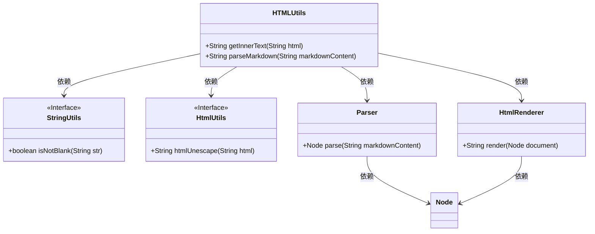
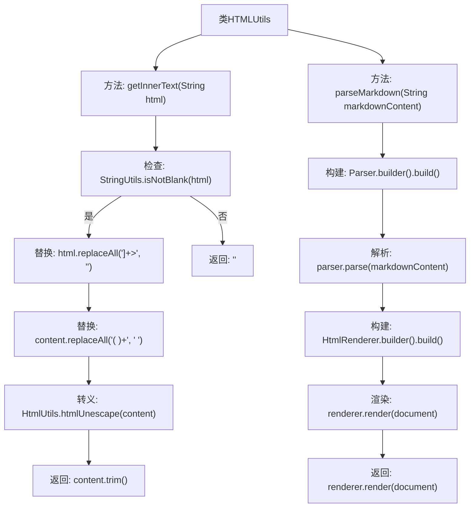

# 基础信息

|      |      |
|------|------|
| 名称 | HTMLUtils |
| 编码语言 | .java |
| 代码路径 | JeecgBoot/jeecg-boot/jeecg-boot-base-core/src/main/java/org/jeecg/common/util/HTMLUtils.java |
| 包名 | org.jeecg.common.util |
| 依赖项 | ['org.apache.commons.lang3.StringUtils', 'org.commonmark.node.Node', 'org.commonmark.parser.Parser', 'org.commonmark.renderer.html.HtmlRenderer', 'org.springframework.web.util.HtmlUtils'] |
| 概述说明 | HTMLUtils类支持HTML文本获取和Markdown转HTML功能。 |

# 说明

HTMLUtils类是一个功能丰富的工具类，主要用于处理HTML文本和Markdown格式的转换。它提供了两个核心功能：一是获取HTML文本，方便用户从各种来源提取HTML内容；二是将Markdown格式的文本解析为HTML，使得用户能够轻松地将Markdown文档转换为标准的HTML格式，便于在网页中展示和使用。这两个功能极大地简化了HTML文本的处理和Markdown到HTML的转换过程，提升了开发效率和代码的可维护性。

# 类列表 Class Summary

| 名称   | 类型  | 说明 |
|-------|------|-------------|
| HTMLUtils | class | HTMLUtils类提供获取HTML文本和解析Markdown为HTML的功能。 |

## 类 HTMLUtils

|      |      |
|------|------|
| 访问范围 | @SuppressWarnings("AlibabaClassNamingShouldBeCamel");public |
| 类型 | class |
| 名称 | HTMLUtils |
| 说明 | HTMLUtils类提供获取HTML文本和解析Markdown为HTML的功能。 |

### UML类图

这段代码定义了一个名为 `HTMLUtils` 的工具类，提供了两个静态方法：`getInnerText` 和 `parseMarkdown`。`getInnerText` 方法用于从 HTML 代码中提取纯文本内容，去除 HTML 标签并处理转义字符。`parseMarkdown` 方法将 Markdown 格式的文本转换为 HTML。代码依赖了 `StringUtils`、`HtmlUtils`、`Parser` 和 `HtmlRenderer` 等外部类或接口，分别用于字符串处理、HTML 转义、Markdown 解析和 HTML 渲染。

### 内部方法调用关系图

这段代码定义了一个名为 `HTMLUtils` 的工具类，包含两个主要方法：`getInnerText` 和 `parseMarkdown`。`getInnerText` 方法用于从HTML代码中提取纯文本内容，去除HTML标签并处理空格和转义字符。`parseMarkdown` 方法用于将Markdown格式的文本转换为HTML，使用 `Parser` 和 `HtmlRenderer` 进行解析和渲染。流程图展示了这两个方法的执行流程，包括条件判断、字符串处理和解析渲染的步骤。

### 字段列表 Field List

| 名称  | 类型  | 说明 |
|-------|-------|------|

### 方法列表 Method List

| 名称  | 类型  | 说明 |
|-------|-------|------|
| getInnerText | String | 该方法去除HTML标签，合并空格并反转义字符，返回纯文本内容。 |
| parseMarkdown | String | JDK17下优化Markdown解析，使用Parser和HtmlRenderer替换PegDownProcessor。 |

