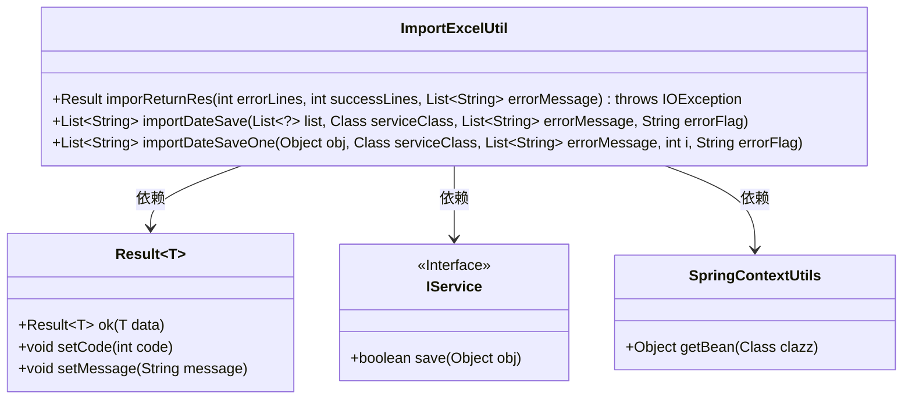
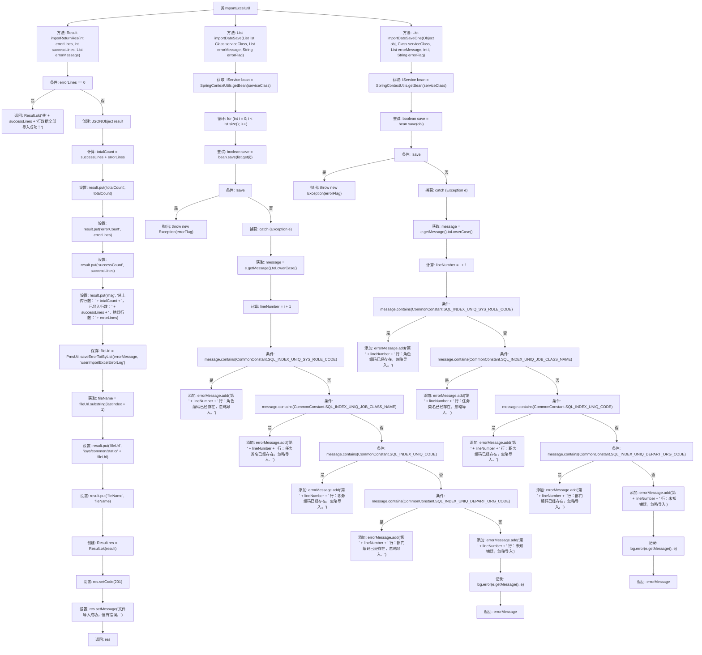

# 基础信息

|      |      |
|------|------|
| 名称 | ImportExcelUtil |
| 编码语言 | .java |
| 代码路径 | JeecgBoot/jeecg-boot/jeecg-boot-base-core/src/main/java/org/jeecg/common/util/ImportExcelUtil.java |
| 包名 | org.jeecg.common.util |
| 依赖项 | ['com.alibaba.fastjson.JSONObject', 'com.baomidou.mybatisplus.extension.service.IService', 'lombok.extern.slf4j.Slf4j', 'org.jeecg.common.api.vo.Result', 'org.jeecg.common.constant.CommonConstant', 'java.io.File', 'java.io.IOException', 'java.util.List'] |
| 概述说明 | 导入Excel工具类，处理数据及错误信息。 |

# 说明

该描述涉及一个Excel工具类，主要用于处理数据导入过程中的结果和错误信息。该工具类的主要功能是导入Excel文件，并对导入的数据进行解析和验证，确保数据的准确性和完整性。在处理过程中，工具类能够捕获并记录任何可能出现的错误信息，如格式错误、数据缺失或数据类型不匹配等。通过这些功能，工具类帮助用户高效地管理和修复数据导入过程中遇到的问题，确保数据能够顺利导入并应用于后续的业务流程中。

# 类列表 Class Summary

| 名称   | 类型  | 说明 |
|-------|------|-------------|
| ImportExcelUtil | class | 导入Excel工具类，处理数据导入结果和错误信息。 |

## 类 ImportExcelUtil

|      |      |
|------|------|
| 访问范围 | @Slf4j;public |
| 类型 | class |
| 名称 | ImportExcelUtil |
| 说明 | 导入Excel工具类，处理数据导入结果和错误信息。 |

### UML类图

**描述：**  
`ImportExcelUtil` 类提供了三个静态方法，用于处理Excel导入操作。`imporReturnRes` 方法根据导入的成功和错误行数生成结果对象；`importDateSave` 方法批量保存导入数据，并捕获异常信息；`importDateSaveOne` 方法处理单个对象的保存，并记录错误信息。该类依赖于 `Result` 类返回操作结果，使用 `IService` 接口进行数据保存，并通过 `SpringContextUtils` 获取服务实例。

### 内部方法调用关系图

这段代码是一个用于处理Excel导入的工具类，包含三个主要方法。`imporReturnRes`方法根据导入结果返回不同的响应信息，`importDateSave`和`importDateSaveOne`方法分别用于批量保存和单个保存导入的数据，并处理可能的错误信息。代码通过捕获异常并根据异常信息生成相应的错误提示，最终返回错误信息列表或导入结果。

### 字段列表 Field List

| 名称  | 类型  | 说明 |
|-------|-------|------|

### 方法列表 Method List

| 名称  | 类型  | 说明 |
|-------|-------|------|
| importDateSave | List<String> | 导入数据时检查重复编码并记录错误信息。 |
| importDateSaveOne | List<String> | 方法导入数据并处理错误，返回错误信息列表。 |
| imporReturnRes | Result<?> | 方法根据导入结果返回成功或包含错误信息的响应。 |

