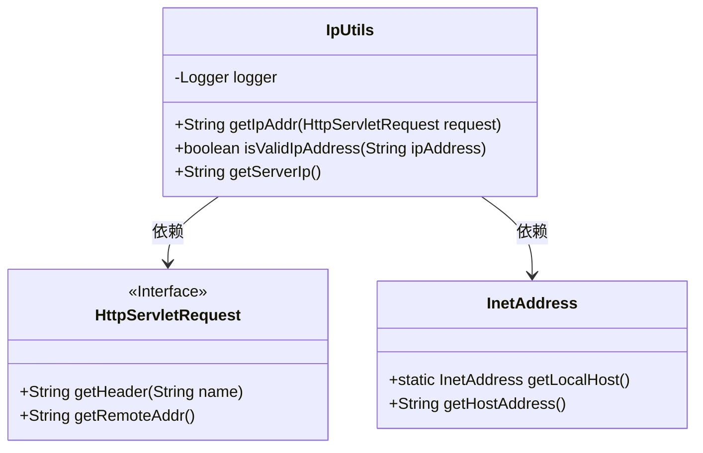
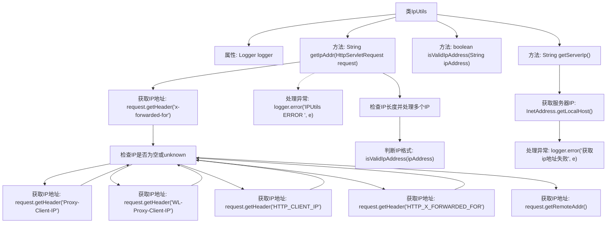

# 基础信息

|      |      |
|------|------|
| 名称 | IpUtils |
| 编码语言 | .java |
| 代码路径 | JeecgBoot/jeecg-boot/jeecg-boot-base-core/src/main/java/org/jeecg/common/util/IpUtils.java |
| 包名 | org.jeecg.common.util |
| 依赖项 | ['javax.servlet.http.HttpServletRequest', 'org.apache.commons.lang3.StringUtils', 'org.jeecg.common.constant.CommonConstant', 'org.slf4j.Logger', 'org.slf4j.LoggerFactory', 'java.net.InetAddress', 'java.net.UnknownHostException', 'java.util.regex.Matcher', 'java.util.regex.Pattern'] |
| 概述说明 | IpUtils类支持获取客户端和服务器IP，适用于代理和反向代理场景。 |

# 说明

IpUtils类是一个用于获取客户端和服务器IP地址的工具类，特别适用于代理和多级反向代理的场景。它能够准确识别并提取客户端和服务器在复杂网络环境中的真实IP地址，确保在存在代理或反向代理的情况下，仍能获取正确的IP信息。该类提供了高效的IP地址解析功能，适用于需要精确获取IP地址的各种应用场景。

# 类列表 Class Summary

| 名称   | 类型  | 说明 |
|-------|------|-------------|
| IpUtils | class | IpUtils类用于获取客户端和服务器IP地址，支持代理和多级反向代理场景。 |

## 类 IpUtils

|      |      |
|------|------|
| 访问范围 | public |
| 类型 | class |
| 名称 | IpUtils |
| 说明 | IpUtils类用于获取客户端和服务器IP地址，支持代理和多级反向代理场景。 |

### UML类图

**描述：**  
`IpUtils` 类提供了与IP地址相关的实用方法，包括从`HttpServletRequest`中获取客户端IP地址、验证IP地址格式以及获取服务器IP地址。`getIpAddr`方法通过检查多个HTTP头信息来获取真实IP地址，并处理了多级反向代理的情况。`isValidIpAddress`方法使用正则表达式验证IP地址格式。`getServerIp`方法通过`InetAddress`类获取服务器的IP地址。该类依赖于`HttpServletRequest`和`InetAddress`接口和类来实现其功能。

### 内部方法调用关系图

这段代码定义了一个`IpUtils`类，用于处理IP地址的获取和验证。`getIpAddr`方法通过多个HTTP头尝试获取客户端的IP地址，并处理多级代理的情况。`isValidIpAddress`方法用于验证IP地址的格式是否正确。`getServerIp`方法用于获取服务器的IP地址。流程图展示了这些方法的调用顺序和逻辑流程。

### 字段列表 Field List

| 名称  | 类型  | 说明 |
|-------|-------|------|
| logger = LoggerFactory.getLogger(IpUtils.class) | Logger | IpUtils类中使用LoggerFactory创建日志记录器。 |

### 方法列表 Method List

| 名称  | 类型  | 说明 |
|-------|-------|------|
| getServerIp | String | 获取本地服务器IP地址的静态方法，失败返回空字符串。 |
| isValidIpAddress | boolean | 该函数使用正则表达式验证IP地址格式是否有效。 |
| getIpAddr | String | 该方法从HTTP请求头中获取客户端IP，优先顺序为x-forwarded-for、Proxy-Client-IP等，最后使用remoteAddr。若IP包含多个，返回第一个有效IP。 |

