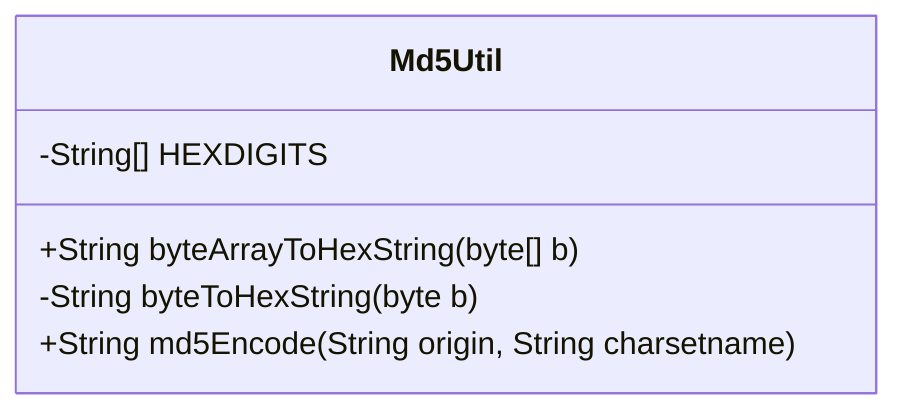
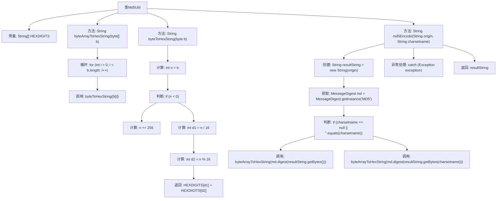

# 基础信息

|      |      |
|------|------|
| 名称 | Md5Util |
| 编码语言 | .java |
| 代码路径 | JeecgBoot/jeecg-boot/jeecg-boot-base-core/src/main/java/org/jeecg/common/util/Md5Util.java |
| 包名 | org.jeecg.common.util |
| 依赖项 | ['java.security.MessageDigest'] |
| 概述说明 | MD5工具类提供字节数组转十六进制字符串及MD5编码功能。 |

# 说明

MD5工具类提供了两种主要功能：一是将字节数组转换为十六进制字符串，二是实现MD5编码。该工具类能够处理字节数据，并将其转换为易于阅读和使用的十六进制格式。同时，它还支持对数据进行MD5编码，确保数据的完整性和安全性。这两项功能在数据处理和加密领域具有广泛应用，能够满足开发者在不同场景下的需求。

# 类列表 Class Summary

| 名称   | 类型  | 说明 |
|-------|------|-------------|
| Md5Util | class | MD5工具类，包含字节数组转十六进制字符串和MD5编码功能。 |

## 类 Md5Util

|      |      |
|------|------|
| 访问范围 | public |
| 类型 | class |
| 名称 | Md5Util |
| 说明 | MD5工具类，包含字节数组转十六进制字符串和MD5编码功能。 |

### UML类图

这段代码定义了一个名为 `Md5Util` 的工具类，主要用于实现MD5加密功能。类中包含三个方法：`byteArrayToHexString` 用于将字节数组转换为十六进制字符串，`byteToHexString` 用于将单个字节转换为十六进制字符串，`md5Encode` 用于对输入字符串进行MD5加密，并支持指定字符集。该类通过 `MessageDigest` 实现MD5算法，并将结果转换为十六进制字符串输出。

### 内部方法调用关系图

这段代码定义了一个名为 `Md5Util` 的类，主要用于对字符串进行 MD5 编码。类中包含一个常量数组 `HEXDIGITS`，用于将字节转换为十六进制字符串。`byteArrayToHexString` 方法将字节数组转换为十六进制字符串，`byteToHexString` 方法将单个字节转换为十六进制字符串。`md5Encode` 方法根据指定的字符集对字符串进行 MD5 编码，并返回编码后的结果。整个流程包括字节转换、MD5 计算和异常处理等步骤。

### 字段列表 Field List

| 名称  | 类型  | 说明 |
|-------|-------|------|
| HEXDIGITS = { "0", "1", "2", "3", "4", "5",            "6", "7", "8", "9", "a", "b", "c", "d", "e", "f" } | String[] | 定义包含16个十六进制字符的静态字符串数组。 |

### 方法列表 Method List

| 名称  | 类型  | 说明 |
|-------|-------|------|
| byteToHexString | String | 将字节转换为两位十六进制字符串，处理负数情况。 |
| md5Encode | String | 该方法用于生成字符串的MD5哈希值，支持指定字符集。 |
| byteArrayToHexString | String | 将字节数组转换为十六进制字符串。 |

