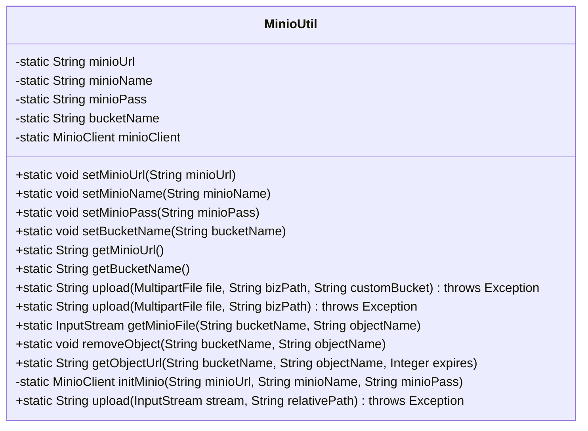

# 基础信息

|      |      |
|------|------|
| 名称 | MinioUtil |
| 编码语言 | .java |
| 代码路径 | JeecgBoot/jeecg-boot/jeecg-boot-base-core/src/main/java/org/jeecg/common/util/MinioUtil.java |
| 包名 | org.jeecg.common.util |
| 依赖项 | ['io.minio', 'io.minio.http.Method', 'lombok.extern.slf4j.Slf4j', 'org.jeecg.common.constant.SymbolConstant', 'org.jeecg.common.util.filter.SsrfFileTypeFilter', 'org.jeecg.common.util.filter.StrAttackFilter', 'org.springframework.web.multipart.MultipartFile', 'java.io.InputStream', 'java.net.URLDecoder'] |
| 概述说明 | MinioUtil类管理MinIO存储，支持上传、下载、删除及获取外链。 |

# 说明

MinioUtil类是一个用于管理MinIO文件存储的工具类，提供了多种文件操作功能。它支持文件的上传、下载和删除操作，同时还具备获取文件外链的能力。通过这些功能，用户可以方便地对存储在MinIO中的文件进行管理和访问。

# 类列表 Class Summary

| 名称   | 类型  | 说明 |
|-------|------|-------------|
| MinioUtil | class | MinioUtil类用于管理MinIO文件存储，支持文件上传、下载、删除及获取外链功能。 |

## 类 MinioUtil

|      |      |
|------|------|
| 访问范围 | @Slf4j;public |
| 类型 | class |
| 名称 | MinioUtil |
| 说明 | MinioUtil类用于管理MinIO文件存储，支持文件上传、下载、删除及获取外链功能。 |

### UML类图

**描述：**
`MinioUtil` 类是一个用于与 MinIO 对象存储服务进行交互的工具类。它包含了多个静态方法，用于设置和获取 MinIO 的连接信息（如 URL、用户名、密码、存储桶名称），以及执行文件上传、下载、删除和获取文件外链等操作。该类通过 `MinioClient` 与 MinIO 服务器进行通信，并提供了多种上传文件的方式，支持自定义存储桶和路径。此外，该类还包含了对上传文件的安全检查，如过滤特殊字符和文件类型检查，以防止潜在的攻击。

### 内部方法调用关系图

```mermaid
graph TD
    A["类MinioUtil"]
    B["属性: String minioUrl"]
    C["属性: String minioName"]
    D["属性: String minioPass"]
    E["属性: String bucketName"]
    F["属性: MinioClient minioClient"]
    G["方法: setMinioUrl(String minioUrl)"]
    H["方法: setMinioName(String minioName)"]
    I["方法: setMinioPass(String minioPass)"]
    J["方法: setBucketName(String bucketName)"]
    K["方法: getMinioUrl()"]
    L["方法: getBucketName()"]
    M["方法: upload(MultipartFile file, String bizPath, String customBucket)"]
    N["方法: upload(MultipartFile file, String bizPath)"]
    O["方法: getMinioFile(String bucketName, String objectName)"]
    P["方法: removeObject(String bucketName, String objectName)"]
    Q["方法: getObjectUrl(String bucketName, String objectName, Integer expires)"]
    R["方法: initMinio(String minioUrl, String minioName, String minioPass)"]
    S["方法: upload(InputStream stream, String relativePath)"]

    A --> B
    A --> C
    A --> D
    A --> E
    A --> F
    A --> G
    A --> H
    A --> I
    A --> J
    A --> K
    A --> L
    A --> M
    A --> N
    A --> O
    A --> P
    A --> Q
    A --> R
    A --> S
```

这段代码定义了一个名为`MinioUtil`的工具类，用于与MinIO对象存储服务进行交互。类中包含多个静态方法，用于设置和获取MinIO服务的配置信息（如URL、用户名、密码、存储桶名称），以及执行文件上传、下载、删除和获取文件外链等操作。代码通过`initMinio`方法初始化MinIO客户端，并在需要时创建存储桶。上传文件时，代码会对文件名进行过滤和格式化，并处理文件流的上传。删除和获取文件外链的操作也通过MinIO客户端完成。整体流程清晰，确保了与MinIO服务的有效交互。

### 字段列表 Field List

| 名称  | 类型  | 说明 |
|-------|-------|------|
| minioName | String | 定义了一个私有静态字符串变量minioName。 |
| minioUrl | String | 私有静态字符串变量minioUrl用于存储MinIO的URL地址。 |
| minioClient = null | MinioClient | 静态私有MinioClient实例为空。 |
| minioPass | String | 私有静态字符串变量minioPass。 |
| bucketName | String | 声明一个私有的静态字符串变量bucketName。 |

### 方法列表 Method List

| 名称  | 类型  | 说明 |
|-------|-------|------|
| getBucketName | String | 获取存储桶名称的静态方法。 |
| getMinioUrl | String | 获取Minio URL的静态方法。 |
| setBucketName | void | 设置MinioUtil类的bucketName属性为指定值。 |
| setMinioPass | void | 设置Minio工具类中的minioPass属性。 |
| initMinio | MinioClient | 初始化Minio客户端，设置端点及凭据，返回单例实例。 |
| setMinioName | void | 设置Minio工具类中的minioName属性值。 |
| removeObject | void | 静态方法删除MinIO存储桶中指定对象，捕获异常记录日志。 |
| upload | String | 上传文件到MinIO存储桶，检查桶是否存在，不存在则创建，返回文件URL。 |
| setMinioUrl | void | 设置Minio工具类的URL属性。 |
| getMinioFile | InputStream | 获取MinIO文件的Java方法，初始化客户端并返回输入流。 |
| upload | String | 上传文件方法，接收文件和业务路径参数，调用重载方法处理。 |
| upload | String | 上传文件至MinIO存储，过滤路径和文件类型，检查存储桶存在性，生成唯一文件名并上传，返回文件URL。 |
| getObjectUrl | String | 获取MinIO文件外链URL，处理异常并解码返回。 |

