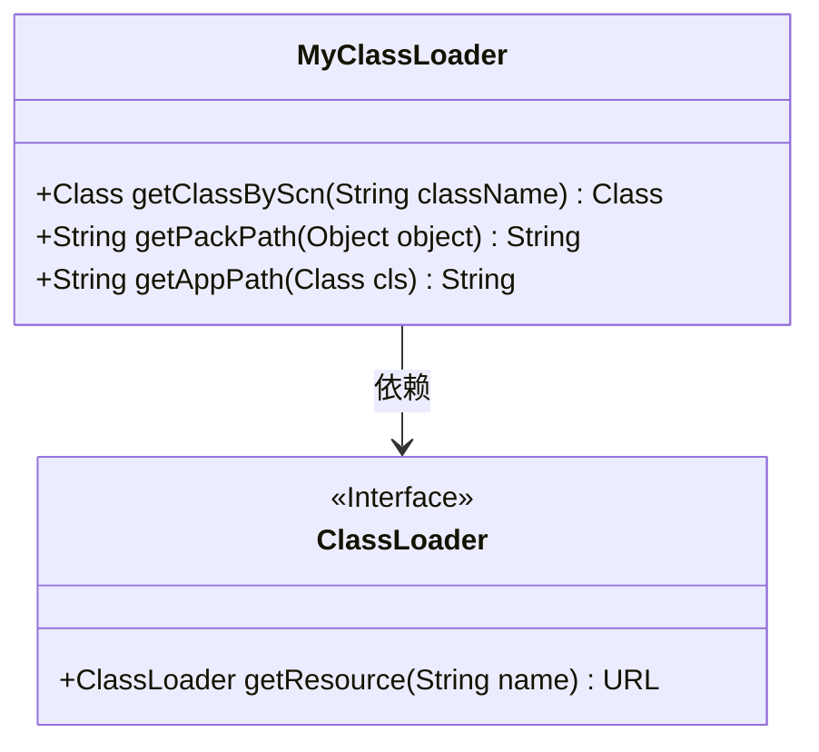

# 基础信息

|      |      |
|------|------|
| 名称 | MyClassLoader |
| 编码语言 | .java |
| 代码路径 | JeecgBoot/jeecg-boot/jeecg-boot-base-core/src/main/java/org/jeecg/common/util/MyClassLoader.java |
| 包名 | org.jeecg.common.util |
| 依赖项 | ['org.jeecg.common.constant.SymbolConstant'] |
| 概述说明 | MyClassLoader实现类加载、获取类全名及类路径功能。 |

# 说明

MyClassLoader类主要负责实现类加载功能，能够动态加载指定的类。此外，该类还提供了获取类全名和类路径的功能，方便在运行时获取类的完整名称及其所在路径。通过这些功能，MyClassLoader增强了类的动态加载和管理能力，适用于需要灵活加载类的应用场景。

# 类列表 Class Summary

| 名称   | 类型  | 说明 |
|-------|------|-------------|
| MyClassLoader | class | MyClassLoader类实现类加载、获取类全名及类路径功能。 |

## 类 MyClassLoader

|      |      |
|------|------|
| 访问范围 | public |
| 类型 | class |
| 名称 | MyClassLoader |
| 说明 | MyClassLoader类实现类加载、获取类全名及类路径功能。 |

### UML类图

这段代码定义了一个 `MyClassLoader` 类，它继承自 `ClassLoader`，并提供了三个主要方法：`getClassByScn`、`getPackPath` 和 `getAppPath`。`getClassByScn` 方法通过类名加载类，若类未找到则抛出异常。`getPackPath` 方法返回对象的全限定类名。`getAppPath` 方法通过传入的类对象获取其在文件系统中的路径，处理了包名、路径转换以及中文和空格编码问题。`MyClassLoader` 依赖于 `ClassLoader` 的 `getResource` 方法来获取资源路径。

### 内部方法调用关系图

```mermaid
graph TD
    A["类MyClassLoader"]
    B["方法: getClassByScn(String className)"]
    C["方法: getPackPath(Object object)"]
    D["方法: getAppPath(Class cls)"]
    E["异常处理: ClassNotFoundException"]
    F["异常处理: IllegalArgumentException"]
    G["异常处理: RuntimeException"]
    H["获得类的全名: object.getClass().getName()"]
    I["检查参数是否为空: object == null"]
    J["检查参数是否为空: cls == null"]
    K["获得类加载器: cls.getClassLoader()"]
    L["获得类的全名: cls.getName() + '.class'"]
    M["获得包信息: cls.getPackage()"]
    N["检查包名是否以'java.'或'javax.'开头"]
    O["转换包名为路径"]
    P["调用ClassLoader的getResource方法"]
    Q["从URL对象中获取路径信息"]
    R["去掉路径信息中的协议名'file:'"]
    S["去掉路径信息最后包含类文件信息的部分"]
    T["去掉JAR等打包文件名"]
    U["解码路径信息: URLDecoder.decode(realPath, 'utf-8')"]

    A --> B
    A --> C
    A --> D
    B --> E
    C --> F
    D --> F
    D --> G
    C --> H
    C --> I
    D --> J
    D --> K
    D --> L
    D --> M
    D --> N
    D --> O
    D --> P
    D --> Q
    D --> R
    D --> S
    D --> T
    D --> U
```

**描述：**
这段代码定义了一个`MyClassLoader`类，包含了三个主要方法：`getClassByScn`、`getPackPath`和`getAppPath`。`getClassByScn`方法通过类名加载类，处理类未找到的异常。`getPackPath`方法获取对象的全限定类名，并检查参数是否为空。`getAppPath`方法获取类的路径，处理路径中的包名、类名、协议名、JAR文件名等，并进行UTF-8解码以处理中文和空格。

### 字段列表 Field List

| 名称  | 类型  | 说明 |
|-------|-------|------|

### 方法列表 Method List

| 名称  | 类型  | 说明 |
|-------|-------|------|
| getClassByScn | Class | 通过类名获取Class对象，若未找到则抛出异常。 |
| getPackPath | String | 检查参数非空后返回对象类的全名。 |
| getAppPath | String | 获取指定类的路径，处理包名转换、系统类检查及路径解码。 |

