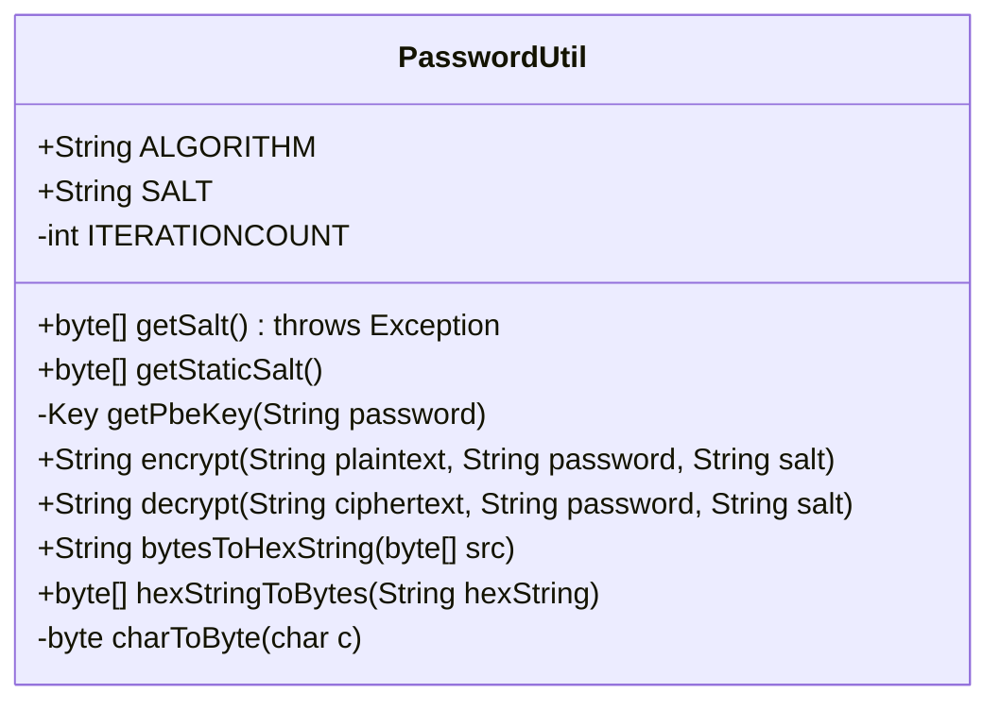
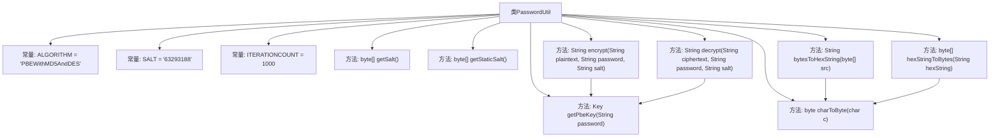

# 基础信息

|      |      |
|------|------|
| 名称 | PasswordUtil |
| 编码语言 | .java |
| 代码路径 | JeecgBoot/jeecg-boot/jeecg-boot-base-core/src/main/java/org/jeecg/common/util/PasswordUtil.java |
| 包名 | org.jeecg.common.util |
| 依赖项 | ['java.security.Key', 'java.security.SecureRandom', 'javax.crypto.Cipher', 'javax.crypto.SecretKey', 'javax.crypto.SecretKeyFactory', 'javax.crypto.spec.PBEKeySpec', 'javax.crypto.spec.PBEParameterSpec'] |
| 概述说明 | PasswordUtil类支持PBEWithMD5AndDES加密、解密及盐值生成。 |

# 说明

PasswordUtil类实现了PBEWithMD5AndDES加密算法，提供了加密、解密以及盐值生成的功能。该类主要用于处理密码相关的安全操作，确保数据在传输和存储过程中的安全性。通过使用MD5哈希算法和DES对称加密算法，PasswordUtil能够有效地保护敏感信息，防止未经授权的访问。盐值的生成进一步增强了加密的强度，使得相同的明文在不同盐值下生成不同的密文，提高了安全性。

# 类列表 Class Summary

| 名称   | 类型  | 说明 |
|-------|------|-------------|
| PasswordUtil | class | PasswordUtil类实现PBEWithMD5AndDES加密算法，支持加密、解密及盐值生成。 |

## 类 PasswordUtil

|      |      |
|------|------|
| 访问范围 | public |
| 类型 | class |
| 名称 | PasswordUtil |
| 说明 | PasswordUtil类实现PBEWithMD5AndDES加密算法，支持加密、解密及盐值生成。 |

### UML类图

**描述：**  
`PasswordUtil` 类是一个用于加密和解密字符串的工具类。它使用了 `PBEWithMD5AndDES` 算法进行加密和解密操作。类中包含了一些静态常量，如算法名称 `ALGORITHM` 和盐值 `SALT`，以及一个固定的迭代次数 `ITERATIONCOUNT`。类提供了生成随机盐值的方法 `getSalt()` 和获取固定盐值的方法 `getStaticSalt()`。加密和解密的核心方法分别是 `encrypt()` 和 `decrypt()`，它们依赖于 `getPbeKey()` 方法来生成密钥。此外，类还提供了 `bytesToHexString()` 和 `hexStringToBytes()` 方法，用于在字节数组和十六进制字符串之间进行转换。`charToByte()` 是一个私有方法，用于将字符转换为字节。

### 内部方法调用关系图

这段代码定义了一个`PasswordUtil`类，用于加密和解密字符串。它使用了`PBEWithMD5AndDES`算法，并定义了盐值和迭代次数。类中包含了获取盐值、生成密钥、加密、解密以及字节数组与十六进制字符串之间转换的方法。加密和解密过程依赖于生成的密钥和盐值，确保了数据的安全性。

### 字段列表 Field List

| 名称  | 类型  | 说明 |
|-------|-------|------|
| ITERATIONCOUNT = 1000 | int | 定义了一个私有静态常量ITERATIONCOUNT，值为1000。 |
| ALGORITHM = "PBEWithMD5AndDES" | String | 定义常量ALGORITHM，值为"PBEWithMD5AndDES"。 |
| SALT = "63293188" | String | 定义了一个不可变字符串常量SALT，值为"63293188"。 |

### 方法列表 Method List

| 名称  | 类型  | 说明 |
|-------|-------|------|
| getPbeKey | Key | 根据密码生成PBE密钥的静态方法，使用指定算法和密钥工厂。 |
| getStaticSalt | byte[] | 静态方法返回固定盐值的字节数组。 |
| charToByte | byte | 将字符转换为对应十六进制值的字节。 |
| encrypt | String | 使用PBE算法加密明文，处理中文编码问题，返回十六进制结果。 |
| hexStringToBytes | byte[] | 将十六进制字符串转换为字节数组，处理空值并返回结果。 |
| getSalt | byte[] | 生成8字节安全随机数作为盐值。 |
| bytesToHexString | String | 将字节数组转换为十六进制字符串，空数组返回null。 |
| decrypt | String | 使用密码和盐值解密字符串，返回解密后的文本。 |

