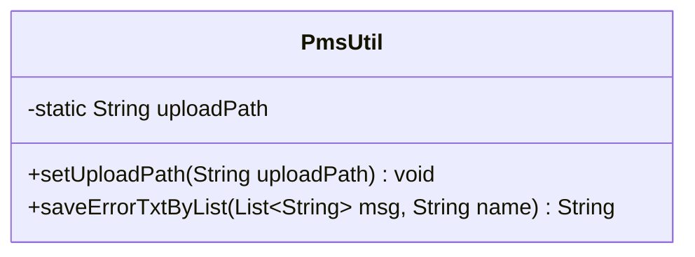
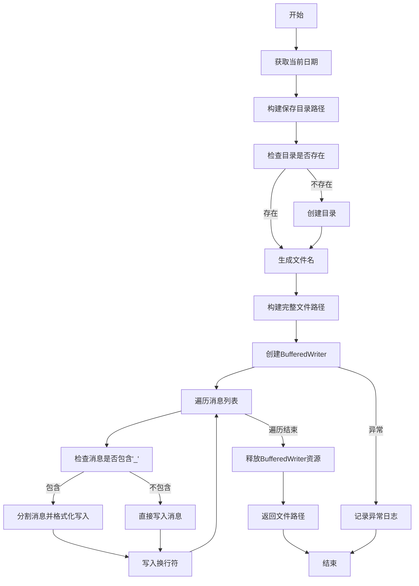
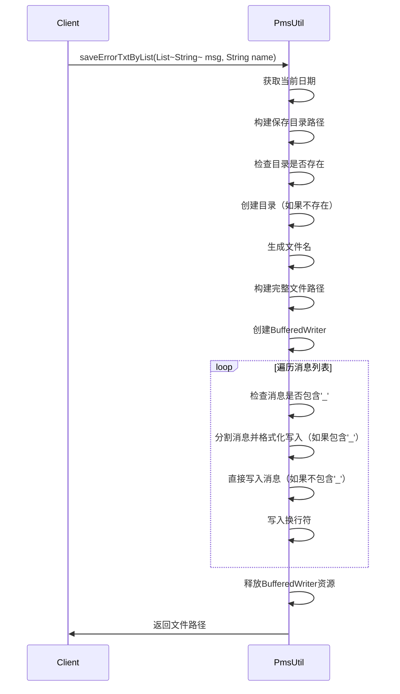
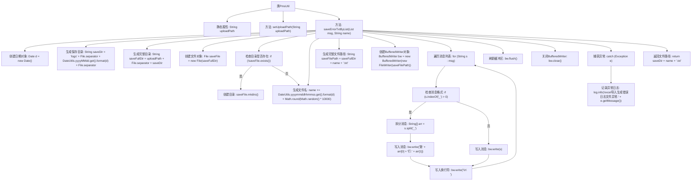

# 基础信息

|      |      |
|------|------|
| 名称 | PmsUtil |
| 编码语言 | .java |
| 代码路径 | JeecgBoot/jeecg-boot/jeecg-boot-base-core/src/main/java/org/jeecg/common/util/PmsUtil.java |
| 包名 | org.jeecg.common.util |
| 依赖项 | ['lombok.extern.slf4j.Slf4j', 'org.springframework.beans.factory.annotation.Value', 'org.springframework.stereotype.Component', 'java.io.BufferedWriter', 'java.io.File', 'java.io.FileWriter', 'java.util.Date', 'java.util.List'] |
| 概述说明 | PmsUtil类用于保存错误日志，具备路径设置和日志文件生成功能。 |

# 说明

PmsUtil类主要用于错误日志的保存，具备路径设置和日志文件生成的功能。该类通过指定路径来存储日志文件，并能够自动生成日志文件以记录错误信息，确保系统运行中的问题能够被有效追踪和分析。

# 类列表 Class Summary

| 名称   | 类型  | 说明 |
|-------|------|-------------|
| PmsUtil | class | PmsUtil类用于保存错误日志，包含路径设置和日志文件生成功能。 |

## 类 PmsUtil

|      |      |
|------|------|
| 访问范围 | @Slf4j;@Component;public |
| 类型 | class |
| 名称 | PmsUtil |
| 说明 | PmsUtil类用于保存错误日志，包含路径设置和日志文件生成功能。 |

### UML类图

这段代码定义了一个名为 `PmsUtil` 的工具类，主要用于将错误信息列表保存到指定目录的文本文件中。代码首先通过 `setUploadPath` 方法设置上传路径，然后在 `saveErrorTxtByList` 方法中，根据当前日期生成保存目录，并检查目录是否存在，若不存在则创建。接着，生成唯一的文件名，并将错误信息逐行写入文本文件。如果消息中包含下划线 `_`，则将其分割并格式化写入，否则直接写入。最后，释放资源并返回文件路径。整个过程包含了异常处理，确保在发生异常时记录日志。

### 内部方法调用关系图

这段代码是一个用于保存错误日志的工具类，主要功能是将错误消息列表保存到指定的文本文件中。代码首先根据当前日期生成保存目录，然后创建文件并写入错误消息。如果消息中包含下划线，则将其拆分为行号和内容进行格式化写入。最后返回保存的文件路径。

### 字段列表 Field List

| 名称  | 类型  | 说明 |
|-------|-------|------|
| uploadPath | String | 定义静态字符串变量uploadPath。 |

### 方法列表 Method List

| 名称  | 类型  | 说明 |
|-------|-------|------|
| setUploadPath | void | 设置上传路径方法，将传入路径赋值给PmsUtil.uploadPath。 |
| saveErrorTxtByList | String | 该方法将错误信息列表保存为带时间戳的日志文件，返回文件路径。 |

