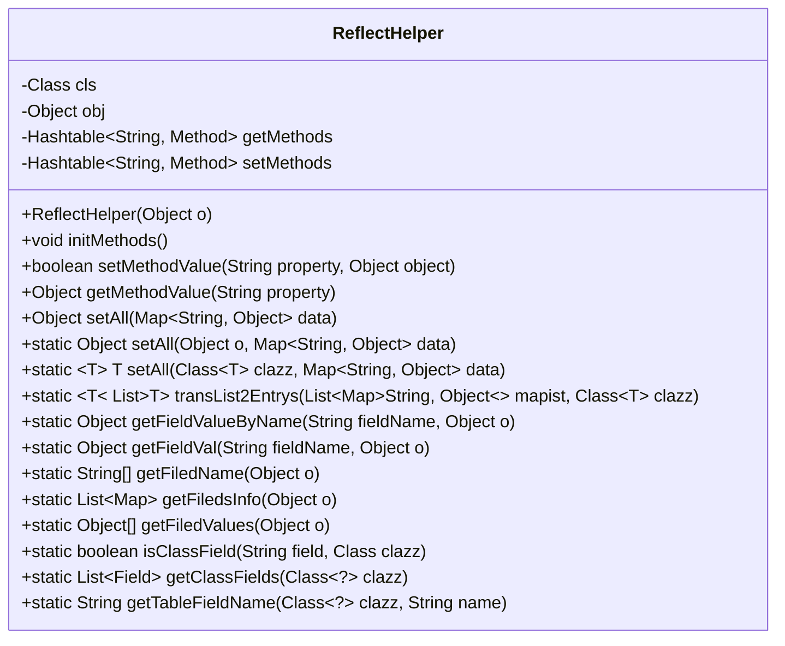

# 基础信息

|      |      |
|------|------|
| 名称 | ReflectHelper |
| 编码语言 | .java |
| 代码路径 | JeecgBoot/jeecg-boot/jeecg-boot-base-core/src/main/java/org/jeecg/common/util/ReflectHelper.java |
| 包名 | org.jeecg.common.util |
| 依赖项 | ['com.baomidou.mybatisplus.annotation.TableField', 'lombok.extern.slf4j.Slf4j', 'java.lang.reflect.Field', 'java.lang.reflect.Method', 'java.util', 'java.util.Map.Entry', 'java.util.regex.Pattern', 'java.util.stream.Collectors'] |
| 概述说明 | ReflectHelper类提供反射操作，支持属性处理、Map操作及实体类转换。 |

# 说明

ReflectHelper类是一个用于反射操作的工具类，主要用于获取和设置对象的属性值，处理Map类型的数据，以及进行实体类列表的转换。该类的功能涵盖了反射机制的核心应用场景，能够简化对对象属性的操作，支持与Map数据结构之间的交互，并提供实体类列表的转换能力，从而提升代码的灵活性和可维护性。

# 类列表 Class Summary

| 名称   | 类型  | 说明 |
|-------|------|-------------|
| ReflectHelper | class | ReflectHelper类用于反射操作，支持获取和设置对象属性，处理Map数据，转换实体类列表。 |

## 类 ReflectHelper

|      |      |
|------|------|
| 访问范围 | @Slf4j;public |
| 类型 | class |
| 名称 | ReflectHelper |
| 说明 | ReflectHelper类用于反射操作，支持获取和设置对象属性，处理Map数据，转换实体类列表。 |

### UML类图

**类图描述：**  
`ReflectHelper` 类是一个用于反射操作的辅助类，主要用于动态调用对象的 getter 和 setter 方法，以及将 Map 数据注入到对象中。它通过正则表达式过滤出对象的 getter 和 setter 方法，并将其存储在 `Hashtable` 中，以便后续调用。此外，该类还提供了将 Map 数据转换为对象、获取对象属性值、判断字段是否属于类等功能。该类广泛应用于需要动态操作对象属性的场景。

### 内部方法调用关系图

```mermaid
graph TD
    A["类ReflectHelper"]
    B["属性: Class cls"]
    C["属性: Object obj"]
    D["属性: Hashtable<String, Method> getMethods"]
    E["属性: Hashtable<String, Method> setMethods"]
    F["构造方法: ReflectHelper(Object o)"]
    G["方法: initMethods()"]
    H["方法: setMethodValue(String property, Object object)"]
    I["方法: getMethodValue(String property)"]
    J["方法: setAll(Map<String, Object> data)"]
    K["静态方法: setAll(Object o, Map<String, Object> data)"]
    L["静态方法: setAll(Class<T> clazz, Map<String, Object> data)"]
    M["静态方法: transList2Entrys(List<Map<String, Object>> mapist, Class<T> clazz)"]
    N["静态方法: getFieldValueByName(String fieldName, Object o)"]
    O["静态方法: getFieldVal(String fieldName, Object o)"]
    P["静态方法: getFiledName(Object o)"]
    Q["静态方法: getFiledsInfo(Object o)"]
    R["静态方法: getFiledValues(Object o)"]
    S["静态方法: isClassField(String field, Class clazz)"]
    T["静态方法: getClassFields(Class<?> clazz)"]
    U["静态方法: getTableFieldName(Class<?> clazz, String name)"]

    A --> B
    A --> C
    A --> D
    A --> E
    A --> F
    F --> G
    A --> H
    A --> I
    A --> J
    A --> K
    A --> L
    A --> M
    A --> N
    A --> O
    A --> P
    A --> Q
    A --> R
    A --> S
    A --> T
    A --> U
```

这段代码定义了一个`ReflectHelper`类，主要用于通过反射机制操作对象的属性和方法。类中包含了多个方法，用于初始化、设置和获取对象的属性值，以及处理Map和List等数据结构。代码通过正则表达式过滤出对象的getter和setter方法，并将其存储在Hashtable中，以便后续调用。此外，还提供了静态方法用于批量设置属性值、获取属性信息等操作。整体设计灵活，适用于处理复杂的对象反射操作。

### 字段列表 Field List

| 名称  | 类型  | 说明 |
|-------|-------|------|
| cls | Class | 定义私有类变量cls。 |
| setMethods = null | Hashtable<String, Method> | 私有哈希表存储字符串到方法的映射。 |
| getMethods = null | Hashtable<String, Method> | 私有哈希表存储字符串与方法的映射。 |
| obj | Object | 声明了一个私有的对象变量obj。 |

### 方法列表 Method List

| 名称  | 类型  | 说明 |
|-------|-------|------|
| setAll | T | 通过反射创建对象并设置属性。 |
| transList2Entrys | List<T> | 将Map列表转换为指定类的对象列表。 |
| getMethodValue | Object | 通过反射调用指定属性的getter方法并返回结果。 |
| getFiledValues | Object[] | 获取对象字段值并返回数组。 |
| isClassField | boolean | 检查字段是否为类的成员字段，忽略大小写和下划线转换。 |
| initMethods | void | 初始化方法，过滤并存储getter和setter方法。 |
| getFiledName | String[] | 获取对象所有字段名称并返回字符串数组。 |
| getClassFields | List<Field> | 获取类及其父类的所有字段列表。 |
| getFiledsInfo | List<Map> | 获取对象字段信息，包括类型、名称和值，返回列表。 |
| setMethodValue | boolean | 通过属性名调用目标类的setter方法，成功返回true，失败返回false。 |
| setAll | Object | 静态方法setAll通过反射将Map数据注入对象并返回该对象。 |
| getFieldVal | Object | 通过反射获取对象指定字段值，忽略访问检查，异常时返回null。 |
| getTableFieldName | String | 获取类字段名，检查TableField注解，决定是否处理该字段。 |
| getFieldValueByName | Object | 通过反射获取对象指定字段的值，调用getter方法并返回结果，异常时返回null。 |
| setAll | Object | 方法`setAll`遍历`data`键值对并调用`setMethodValue`设置值，若`data`为空返回`null`。 |

