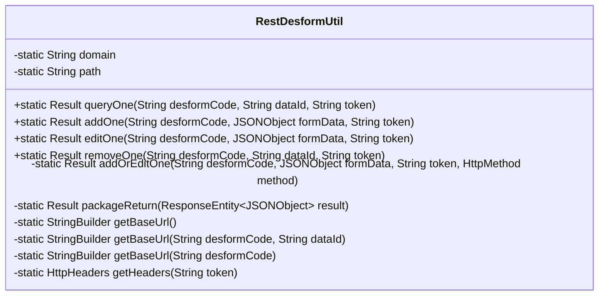
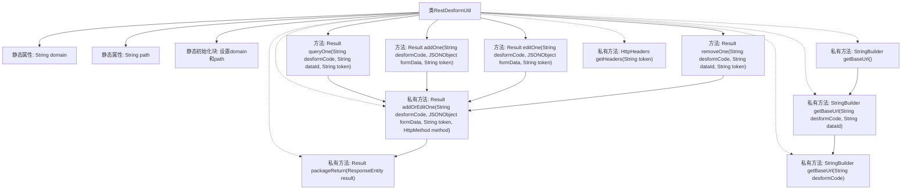

# 基础信息

|      |      |
|------|------|
| 名称 | RestDesformUtil |
| 编码语言 | .java |
| 代码路径 | JeecgBoot/jeecg-boot/jeecg-boot-base-core/src/main/java/org/jeecg/common/util/RestDesformUtil.java |
| 包名 | org.jeecg.common.util |
| 依赖项 | ['com.alibaba.fastjson.JSONObject', 'org.jeecg.common.api.vo.Result', 'org.springframework.http.HttpHeaders', 'org.springframework.http.HttpMethod', 'org.springframework.http.MediaType', 'org.springframework.http.ResponseEntity'] |
| 概述说明 | RestDesformUtil类处理数据操作，支持HTTP与API交互。 |

# 说明

RestDesformUtil类是一个用于处理数据操作的工具类，主要功能包括数据查询、新增、修改和删除。它支持通过HTTP请求与API进行交互，简化了与后端服务的数据通信流程。该类为开发者提供了一种便捷的方式来执行常见的数据操作，适用于需要与API进行数据交互的各种应用场景。

# 类列表 Class Summary

| 名称   | 类型  | 说明 |
|-------|------|-------------|
| RestDesformUtil | class | RestDesformUtil类用于处理数据查询、新增、修改和删除操作，支持通过HTTP请求与API交互。 |

## 类 RestDesformUtil

|      |      |
|------|------|
| 访问范围 | public |
| 类型 | class |
| 名称 | RestDesformUtil |
| 说明 | RestDesformUtil类用于处理数据查询、新增、修改和删除操作，支持通过HTTP请求与API交互。 |

### UML类图

**描述：**  
`RestDesformUtil` 是一个工具类，用于处理与 RESTful API 相关的操作。它包含静态方法，用于查询、新增、修改和删除数据。这些方法通过构建 URL 和设置 HTTP 头信息，调用 `RestUtil` 来发送请求，并将响应结果封装为 `Result` 对象返回。类中的私有方法用于辅助生成 URL 和 HTTP 头信息，确保代码的复用性和简洁性。

### 内部方法调用关系图

该流程图展示了`RestDesformUtil`类的结构和主要方法之间的调用关系。类中包含静态属性`domain`和`path`，并通过静态初始化块进行初始化。主要方法如`queryOne`、`addOne`、`editOne`和`removeOne`都依赖于私有方法`addOrEditOne`来处理请求，而`addOrEditOne`又调用`packageReturn`方法来处理返回结果。此外，`getBaseUrl`方法用于构建URL，`getHeaders`方法用于设置请求头。

### 字段列表 Field List

| 名称  | 类型  | 说明 |
|-------|-------|------|
| path = null | String | 私有静态字符串变量path初始化为null。 |
| domain = null | String | 定义静态私有字符串变量domain，初始值为null。 |

### 方法列表 Method List

| 名称  | 类型  | 说明 |
|-------|-------|------|
| getBaseUrl | StringBuilder | 获取指定表单代码的基础URL。 |
| getBaseUrl | StringBuilder | 生成包含表单代码和数据ID的基础URL。 |
| packageReturn | Result | 私有方法将响应实体转换为结果对象，失败返回错误信息。 |
| queryOne | Result | 静态方法queryOne通过URL和请求头查询数据并返回结果。 |
| addOne | Result | 静态方法addOne通过POST请求添加或编辑数据。 |
| getHeaders | HttpHeaders | 静态方法生成包含JSON类型和令牌的HTTP请求头。 |
| removeOne | Result | 静态方法removeOne通过DELETE请求删除指定资源，返回处理结果。 |
| getBaseUrl | StringBuilder | 该方法通过拼接域名、路径和固定字符串生成基础URL。 |
| addOrEditOne | Result | 私有静态方法`addOrEditOne`通过HTTP请求处理表单数据，返回结果。 |
| editOne | Result | 静态方法editOne通过PUT方法调用addOrEditOne编辑表单数据。 |

