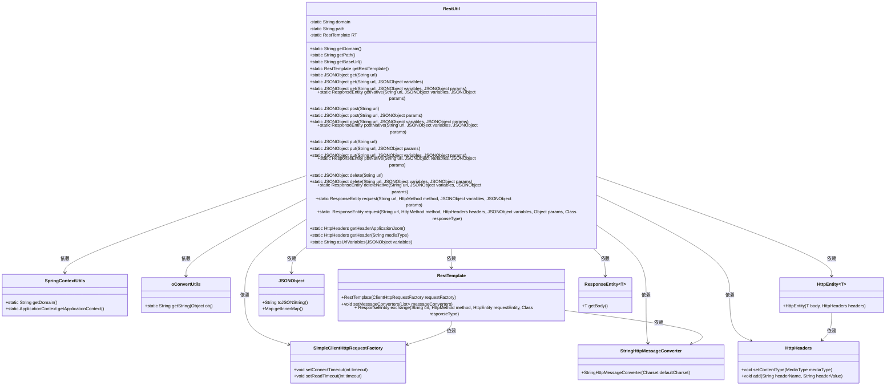

# 基础信息

|      |      |
|------|------|
| 名称 | RestUtil |
| 编码语言 | .java |
| 代码路径 | JeecgBoot/jeecg-boot/jeecg-boot-base-core/src/main/java/org/jeecg/common/util/RestUtil.java |
| 包名 | org.jeecg.common.util |
| 依赖项 | ['com.alibaba.fastjson.JSONObject', 'lombok.extern.slf4j.Slf4j', 'org.apache.commons.lang3.StringUtils', 'org.springframework.http', 'org.springframework.http.client.SimpleClientHttpRequestFactory', 'org.springframework.http.converter.StringHttpMessageConverter', 'org.springframework.web.client.RestTemplate', 'java.nio.charset.StandardCharsets', 'java.util.Iterator', 'java.util.Map'] |
| 概述说明 | RestUtil类支持REST API调用，处理多种请求和参数，返回JSON或原生响应。 |

# 说明

RestUtil类是一个用于调用REST API的工具类，支持GET、POST、PUT和DELETE四种HTTP请求方法。它能够处理URL参数和请求头，并返回JSON对象或原生响应实体，适用于各种RESTful服务调用场景。

# 类列表 Class Summary

| 名称   | 类型  | 说明 |
|-------|------|-------------|
| RestUtil | class | RestUtil类提供REST API调用功能，支持GET、POST、PUT、DELETE请求，处理URL参数和请求头，返回JSON对象或原生响应实体。 |

## 类 RestUtil

|      |      |
|------|------|
| 访问范围 | @Slf4j;public |
| 类型 | class |
| 名称 | RestUtil |
| 说明 | RestUtil类提供REST API调用功能，支持GET、POST、PUT、DELETE请求，处理URL参数和请求头，返回JSON对象或原生响应实体。 |

### UML类图

### 描述
`RestUtil` 是一个用于处理HTTP请求的工具类，提供了GET、POST、PUT、DELETE等HTTP方法的封装。它依赖于`SpringContextUtils`获取域名和路径，`oConvertUtils`进行字符串转换，`RestTemplate`发送HTTP请求。`RestTemplate`使用`SimpleClientHttpRequestFactory`设置连接和读取超时，并使用`StringHttpMessageConverter`解决乱码问题。`RestUtil`还提供了请求头的设置和URL参数的拼接功能，最终返回`ResponseEntity`对象。

### 内部方法调用关系图

```mermaid
graph TD
    A["类RestUtil"]
    B["静态属性: String domain"]
    C["静态属性: String path"]
    D["静态方法: String getDomain()"]
    E["静态方法: String getPath()"]
    F["静态方法: String getBaseUrl()"]
    G["静态属性: RestTemplate RT"]
    H["静态初始化块: 初始化RT"]
    I["静态方法: RestTemplate getRestTemplate()"]
    J["静态方法: JSONObject get(String url)"]
    K["静态方法: JSONObject get(String url, JSONObject variables)"]
    L["静态方法: JSONObject get(String url, JSONObject variables, JSONObject params)"]
    M["静态方法: ResponseEntity<JSONObject> getNative(String url, JSONObject variables, JSONObject params)"]
    N["静态方法: JSONObject post(String url)"]
    O["静态方法: JSONObject post(String url, JSONObject params)"]
    P["静态方法: JSONObject post(String url, JSONObject variables, JSONObject params)"]
    Q["静态方法: ResponseEntity<JSONObject> postNative(String url, JSONObject variables, JSONObject params)"]
    R["静态方法: JSONObject put(String url)"]
    S["静态方法: JSONObject put(String url, JSONObject params)"]
    T["静态方法: JSONObject put(String url, JSONObject variables, JSONObject params)"]
    U["静态方法: ResponseEntity<JSONObject> putNative(String url, JSONObject variables, JSONObject params)"]
    V["静态方法: JSONObject delete(String url)"]
    W["静态方法: JSONObject delete(String url, JSONObject variables, JSONObject params)"]
    X["静态方法: ResponseEntity<JSONObject> deleteNative(String url, JSONObject variables, JSONObject params)"]
    Y["静态方法: ResponseEntity<JSONObject> request(String url, HttpMethod method, JSONObject variables, JSONObject params)"]
    Z["静态方法: <T> ResponseEntity<T> request(String url, HttpMethod method, HttpHeaders headers, JSONObject variables, Object params, Class<T> responseType)"]
    AA["静态方法: HttpHeaders getHeaderApplicationJson()"]
    AB["静态方法: HttpHeaders getHeader(String mediaType)"]
    AC["静态方法: String asUrlVariables(JSONObject variables)"]

    A --> B
    A --> C
    A --> D
    A --> E
    A --> F
    A --> G
    A --> H
    A --> I
    A --> J
    A --> K
    A --> L
    A --> M
    A --> N
    A --> O
    A --> P
    A --> Q
    A --> R
    A --> S
    A --> T
    A --> U
    A --> V
    A --> W
    A --> X
    A --> Y
    A --> Z
    A --> AA
    A --> AB
    A --> AC
```

这段代码定义了一个名为 `RestUtil` 的工具类，用于处理 RESTful API 的请求。类中包含了一系列静态方法，用于发送 GET、POST、PUT 和 DELETE 请求，并返回 JSON 格式的响应。代码还包含了处理请求头、URL 参数和请求体的工具方法，以及一个静态的 `RestTemplate` 实例用于发送 HTTP 请求。代码通过静态初始化块对 `RestTemplate` 进行初始化，并设置了超时时间和字符编码。整体设计简洁，功能明确，适合用于微服务架构中的 API 调用。

### 字段列表 Field List

| 名称  | 类型  | 说明 |
|-------|-------|------|
| domain = null | String | 私有静态字符串变量domain未初始化。 |
| RT | RestTemplate | 私有静态常量RestTemplate实例RT。 |
| path = null | String | 私有静态字符串变量path未初始化。 |

### 方法列表 Method List

| 名称  | 类型  | 说明 |
|-------|-------|------|
| getRestTemplate | RestTemplate | 静态方法返回RestTemplate实例RT。 |
| getBaseUrl | String | 获取基础URL并记录日志。 |
| get | JSONObject | 静态方法get通过url获取JSONObject对象。 |
| post | JSONObject | 静态方法post通过url调用postNative并返回其JSON对象。 |
| getHeaderApplicationJson | HttpHeaders | 静态方法返回JSON格式的HTTP头信息。 |
| getPath | String | 静态方法获取上下文路径，若为空则从Spring环境读取。 |
| getHeader | HttpHeaders | 静态方法生成指定媒体类型的HTTP头。 |
| getNative | ResponseEntity<JSONObject> | 静态方法通过GET请求获取JSON数据，返回响应实体。 |
| post | JSONObject | 静态方法post调用postNative并返回其响应体。 |
| postNative | ResponseEntity<JSONObject> | 静态方法postNative用于POST请求，返回JSONObject响应。 |
| putNative | ResponseEntity<JSONObject> | 静态方法putNative通过PUT请求发送JSON数据到指定URL。 |
| get | JSONObject | 静态方法get通过url和variables调用getNative并返回响应体。 |
| delete | JSONObject | 静态方法delete通过调用deleteNative删除指定URL资源并返回JSON对象。 |
| put | JSONObject | 静态方法put通过url和params调用putNative并返回其响应体。 |
| request | ResponseEntity<JSONObject> | 静态方法request用于发送HTTP请求，返回JSONObject类型的响应实体。 |
| asUrlVariables | String | 将JSON对象转换为URL参数字符串，去除首个&符号。 |
| deleteNative | ResponseEntity<JSONObject> | 静态方法deleteNative通过HTTP DELETE请求删除资源，返回JSONObject响应。 |
| getDomain | String | 方法getDomain获取域名，若为空则通过SpringContextUtils获取并处理端口号-1问题。 |
| put | JSONObject | 静态方法put接收URL参数，调用putNative并返回响应体。 |
| put | JSONObject | 静态方法put通过url、variables和params调用putNative并返回响应体。 |
| request | ResponseEntity<T> | 该方法用于发送HTTP请求，检查URL和方法非空，处理请求体和URL参数，并返回响应。 |
| post | JSONObject | 静态方法post发送JSON对象到指定URL并返回响应体。 |
| delete | JSONObject | 静态方法删除URL资源，返回JSON对象。 |
| get | JSONObject | 静态方法get通过调用getNative获取指定URL的JSON对象并返回其主体。 |

